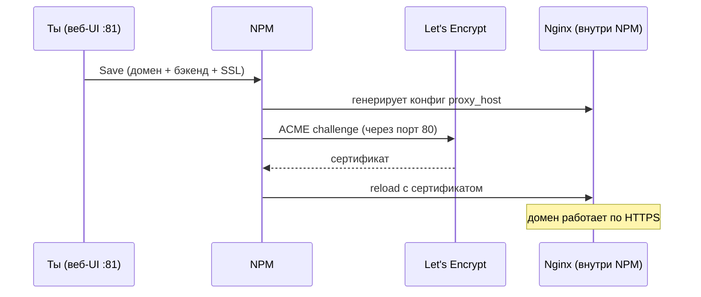
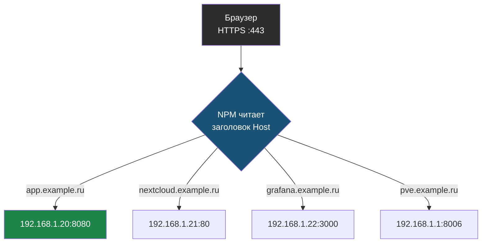

> ⏱ Время чтения: ~20 мин.

# Глава 10: Nginx Proxy Manager — веб-интерфейс для обратного прокси

> **Запомни:** Ты уже умеешь настраивать Nginx руками и понимаешь Caddyfile. Теперь посмотрим на тот же слой через веб-интерфейс — для сценариев где конфигурация нужна быстро, без редактирования файлов.

---

## 10.1 Зачем нужен Nginx Proxy Manager

Вспомни что ты делал в предыдущих главах:

- Писал `server`-блоки и `location` в конфигах Nginx
- Запускал `certbot`, настраивал таймер автопродления
- Перезапускал `nginx -t && systemctl reload nginx` после каждого изменения

NPM делает всё это через браузер:

```
Nginx (вручную):                    Nginx Proxy Manager:
──────────────────────────────      ──────────────────────────────
nano /etc/nginx/sites-available/    Открыл браузер
proxy_pass http://192.168.1.10:8080 Нажал Add Proxy Host
certbot --nginx -d domain.ru        Поставил галочку SSL → Let's Encrypt
systemctl reload nginx              Нажал Save
```

NPM — это **Nginx под капотом** с веб-интерфейсом сверху. Он сам генерирует конфиги nginx, запрашивает сертификаты через certbot и перезагружает nginx после изменений.

> **Важно:** NPM не заменяет понимание Nginx. Ты уже знаешь что происходит под капотом — это и есть ценность предыдущих глав. NPM просто убирает рутину.

---

## 10.2 Где запускать NPM

**NPM запускают в Docker** — официальный способ, всё в одном контейнере.

Для Proxmox-среды рекомендуемая схема:

```
Роутер
  │  :80, :443
  ▼
LXC-контейнер (Debian/Ubuntu + Docker)
  └── NPM (jc21/nginx-proxy-manager)
        │  :80, :443 — входящий трафик
        │  :81       — веб-интерфейс NPM
        ▼
  VM1 :8080, VM2 :3000, VM3 :5000 ...
```

NPM стоит **между роутером и твоими сервисами**. Роутер форвардит 80/443 на IP этого LXC-контейнера, NPM решает куда направить запрос по доменному имени.

---

## 10.3 Установка

### Требования

- LXC-контейнер или VM с Debian 12 / Ubuntu 22.04+
- Docker и Docker Compose
- Статический IP внутри сети (например `192.168.1.10`)
- Роутер форвардит `:80` и `:443` на этот IP

### Установка Docker

```bash
apt update && apt install -y docker.io docker-compose-plugin
```

### docker-compose.yml для NPM

Создай директорию и файл:

```bash
mkdir -p ~/npm && cd ~/npm
nano docker-compose.yml
```

```yaml
services:
  npm:
    image: jc21/nginx-proxy-manager:latest
    restart: unless-stopped
    ports:
      - "80:80"       # HTTP — нужен для ACME challenge (Let's Encrypt)
      - "443:443"     # HTTPS
      - "81:81"       # Веб-интерфейс NPM
    volumes:
      - ./data:/data
      - ./letsencrypt:/etc/letsencrypt
```

Запусти:

```bash
docker compose up -d
docker compose logs -f npm   # смотри логи пока не поднимется (~30 сек)
```

### Первый вход

Открой в браузере: `http://192.168.1.10:81`

Данные по умолчанию:
```
Email:    admin@example.com
Password: changeme
```

> **Сразу смени пароль** — тебя попросят при первом входе. Используй сильный пароль: интерфейс не должен быть доступен из интернета, но привычка важна.

---

## 10.4 Добавить первый Proxy Host

**Proxy Host** — это правило: «запрос на домен X → перенаправь на адрес Y».

### Шаг 1: Hosts → Proxy Hosts → Add Proxy Host

Заполни вкладку **Details**:

| Поле | Что вводить | Пример |
|------|-------------|--------|
| Domain Names | Доменное имя | `app.example.ru` |
| Scheme | Протокол до бэкенда | `http` (обычно) |
| Forward Hostname / IP | IP или hostname сервиса | `192.168.1.20` |
| Forward Port | Порт сервиса | `8080` |
| Websockets Support | Для WebSocket-приложений | включить если нужно |

### Шаг 2: SSL — вкладка SSL

| Поле | Значение |
|------|----------|
| SSL Certificate | Request a new SSL Certificate |
| Force SSL | ✓ (HTTP → HTTPS автоматически) |
| HTTP/2 Support | ✓ |
| Email Address | твой email (для уведомлений от Let's Encrypt) |
| I Agree to the ToS | ✓ |

Нажми **Save**. NPM:
1. Создаст конфиг Nginx для этого домена
2. Запустит ACME challenge через certbot
3. Получит сертификат и настроит автопродление
4. Перезагрузит Nginx



### Проверка

```bash
# Проверь что сертификат получен
curl -I https://app.example.ru

# Проверь редирект HTTP → HTTPS
curl -I http://app.example.ru
```

---

## 10.5 Несколько сервисов на одном сервере

Типичный homelab: несколько сервисов, каждый на своём домене.

```
app.example.ru     → 192.168.1.20:8080  (веб-приложение)
nextcloud.example.ru → 192.168.1.21:80   (Nextcloud)
grafana.example.ru → 192.168.1.22:3000  (Grafana)
pve.example.ru     → 192.168.1.1:8006   (Proxmox UI)
```

Для каждого — отдельный Proxy Host в NPM. Nginx определяет маршрут по заголовку `Host` — это то же самое что `server_name` в ручном конфиге Nginx.



> **Запомни:** Когда браузер открывает `app.example.ru`, он добавляет в HTTP-запрос заголовок `Host: app.example.ru`. NPM читает этот заголовок и решает на какой бэкенд проксировать.

---

## 10.6 Access Lists — базовая аутентификация

NPM позволяет закрыть любой Proxy Host логином и паролем — без изменений в самом приложении.

**Security → Access Lists → Add Access List:**

1. Дай имя (например `admin-only`)
2. Вкладка **Authorization** → Add:
   - Username: `admin`
   - Password: `yourpassword`
3. Сохрани

Теперь в Proxy Host → вкладка **Details** → **Access List** — выбери созданный список.

Теперь при открытии домена браузер покажет стандартное HTTP Basic Auth окно.

> **Ограничение:** HTTP Basic Auth передаёт credentials в base64, не в зашифрованном виде. Используй только поверх HTTPS (что NPM делает по умолчанию).

---

## 10.7 Streams — TCP/UDP проксирование

Кроме HTTP/HTTPS NPM умеет проксировать произвольный TCP/UDP трафик — это раздел **Hosts → Streams**.

Пример: проброс SSH-порта или базы данных.

```
Внешний :2222  →  192.168.1.20:22   (SSH к конкретной VM)
Внешний :5432  →  192.168.1.30:5432 (PostgreSQL)
```

> **Осторожно:** TCP streams не имеют SSL и не защищены NPM автоматически. Убедись что трафик шифруется на уровне протокола (SSH шифрует сам, БД — нет).

---

## 10.8 Где хранятся данные

```
~/npm/
├── data/
│   ├── nginx/           # сгенерированные конфиги Nginx
│   │   └── proxy_host/  # один файл на каждый Proxy Host
│   ├── database.sqlite  # все настройки NPM
│   └── logs/            # access и error логи
└── letsencrypt/
    └── live/            # сертификаты Let's Encrypt
        └── app.example.ru/
            ├── fullchain.pem
            └── privkey.pem
```

> **Бэкап:** сохрани папку `~/npm/data` — там вся конфигурация. `~/npm/letsencrypt` тоже важна, но сертификаты можно перевыпустить (помни о лимите: 5 в неделю на домен).

---

## 10.9 Просмотр сгенерированных конфигов

NPM генерирует реальные Nginx-конфиги. Полезно для отладки и понимания:

```bash
# Посмотреть конфиг конкретного Proxy Host
docker compose exec npm cat /data/nginx/proxy_host/1.conf
```

Пример сгенерированного конфига:
```nginx
server {
  set $forward_scheme http;
  set $server         "192.168.1.20";
  set $port           8080;

  listen 80;
  listen [::]:80;

  server_name app.example.ru;

  # Let's Encrypt challenge
  include conf.d/include/letsencrypt-acme-challenge.conf;
  include conf.d/include/force-ssl.conf;
}

server {
  listen 443 ssl http2;
  server_name app.example.ru;

  ssl_certificate     /etc/letsencrypt/live/npm-1/fullchain.pem;
  ssl_certificate_key /etc/letsencrypt/live/npm-1/privkey.pem;

  location / {
    proxy_pass $forward_scheme://$server:$port;
    proxy_set_header Host $host;
    proxy_set_header X-Real-IP $remote_addr;
    # ...
  }
}
```

Узнаёшь? Это те же директивы из Главы 4. NPM просто заполняет этот шаблон через UI.

---

## 10.10 Диагностика

### Сертификат не получается

```bash
docker compose logs npm | grep -i "error\|ssl\|acme\|cert"
```

Типичные причины:

| Проблема | Симптом | Решение |
|----------|---------|---------|
| Порт 80 не открыт снаружи | `timeout during connect` | Проверь форвардинг на роутере |
| DNS не указывает на твой IP | `no such host` | `dig app.example.ru +short` |
| Превышен лимит Let's Encrypt | `too many certificates` | Подожди неделю |
| NPM не видит интернет | `connection refused` | Проверь DNS в контейнере |

### 502 Bad Gateway

Бэкенд не отвечает или неправильный IP/порт:

```bash
# Из контейнера NPM попробуй достучаться до бэкенда
docker compose exec npm curl -v http://192.168.1.20:8080
```

### Логи доступа

```bash
# Все запросы через NPM
docker compose exec npm tail -f /data/logs/proxy_host-1_access.log
```

---

## 10.11 NPM, Caddy или Nginx напрямую?

| | NPM | Caddy | Nginx напрямую |
|--|-----|-------|---------------|
| Интерфейс | Веб-UI | Конфиг-файл | Конфиг-файл |
| Авто-HTTPS | Да | Да | Через certbot |
| Сложность старта | Низкая | Низкая | Средняя |
| Гибкость | Средняя | Средняя | Высокая |
| Docker overhead | ~150 МБ RAM | ~30 МБ RAM | нет (системный) |
| Когда выбрать | Много сервисов, хочешь UI | Новый проект, простой конфиг | Сложная логика, нестандартные сценарии |

**Когда NPM — хороший выбор:**
- Homelab с 5–15 сервисами
- Хочешь управлять прокси через браузер
- Несколько человек в команде управляют маршрутами

**Когда NPM — лишний слой:**
- 1–2 сервиса: Caddy или Nginx напрямую проще
- Нужна нестандартная конфигурация Nginx — NPM скрывает конфиги
- Ресурсы ограничены: NPM тяжелее Caddy

---

## 10.12 Упражнения

### Упражнение 1: Установить NPM

1. Создай LXC-контейнер (Debian 12, 512 МБ RAM)
2. Установи Docker
3. Запусти NPM через docker-compose
4. Открой веб-интерфейс, смени пароль

### Упражнение 2: Первый Proxy Host без SSL

1. Запусти на другой VM любой HTTP-сервис (можно `python3 -m http.server 8080`)
2. Добавь Proxy Host в NPM: домен `test.local` → IP:8080
3. Добавь в `/etc/hosts` на своём компьютере: `192.168.1.10 test.local`
4. Открой `http://test.local` в браузере

### Упражнение 3: Добавь SSL

1. Настрой реальный домен → IP твоего NPM-сервера
2. Добавь Proxy Host с Let's Encrypt
3. Проверь что `https://` работает и `http://` редиректит на HTTPS
4. Посмотри сгенерированный конфиг Nginx

### Упражнение 4: Access List

1. Создай Access List с логином/паролем
2. Примени к одному из Proxy Host
3. Проверь что браузер запрашивает авторизацию

---

> **Итог:** Ты прошёл три подхода к обратному прокси: Nginx вручную (полный контроль), Caddy (минимальный конфиг), NPM (веб-интерфейс). Каждый — инструмент под свой сценарий. Nginx дал понимание. Caddy и NPM — варианты применения этого понимания.

---
*Следующая глава: [Приложение A — Шпаргалка команд](appendix-a.md)*
