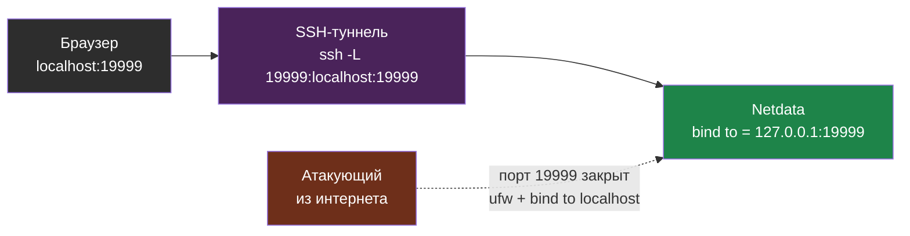

# Глава 5: Метрики в реальном времени — Netdata

> **Запомни:** Ты не можешь смотреть в терминал 24/7. Netdata смотрит за тебя и показывает всё в браузере.

---

## 5.1 Зачем Netdata а не Prometheus+Grafana

Прежде чем сравнивать — давай разберёмся, что это за звери.

### Что такое Netdata?

Netdata — это **одна программа, которая делает всё сразу**: собирает метрики (CPU, RAM, диск, сеть, Docker, Nginx, PostgreSQL — сотни показателей), рисует красивые графики в браузере и даже имеет встроенные алерты. 

Установил одну команду, открыл `http://server:19999` — и уже видишь дашборд. Ничего настраивать не нужно.

**Netdata — это «всё-в-одном» для одного сервера.**

### Что такое Prometheus + Grafana?

Это **две разные программы**, которые работают в связке:

- **Prometheus** — база данных для метрик. Он сам ходит к сервисам (их называют «экспортеры») и забирает показатели: «сколько CPU?», «сколько RAM?». Хранит историю — можешь посмотреть график за прошлую неделю. Но встроенного красивого интерфейса у Prometheus нет — только примитивные графики и таблицы.

- **Grafana** — рисует красивые дашборды. Grafana **сама не собирает метрики**. Она подключается к Prometheus (как к источнику данных) и показывает графики: «вот CPU за неделю», «вот как рос диск», «вот когда упал Docker».

**Prometheus + Grafana = разделение труда: Prometheus хранит данные, Grafana их показывает.**

Но чтобы это заработало, тебе нужно поднять и настроить минимум 3 сервиса: Prometheus, Grafana и Node Exporter (программа-сборщик метрик с сервера). Это требует времени и понимания, как они связаны.

### Что выбрать?

| | Netdata | Prometheus + Grafana |
|--|---------|---------------------|
| Суть | Одна программа — готовый дашборд | Две программы: база метрик (Prometheus) + визуализация (Grafana) |
| Установка | 1 команда | 3+ сервиса |
| Настройка | 0 | Часы |
| Красивый дашборд | Есть из коробки | Нужно настраивать |
| История метрик | Ограниченная (часы) | Недели и месяцы |
| Для одного сервера | ✅ Идеально | Избыточно |
| Для кластера | ❌ | ✅ |

Для одного сервера — Netdata более чем достаточно. Prometheus + Grafana имеет смысл, когда у тебя 5+ серверов и нужно сводить все метрики в один дашборд. Этим мы займёмся в книге 38 «Мониторинг с нуля», а пока — просто ставим Netdata.

---

## 5.2 Установка

```bash
wget -O /tmp/netdata-kickstart.sh https://get.netdata.cloud/kickstart.sh
sh /tmp/netdata-kickstart.sh --stable-channel --disable-telemetry
```

`--disable-telemetry` = не отправлять данные разработчикам.

### Проверить

```bash
systemctl status netdata
```

---

## 5.3 Что показывает

Открой: `http://server-ip:19999`

### Из коробки

| Метрика | Что видишь |
|---------|-----------|
| CPU | Общий + по ядрам |
| RAM | Используется / кеш / свободно |
| Диск | I/O, занятое место |
| Сеть | Входящий/исходящий трафик |
| Процессы | Топ по CPU и памяти |
| Docker | CPU/RAM каждого контейнера |
| Nginx | Запросы, коды ответов, таймауты |
| PostgreSQL | Коннекты, запросы, блокировки |

---

## 5.4 Закрыть от интернета

Netdata по умолчанию доступна всем. Это плохо.

### Ограничить localhost

```bash
sudo nano /etc/netdata/netdata.conf
```

```ini
[web]
    bind to = 127.0.0.1
```

```bash
sudo systemctl restart netdata
```

Теперь Netdata только на `localhost:19999`.

### Подключиться через SSH-туннель

На своей машине:

```bash
ssh -L 19999:localhost:19999 deploy@server-ip
```

Открой: `http://localhost:19999`

Трафик идёт через зашифрованный SSH-туннель. Никто снаружи не видит.

Схема доступа: Netdata слушает только `localhost` сервера, а твой браузер достаёт его через проброшенный SSH-порт. Снаружи порт 19999 закрыт полностью.



> **Запомни:** Никогда не открывай Netdata наружу.
> Там все метрики сервера — лакомый кусок для злоумышленника.

---

## 5.5 Встроенные алерты

Netdata уже имеет алерты по умолчанию:

| Алерт | Порог |
|-------|-------|
| CPU > 85% | 5 минут |
| Диск > 85% | мгновенно |
| RAM < 10% свободно | 5 минут |
| Docker контейнер упал | мгновенно |

Где посмотреть:

```
Netdata → Alerts → Active
```

Но они только в UI. В Главе 6 настроим Telegram-алерты.

---

## 📝 Упражнения

### Упражнение 5.1: Установить Netdata
**Задача:**
1. Установи: `sh /tmp/netdata-kickstart.sh --stable-channel --disable-telemetry`
2. Проверь: `systemctl status netdata`
3. Открой: `http://server-ip:19999`

### Упражнение 5.2: Закрыть от интернета
**Задача:**
1. Настрой `bind to = 127.0.0.1` в netdata.conf
2. Перезапусти: `sudo systemctl restart netdata`
3. Подключись через SSH-туннель: `ssh -L 19999:localhost:19999 deploy@server`
4. Открой: `http://localhost:19999`

### Упражнение 5.3: Изучить метрики
**Задача:**
1. Найди контейнер с максимальным потреблением RAM
2. Найди сколько CPU использует Nginx
3. Найди сколько места на диске
4. Посмотри алерты: Alerts → Active

### Упражнение 5.4: Нагрузка
**Задача:**
1. Создай нагрузку: `stress --cpu 2 --timeout 30` (установи если нет)
2. Смотри как реагирует Netdata
3. CPU вырос? Как быстро Netdata показал?

### Упражнение 5.5: DevOps Think
**Задача:** «Netdata показывает что диск заполнен на 90%. Но `df -h` показывает 45%. Почему?»

Подсказки:
1. Netdata смотрит на корневой раздел `/`
2. `df -h` покажет все разделы
3. Может быть другой раздел заполнен
4. Или Docker volume на другом разделе
5. Проверь: `df -h` и сравни с Netdata

---

## 📋 Чеклист главы 5

- [ ] Netdata установлен
- [] Открыл дашборд в браузере
- [ ] Закрыл от интернета (bind to = 127.0.0.1)
- [ ] Могу подключиться через SSH-туннель
- [ ] Нашёл метрики CPU, RAM, диск, сеть
- [ ] Нашёл метрики Docker-контейнеров
- [ ] Посмотрел встроенные алерты

**Всё отметил?** Переходи к Главе 6 — алерты в Telegram.
