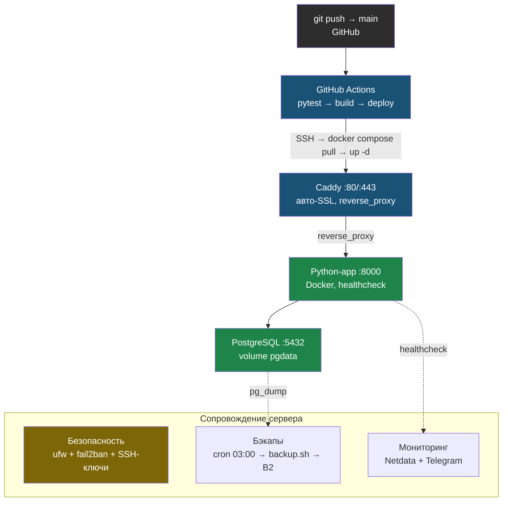

# Финальный проект: Production-сервер с нуля

> Модуль 7 — итоговый. Никакой теории. Только команды, порядок, проверки.

---

## Что будет на сервере

```
GitHub
  │  git push → main
  ▼
GitHub Actions
  │  1. pytest
  │  2. docker build → ghcr.io/user/repo:SHA
  │  3. SSH → сервер → docker compose pull → up -d
  ▼
Сервер Ubuntu
  │
  ├── [Caddy :80/:443]  ← авто-SSL, reverse_proxy
  │       │
  │       ▼
  ├── [Python-app :8000]  ← Docker, healthcheck
  │       │
  │       ▼
  ├── [PostgreSQL :5432]  ← volume pgdata
  │
  ├── Безопасность: ufw + fail2ban + SSH-ключи
  ├── Бэкапы: cron 03:00 → backup.sh → rclone → B2
  └── Мониторинг: Netdata + Telegram-алерты
```

Та же архитектура в виде схемы — поток запроса и связи компонентов на сервере:



---

## Как пользоваться

1. Открой `playbook.md` — иди сверху вниз, не пропускай фазы
2. Каждая фаза заканчивается проверкой — убедись что всё ок
3. После всех фаз открой `checklist.md` — пройди 30 пунктов
4. Если что-то не прошло — вернись к соответствующему модулю курса
5. Прошёл всё? Проверь себя на тренажёре `debug-drill.md` — 8 типичных поломок этого сервера

Дополнительно:

- [**Тренажёр: найди и почини**](debug-drill.md) — 8 сломанных сценариев с симптомами и разбором
- [**Глоссарий**](glossary.md)

| Фаза | Что настраиваешь | Модуль |
|------|-----------------|--------|
| 0 | Подготовка (до сервера) | — |
| 1 | Сервер: SSH, ufw, пользователь | М1, М2, М6 |
| 2 | Docker | М3 |
| 3 | Структура проекта | М3 |
| 4 | Переменные окружения (.env) | М5 |
| 5 | docker-compose.yml | М3 |
| 6 | Caddy (reverse proxy + SSL) | М2 |
| 7 | Первый деплой | М3 |
| 8 | Миграции БД | М5 |
| 9 | Бэкапы | М5 |
| 10 | fail2ban | М6 |
| 11 | Автообновления | М6 |
| 12 | Netdata | М6 |
| 13 | Telegram-алерты | М6 |
| 14 | CI/CD GitHub Actions | М4 |

---

## Стартовая модель

Тип проекта: **отдельный production capstone с чистого сервера**.

Ты не продолжаешь учебный сервер из книг 2-6. Этот проект нужен, чтобы собрать весь путь заново на новом сервере: SSH, Docker, Caddy, PostgreSQL, бэкапы, мониторинг и CI/CD.

Лучший вариант:
- новый VPS;
- чистая Ubuntu Server 22.04/24.04;
- root-доступ только на первичную настройку;
- домен уже указывает A-записью на IP сервера.

Если хочешь использовать старую VM из курса, сначала откатись к чистому снапшоту или переустанови Ubuntu. Не пытайся проходить этот playbook поверх сервера, где уже живут старые Nginx-конфиги, Docker Compose проекты, cron-задачи и тестовые пользователи: ты потратишь время на конфликты, а не на закрепление.

---

## Что нужно до начала

- ✅ Сервер Ubuntu 22.04/24.04 (root-доступ)
- ✅ Домен с A-записью на IP сервера
- ✅ GitHub-репозиторий с Python-приложением
- ✅ Telegram-бот (токен + chat_id)
- ✅ Backblaze B2 bucket (или S3)
