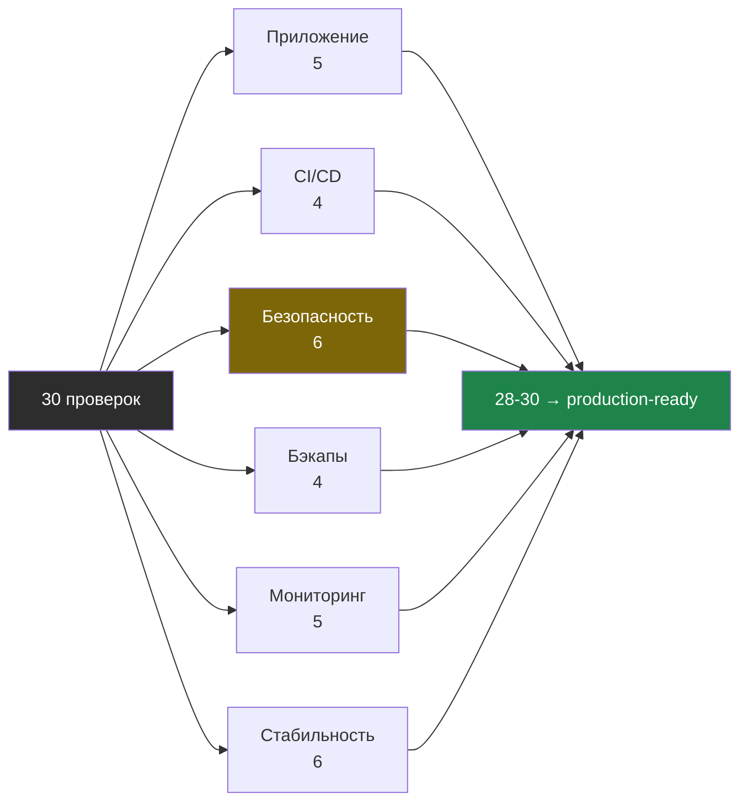

# Финальный чеклист: 30 пунктов

> Только проверки. Не прошло — иди к нужной фазе в `playbook.md` или к соответствующему модулю.

30 пунктов делятся на 6 секций — порог приёмки и распределение проверок:

---

## Приложение (5 пунктов)

- [ ] `curl https://domain.ru` → 200 OK
- [ ] `curl http://domain.ru` → 301 redirect на HTTPS
- [ ] `curl http://localhost:8000/health` → `{"status": "ok"}`
- [ ] `docker compose ps` → все контейнеры `Up (healthy)`
- [ ] `docker compose logs --tail=10 app` → нет ошибок

---

## CI/CD (4 пункта)

- [ ] `git commit --allow-empty -m "test" && git push` → деплой прошёл
- [ ] GitHub Actions: все 3 jobs (test, build, deploy) → зелёные
- [ ] `cat /opt/myapp/.env | grep IMAGE_TAG` → SHA коммита
- [ ] Сломанный тест → merge заблокирован, деплой не запускался

---

## Безопасность (6 пунктов)

- [ ] `ssh -o PreferredAuthentications=password deploy@IP` → Permission denied
- [ ] `grep PermitRootLogin /etc/ssh/sshd_config` → `no`
- [ ] `sudo ufw status` → открыты только 22, 80, 443
- [ ] `sudo fail2ban-client status sshd` → jail активен
- [ ] `sudo fail2ban-client status` → Total banned > 0
- [ ] `stat -c "%a" /opt/myapp/.env` → 600

---

## Бэкапы (4 пункта)

- [ ] `/opt/myapp/scripts/backup.sh` → завершается с "Backup OK"
- [ ] `/var/backups/myapp/` → есть директория с датой, внутри db.sql.gz
- [ ] `rclone ls remote:myapp-backup/` → файл в облаке
- [ ] `cat /etc/cron.d/myapp-backup` → cron на 03:00

---

## Мониторинг (5 пунктов)

- [ ] `systemctl status netdata` → active (running)
- [ ] `grep "bind to" /etc/netdata/netdata.conf` → `127.0.0.1`
- [ ] SSH-туннель → `http://localhost:19999` → Netdata открылся
- [ ] `/opt/myapp/scripts/health-monitor.sh` → сообщение пришло в Telegram
- [ ] `cat /etc/cron.d/myapp-monitor` → каждые 5 минут + ежедневный отчёт

---

## Стабильность (6 пунктов)

- [ ] `sudo reboot` → после перезагрузки все сервисы поднялись
- [ ] `docker compose stop app && sleep 10 && docker compose ps` → app restarted
- [ ] `df -h` → диск заполнен < 70%
- [ ] `free -h` → RAM доступно > 500MB
- [ ] `systemctl status unattended-upgrades` → active
- [ ] `docker system df` → reclaimable < 1GB

---

## Итого: __/30

| Секция | Результат |
|--------|-----------|
| Приложение | _/5 |
| CI/CD | _/4 |
| Безопасность | _/6 |
| Бэкапы | _/4 |
| Мониторинг | _/5 |
| Стабильность | _/6 |
| **Итого** | **_/30** |

**28-30/30** — production-ready ✅
**20-27/30** — почти, доделай что не прошло
**< 20/30** — пройди playbook заново
