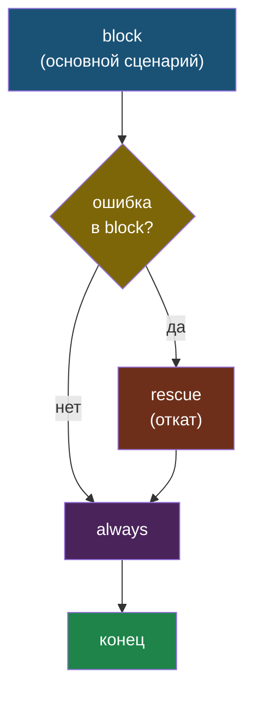
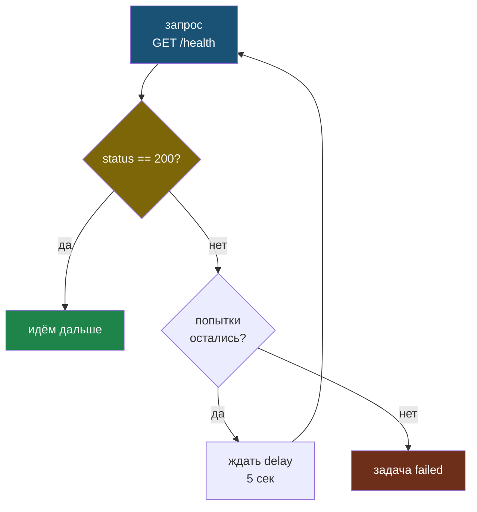

# Глава 8: Loops и conditions

> **Запомни:** Не пиши 10 одинаковых задач. Один loop — 10 итераций.
>
> **Проект этой главы:** делаем деплой практичнее: пакеты списком, пользователи списком, ожидание старта приложения и откат при ошибке.
> К концу книги: Flask-приложение за Nginx, деплой одной командой.

---

## 8.1 `loop` — список

```yaml
- name: Установить пакеты
  apt:
    name: "{{ item }}"
    state: present
  loop:
    - nginx
    - python3
    - python3-pip
    - git
    - htop
```

Это уже ближе к реальному деплою: один task ставит весь набор пакетов для проекта.

---

## 8.2 `loop` со словарями

```yaml
- name: Создать пользователей
  user:
    name: "{{ item.name }}"
    groups: "{{ item.groups }}"
  loop:
    - { name: deploy, groups: sudo }
    - { name: metrics, groups: adm }
    - { name: readonly, groups: www-data }
```

Так удобно создавать не только пользователей, но и директории, firewall-правила, systemd-unit файлы и любые объекты с несколькими полями.

---

## 8.3 `when` — условие

```yaml
- name: Установить nginx
  apt:
    name: nginx
  when: ansible_os_family == "Debian"

- name: Перезапустить если изменился конфиг
  service:
    name: nginx
    state: reloaded
  when: nginx_config.changed
```

`when` особенно полезен в деплое, когда часть шагов зависит от ОС, переменных окружения или результата прошлой задачи.

---

## 8.4 `block / rescue / always`

```yaml
- block:
    - name: risky task
      command: /usr/local/bin/risky-script

  rescue:
    - name: откатить
      command: /usr/local/bin/rollback

  always:
    - name: лог
      debug:
        msg: "Task completed (or failed)"
```

Это аналог `try / catch / finally`:

- `block` — основной сценарий;
- `rescue` — что делать при ошибке;
- `always` — что выполнить в любом случае.

Поток выполнения зависит от того, упала ли задача внутри `block`: `rescue` запускается только при ошибке, а `always` — всегда.



Если `rescue` сам отработал без ошибки, play продолжается дальше как обычно: Ansible считает, что сбой обработан.

---

## 8.5 `until` — ждать пока условие выполнится

После деплоя сервис часто стартует не мгновенно. Нужна пауза с повторной проверкой:

```yaml
- name: Подождать пока приложение запустится
  uri:
    url: http://localhost:8000/health
    status_code: 200
  register: result
  until: result.status == 200
  retries: 10
  delay: 5
```

`retries: 10` и `delay: 5` означают максимум 50 секунд ожидания.

Механика `until` — это цикл с проверкой: задача повторяется, пока условие не станет истинным или не закончатся попытки.



Это типичная задача после запуска Flask/Gunicorn/systemd-сервиса: не переходить дальше, пока приложение реально не поднялось.

---

## 8.6 Реальный пример `block / rescue` при деплое

```yaml
- block:
    - name: Остановить приложение
      systemd:
        name: myapp
        state: stopped

    - name: Скопировать новую версию
      copy:
        src: dist/
        dest: /opt/myapp/

    - name: Запустить приложение
      systemd:
        name: myapp
        state: started

    - name: Проверить что запустилось
      uri:
        url: http://localhost:8000/health
        status_code: 200

  rescue:
    - name: ОТКАТ — запустить старую версию
      systemd:
        name: myapp
        state: started

    - name: Уведомить об ошибке
      debug:
        msg: "Деплой упал! Выполнен откат."

  always:
    - name: Записать результат деплоя в лог
      lineinfile:
        path: /var/log/deploy.log
        line: "{{ ansible_date_time.iso8601 }} deploy finished"
        create: yes
```

Это уже реальный deploy-with-rollback сценарий:

- пробуем новый релиз;
- если он не поднялся, возвращаем рабочее состояние;
- в любом случае пишем результат в лог.

---

## 📝 Упражнения

### Упражнение 8.1: Loop
**Задача:**
1. Создай `loop` для установки 5 пакетов
2. Запусти — все 5 установились?

### Упражнение 8.2: when
**Задача:**
1. Создай задачу только для Ubuntu
2. Запусти на разных серверах — сработала только на Ubuntu?

### Упражнение 8.3: until
**Задача:**
1. Запусти сервис через `systemd`
2. Добавь задачу с `until`: жди пока порт откроется (`uri` или `wait_for`)
3. Поставь `retries: 5`, `delay: 3`
4. Что произойдёт если сервис не поднимется за 15 секунд?

---

## 📋 Чеклист главы 8

- [ ] Я могу использовать `loop` для списков и словарей
- [ ] Я могу использовать `when` для условий
- [ ] Я понимаю `block / rescue / always`
- [ ] Я могу использовать `until` чтобы дождаться сервиса

**Всё отметил?** Переходи к Главе 9 — Тестирование.
