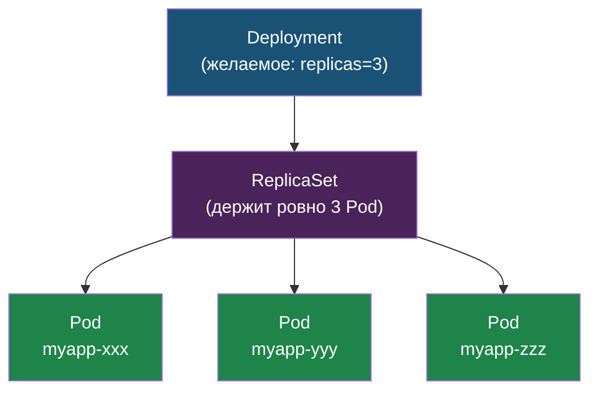
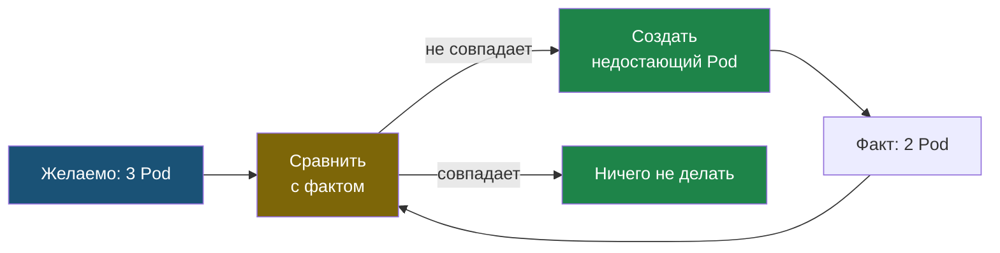

# Глава 2: Deployment — управление репликами

> **Запомни:** Deployment = контроллер который следит за Pod'ами. Убей Pod → Deployment поднимет новый.

Deployment управляет Pod'ами не напрямую, а через промежуточный объект ReplicaSet:



Каждая версия образа порождает свой ReplicaSet — именно поэтому возможен откат к предыдущей ревизии.

---

## 2.1 Манифест

```yaml
apiVersion: apps/v1
kind: Deployment
metadata:
  name: myapp
spec:
  replicas: 3
  selector:
    matchLabels:
      app: myapp
  template:
    metadata:
      labels:
        app: myapp
    spec:
      containers:
      - name: app
        image: python:3.12-slim
        command: ["python", "-m", "http.server", "8000"]
        ports:
        - containerPort: 8000
        resources:
          requests:
            memory: "64Mi"
            cpu: "50m"
          limits:
            memory: "128Mi"
            cpu: "100m"
```

---

## 2.2 Самовосстановление

```bash
kubectl apply -f deployment.yaml
kubectl get pods
# myapp-xxx  Running
# myapp-yyy  Running
# myapp-zzz  Running

# Убить один Pod
kubectl delete pod myapp-xxx

# Наблюдать в watch:
# myapp-xxx  Terminating
# myapp-aaa  Pending → Running  ← новый!
```

Deployment заметил что Pod'ов стало 2 вместо 3 → создал новый.

Это и есть reconciliation loop — цикл сверки желаемого и фактического состояния, который крутится постоянно:



K8s не выполняет команды разово — он непрерывно приводит кластер к желаемому состоянию.

---

## 2.3 Масштабирование

```bash
kubectl scale deployment myapp --replicas=5
kubectl get pods
# 5 Pod'ов!
```

---

## 2.4 Rolling update

```bash
kubectl set image deployment/myapp app=python:3.11-slim
kubectl rollout status deployment/myapp
```

```text
Waiting for deployment "myapp" rollout to finish: 1 out of 3 new replicas updated...
Waiting for deployment "myapp" rollout to finish: 2 out of 3 new replicas updated...
Waiting for deployment "myapp" rollout to finish: 1 old replicas are pending termination...
deployment "myapp" successfully rolled out
```

K8s обновляет Pod'ы по одному без даунтайма: сначала поднимает новый Pod, потом удаляет старый.

---

## 2.5 Откат

Если новая версия сломана:

```bash
kubectl rollout undo deployment/myapp
```

```text
deployment.apps/myapp rolled back
```

История ревизий:

```bash
kubectl rollout history deployment/myapp
```

```text
REVISION  CHANGE-CAUSE
1         kubectl apply --filename=deployment.yaml
2         kubectl set image deployment/myapp app=python:3.11-slim
```

---

## 📝 Упражнения

### Упражнение 2.1: Самовосстановление
**Задача:**
1. Создай Deployment с 3 репликами
2. `watch kubectl get pods` — запусти в другом терминале
3. Убей один Pod — новый поднялся?

### Упражнение 2.2: Масштабирование
**Задача:**
1. `kubectl scale deployment myapp --replicas=5`
2. 5 Pod'ов?
3. `kubectl scale deployment myapp --replicas=2`
4. 2 Pod'а остались?

### Упражнение 2.3: Rolling update и откат
**Задача:**
1. Обнови образ через `kubectl set image`
2. `kubectl rollout status deployment/myapp` — видишь процесс обновления?
3. `kubectl rollout history deployment/myapp` — появилась новая ревизия?
4. Выполни `kubectl rollout undo deployment/myapp`

---

## 📋 Чеклист главы 2

- [ ] Я могу создать Deployment
- [ ] Я вижу самовосстановление (убил → поднялся)
- [ ] Я могу масштабировать (`kubectl scale`)
- [ ] Я понимаю rolling update

**Всё отметил?** Переходи к Главе 3 — Service.
