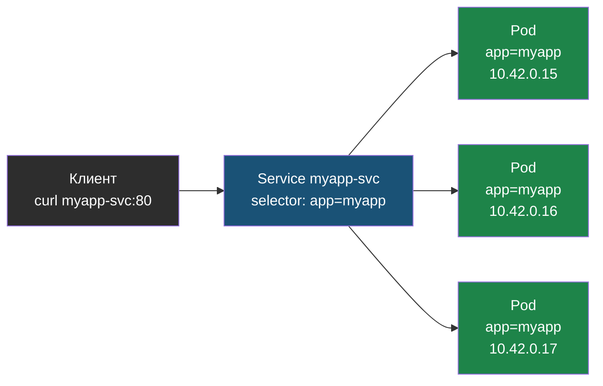

# Глава 3: Service — сетевой доступ

> **Запомни:** Pods получают случайные IP. Service = стабильный адрес для группы Pods.

---

## 3.1 ClusterIP (по умолчанию)

```yaml
apiVersion: v1
kind: Service
metadata:
  name: myapp-svc
spec:
  selector:
    app: myapp
  ports:
  - port: 80
    targetPort: 8000
```

Доступен только внутри кластера.

```bash
kubectl get services
# myapp-svc  ClusterIP  10.43.x.x  80/TCP
```

Другие Pods обращаются: `curl http://myapp-svc:80`

Как проверить что Service реально нашёл нужные Pod:

```bash
kubectl describe service myapp-svc
```

```text
Name:              myapp-svc
Selector:          app=myapp
Endpoints:         10.42.0.15:8000,10.42.0.16:8000,10.42.0.17:8000
                   ↑ три Pod'а нашлись
```

Если видишь:

```text
Endpoints:         <none>
```

значит labels не совпадают. Проверить:

```bash
kubectl get pods --show-labels
# myapp-xxx   Running   app=myapp
```

---

## 3.2 NodePort (для тестов)

```yaml
spec:
  type: NodePort
  ports:
  - port: 80
    targetPort: 8000
    nodePort: 30080
```

Доступен снаружи: `http://node-ip:30080`

---

## 3.3 Как Service находит Pods

Через labels:

```
Service selector: app=myapp
    ↓
Находит Pods с label: app=myapp
    ↓
Балансирует трафик между ними
```

Service по selector держит актуальный список Endpoints и распределяет на них трафик:



Если ни один Pod не подходит под selector — список Endpoints пуст (`<none>`), и Service отдаёт ошибку соединения.

---

## 3.4 Тестировать Service изнутри кластера

Самый полезный тест ClusterIP Service:

```bash
kubectl run test --image=curlimages/curl --rm -it --restart=Never \
  -- curl http://myapp-svc:80
```

Если приложение ответило, значит Service работает внутри кластера.

---

## 📝 Упражнения

### Упражнение 3.1: ClusterIP
**Задача:**
1. Создай Service (ClusterIP)
2. `kubectl get services` — появился?
3. Подключись из другого Pod: `kubectl exec -it <other-pod> -- curl http://myapp-svc:80`

### Упражнение 3.2: NodePort
**Задача:**
1. Измени тип на NodePort
2. `curl http://node-ip:30080` — работает?

### Упражнение 3.3: Проверить Endpoints
**Задача:**
1. Запусти `kubectl describe service myapp-svc`
2. В `Endpoints` видны Pod'ы?
3. Временно сломай label у Pod template
4. `Endpoints: <none>` появился?

---

## 📋 Чеклист главы 3

- [ ] Я понимаю зачем Service (стабильный адрес)
- [ ] Я могу создать ClusterIP Service
- [ ] Я могу создать NodePort Service
- [ ] Я понимаю как Service находит Pods (labels)

**Всё отметил?** Переходи к Главе 4 — ConfigMap и Secret.
