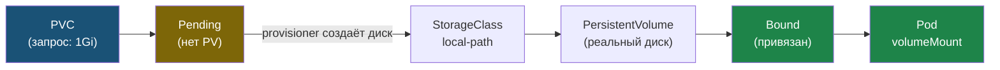

# Глава 5: Volume и PersistentVolume

> **Запомни:** Данные в Pod временные. PVC = постоянный диск который переживает пересоздание Pod.

---

## 5.1 PersistentVolumeClaim

```yaml
apiVersion: v1
kind: PersistentVolumeClaim
metadata:
  name: pgdata
spec:
  accessModes:
  - ReadWriteOnce
  resources:
    requests:
      storage: 1Gi
```

### Использовать в Pod

```yaml
volumes:
- name: pgdata
  persistentVolumeClaim:
    claimName: pgdata
containers:
- name: postgres
  volumeMounts:
  - name: pgdata
    mountPath: /var/lib/postgresql/data
```

---

## 5.2 Проверить

```bash
kubectl get pvc
# pgdata  Bound  1Gi

kubectl get pv
# pvc-xxx  1Gi  Bound
```

Если PVC завис в `Pending`:

```bash
kubectl get pvc
# pgdata  Pending
```

```bash
kubectl describe pvc pgdata
```

```text
Events:
  Warning  ProvisioningFailed  storageclass.storage.k8s.io "standard" not found
```

Что делать: проверить доступные `StorageClass`:

```bash
kubectl get storageclass
```

В `k3s` по умолчанию обычно есть `local-path`, поэтому PVC часто нужно явно дополнить:

```yaml
spec:
  storageClassName: local-path
```

Как PVC проходит путь от запроса к подключению в Pod:



PVC завис в `Pending`, если подходящего `StorageClass` нет — диск просто некому создать.

---

## 5.3 AccessModes — что значат

| AccessMode | Что значит | Типичное использование |
|---|---|---|
| `ReadWriteOnce` | Один Pod пишет | PostgreSQL, одиночные БД |
| `ReadOnlyMany` | Много Pod'ов читают | Shared assets |
| `ReadWriteMany` | Много Pod'ов пишут | NFS, distributed storage |

> **Правило:** Для PostgreSQL почти всегда `ReadWriteOnce`.
> Базу нельзя безопасно писать из нескольких Pod одновременно.

---

## 📝 Упражнения

### Упражнение 5.1: PVC
**Задача:**
1. Создай PVC и Deployment с PostgreSQL
2. Наполни данными
3. Удали Pod → новый поднялся → данные сохранились?

### Упражнение 5.2: Pending PVC
**Задача:**
1. Создай PVC без `storageClassName`
2. Если он завис в `Pending` — запусти `kubectl describe pvc pgdata`
3. Посмотри `kubectl get storageclass`
4. Добавь правильный `storageClassName` и добейся `Bound`

---

## 📋 Чеклист главы 5

- [ ] Я могу создать PVC
- [ ] Я могу подключить PVC к Pod
- [ ] Данные сохраняются при пересоздании Pod

**Всё отметил?** Переходи к Главе 6 — Namespace.
