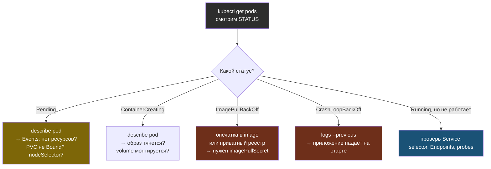

# Глава 11: Диагностика — когда что-то сломалось

> **Запомни:** 90% проблем в Kubernetes решаются тремя командами: `kubectl get`, `kubectl describe` и `kubectl logs`. Не угадывай — спроси у кластера, что не так.

---

В реальной работе джуна большая часть времени с Kubernetes — это не «написал манифест и всё заработало», а «задеплоил, а оно не поднимается, почему?». Эта глава — про то, как находить причину быстро и по шагам, а не тыкать наугад.

## 11.1 Золотое правило диагностики

Всегда иди от общего к частному:

```
1. kubectl get pods          → какой статус? (Pending / CrashLoop / Running)
2. kubectl describe pod NAME  → раздел Events внизу: что говорит кластер?
3. kubectl logs NAME          → что говорит само приложение?
```

`Events` в выводе `describe` — это дневник Pod'а: что планировщик пытался сделать, почему не смог скачать образ, почему не хватило ресурсов. **Читай его первым.**



> **Запомни:** `kubectl get events --sort-by='.lastTimestamp'` показывает события всего namespace по времени — удобно, когда непонятно, какой именно объект сломался.

## 11.2 Pod завис в `Pending`

`Pending` означает: Pod создан, но планировщик **не смог поставить его на ноду**. Причина — почти всегда в `describe`:

```bash
kubectl describe pod myapp
```

Частые причины в `Events`:

- **`Insufficient cpu/memory`** — на нодах нет столько ресурсов, сколько ты запросил в `requests`. Уменьши `requests` или добавь ноду.
- **`pod has unbound immediate PersistentVolumeClaims`** — PVC не получил том. Проверь `kubectl get pvc` (см. главу 5).
- **`node(s) didn't match node selector / taint`** — ты указал `nodeSelector` или нода в `taint`, и Pod некуда ставить (про taints — глава 12).

## 11.3 `CrashLoopBackOff` — приложение падает на старте

Контейнер запускается, падает, K8s его перезапускает, он снова падает — и так по кругу с растущей задержкой. **Кластер тут ни при чём — падает само приложение.** Смотри его логи:

```bash
kubectl logs myapp                 # текущий (часто уже пустой — контейнер только перезапустился)
kubectl logs myapp --previous      # логи ПРЕДЫДУЩЕГО упавшего запуска — то, что нужно
```

Типичное в логах: не подключилась база (неверный `DATABASE_URL`), нет обязательной переменной окружения, опечатка в команде запуска, файл конфига не найден.

> **Запомни:** при `CrashLoopBackOff` всегда смотри `logs --previous`. Текущий контейнер живёт доли секунды, и обычный `logs` часто пустой.

## 11.4 `ImagePullBackOff` / `ErrImagePull`

Kubernetes не смог скачать образ. Причины:

- **Опечатка в имени или теге** (`nginx:latests` вместо `latest`) — самое частое.
- **Образа нет в реестре** (забыл `docker push`).
- **Приватный реестр без доступа** — нужен `imagePullSecret`.

```bash
kubectl describe pod myapp | grep -A5 Events
# Failed to pull image "myapp:v2": not found
```

## 11.5 «Service не работает» — Pod есть, а доступа нет

Самая коварная категория, потому что Pod в `Running`, но снаружи не отвечает. Проверяй по цепочке:

```bash
kubectl get endpoints myapp        # ПУСТО? значит Service не нашёл ни одного Pod
```

**Пустые Endpoints = `selector` Service не совпадает с `labels` Pod'ов.** Это причина №1. Сверь:

```bash
kubectl get pods --show-labels
kubectl describe service myapp | grep Selector
```

Если Endpoints не пустые, но доступа всё равно нет — проверь сетевой путь и DNS:

```bash
# DNS внутри кластера: резолвится ли имя сервиса?
kubectl run test --rm -it --image=busybox --restart=Never -- nslookup myapp
```

Не резолвится — проблема в **CoreDNS** (внутренний DNS кластера). Проверь, что он жив:

```bash
kubectl get pods -n kube-system -l k8s-app=kube-dns
```

> **Запомни:** «Service не резолвится» в 9 из 10 случаев — это несовпадение `selector` ↔ `labels`, а не «сломался DNS». Сначала смотри `kubectl get endpoints`.

## 11.6 `Node NotReady`

Если `kubectl get nodes` показывает ноду как `NotReady` — на ней сломался `kubelet` (агент, который запускает Pod'ы) или пропала сеть/диск.

```bash
kubectl describe node NODENAME     # Conditions: MemoryPressure, DiskPressure, Ready=False
```

Дальше диагностика уходит **на саму ноду** (по SSH):

```bash
systemctl status k3s           # или kubelet — жив ли агент
journalctl -u k3s -n 100       # логи агента: out of disk? сертификат протух?
df -h                          # не забит ли диск (DiskPressure)
```

## 11.7 `kubectl debug` — дебаг без перезапуска

Раньше, чтобы заглянуть в проблемный Pod, в него добавляли отладочные утилиты и пересобирали образ. Современный способ — **ephemeral containers**: подсадить временный контейнер с инструментами в уже работающий Pod, ничего не перезапуская:

```bash
kubectl debug -it myapp --image=busybox --target=myapp
# внутри: ping, nslookup, wget, ps — всё, чего нет в «тонком» образе приложения
```

Особенно полезно для distroless/`scratch`-образов, где нет даже `sh`.

```bash
# Скопировать упавший Pod с шеллом вместо команды — чтобы разобраться «руками»
kubectl debug myapp --copy-to=myapp-debug --container=myapp -- sh
```

## 11.8 Заглянуть ещё глубже (на будущее)

- **`crictl`** — как `docker`, но для container runtime на ноде (`crictl ps`, `crictl logs`). Пригодится, когда `kubectl` ещё не видит Pod, но контейнер уже где-то крутится.
- **CNI** (Flannel / Calico / Cilium) — плагин, отвечающий за сеть между Pod'ами. Если Pod'ы не видят друг друга по сети, а CoreDNS жив — копай в сторону CNI (`kubectl get pods -n kube-system`). Подробнее — в главе 12 и Томе 11.

## 11.9 Упражнение: «Найди баг»

Ниже 4 манифеста с типичными ошибками. Найди проблему в каждом, **не запуская** — только глазами. Ответы в конце.

**Манифест №1**
```yaml
apiVersion: apps/v1
kind: Deployment
metadata:
  name: web
spec:
  replicas: 2
  selector:
    matchLabels:
      app: web
  template:
    metadata:
      labels:
        app: webapp
    spec:
      containers:
        - name: web
          image: nginx:1.27
```

**Манифест №2**
```yaml
apiVersion: v1
kind: Service
metadata:
  name: api
spec:
  selector:
    app: api
  ports:
    - port: 80
      targetPort: 8080
---
# Pod с приложением:
#   labels: { app: backend }
#   контейнер слушает порт 8080
```

**Манифест №3**
```yaml
apiVersion: v1
kind: Pod
metadata:
  name: cache
spec:
  containers:
    - name: redis
      image: redis:7
      resources:
        requests:
          memory: "16Gi"
          cpu: "8"
```

**Манифест №4**
```yaml
apiVersion: apps/v1
kind: Deployment
metadata:
  name: worker
spec:
  replicas: 1
  selector:
    matchLabels:
      app: worker
  template:
    metadata:
      labels:
        app: worker
    spec:
      containers:
        - name: worker
          image: mycompany/wokrer:v1
```

---

**Ответы:**

1. **Несовпадение меток.** `selector.matchLabels: app=web`, а у Pod'а `labels: app=webapp`. Deployment не «усыновит» свои же Pod'ы → ошибка валидации / 0 готовых реплик. Сделай метки одинаковыми.
2. **Service не найдёт Pod'ы.** `selector: app=api`, а у Pod'а `app=backend`. `kubectl get endpoints api` будет пустым. Причина №1 из раздела 11.5.
3. **Pod зависнет в `Pending`.** Запрошено 16 ГБ памяти и 8 ядер — на учебной ноде столько нет → `Insufficient memory/cpu` в Events. Уменьши `requests`.
4. **`ImagePullBackOff`.** Опечатка в образе: `wokrer` вместо `worker`. Реестр вернёт «not found».

---

## 📋 Чеклист главы 11

- [ ] Я начинаю диагностику с `get → describe → logs`
- [ ] Я знаю, что Events в `describe` — это первое, что нужно читать
- [ ] Я понимаю разницу: `Pending` (планировщик), `CrashLoopBackOff` (приложение), `ImagePullBackOff` (образ)
- [ ] При `CrashLoopBackOff` я смотрю `logs --previous`
- [ ] Я проверяю `kubectl get endpoints`, когда «Service не работает»
- [ ] Я умею подсадить отладочный контейнер через `kubectl debug`

**Всё отметил?** Переходи к Главе 12 — карта продвинутых тем.
