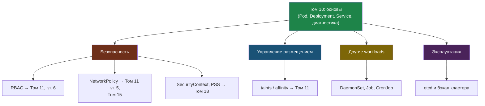

# Глава 12: Куда дальше — карта продвинутых тем

> **Запомни:** Базовый K8s ты уже знаешь: Pod, Deployment, Service, ConfigMap, Volume, Namespace и диагностику. Эта глава — карта: что учить следующим и где про это читать, чтобы не утонуть.

---

Не нужно учить всё сразу. Ниже — темы, которые встретятся в реальной работе, с одним абзацем «зачем» и ссылкой, где разобрано подробно. Возвращайся сюда, когда дорастёшь до конкретной задачи.



## 12.1 RBAC — кто что может делать в кластере

По умолчанию у приложений и людей слишком много прав. **RBAC** (Role-Based Access Control) ограничивает: `Role`/`ClusterRole` описывают разрешения, `RoleBinding` выдаёт их `ServiceAccount` или пользователю. Это то, что обязательно настраивают в проде.

➡️ Подробно — **Том 11 «Kubernetes: продвинутый», Глава 6 (RBAC)**.

## 12.2 NetworkPolicy — фаервол для Pod'ов

По умолчанию в кластере **все Pod'ы видят всех**. `NetworkPolicy` закрывает лишние связи: например, к базе ходит только бэкенд, а не весь кластер (модель «default deny»).

➡️ Подробно — **Том 11, Глава 5 (NetworkPolicy)**, и принципы сегментации — **Том 15 «Защита периметра»**.

## 12.3 Управление размещением — taints, affinity

Когда нод становится больше одной, ты захочешь управлять, **куда** попадают Pod'ы:

- **taints / tolerations** — «пометить» ноду так, чтобы на неё не ставили обычные Pod'ы (например, нода с GPU только для ML-задач).
- **node affinity** — наоборот, «притянуть» Pod к нодам с нужными метками (`required` — обязательно, `preferred` — желательно).
- **podTopologySpread** — равномерно размазать реплики по зонам/нодам, чтобы падение одной ноды не убило весь сервис.

➡️ Углублённо размещение и масштабирование — **Том 11**.

## 12.4 SecurityContext и Pod Security Standards

`securityContext` задаёт, от кого запускается контейнер и что ему можно: `runAsNonRoot: true`, `readOnlyRootFilesystem: true`, сброс лишних `capabilities`. **Pod Security Standards** — три готовых уровня политики: `privileged` (всё можно), `baseline` (разумный минимум), `restricted` (строго). В проде стремятся к `restricted`.

➡️ Подробно про защиту контейнеров и рантайма — **Том 18 «Безопасность облака и контейнеров»** (там же про non-root, cap_drop, seccomp).

## 12.5 Другие workloads: DaemonSet, Job, CronJob

`Deployment` — не единственный способ запускать нагрузку:

- **DaemonSet** — по одному Pod'у **на каждую ноду**. Для агентов мониторинга, сбора логов, сетевых плагинов.
- **Job** — задача, которая должна **выполниться один раз и завершиться** (миграция БД, разовый расчёт). K8s следит, что она дошла до конца.
- **CronJob** — `Job` по расписанию (как `cron`): бэкап каждую ночь, отчёт раз в час.

```yaml
apiVersion: batch/v1
kind: CronJob
metadata:
  name: nightly-backup
spec:
  schedule: "0 3 * * *"        # каждый день в 03:00
  jobTemplate:
    spec:
      template:
        spec:
          restartPolicy: OnFailure
          containers:
            - name: backup
              image: mycompany/backup:v1
```

> **Запомни:** нужно «сделать и забыть» — это `Job`. Нужно «по расписанию» — `CronJob`. Нужно «на каждой ноде» — `DaemonSet`.

## 12.6 etcd — память кластера (и зачем её бэкапить)

Всё состояние кластера — какие объекты есть, их конфиги, секреты — хранится в **etcd**, распределённой key-value базе управляющего слоя. **Нет etcd — нет кластера.** Поэтому в проде его бэкапят: потеряешь etcd без бэкапа — придётся пересоздавать все объекты руками.

Полную процедуру `etcdctl snapshot save/restore` учить сейчас не нужно — это операция администратора кластера, а в managed-кластерах (см. ниже) её делает провайдер. Достаточно понимать **что это и зачем**.

➡️ Официальная процедура, когда понадобится: документация Kubernetes — *“Backing up an etcd cluster”* (kubernetes.io).

## 12.7 Когда вы перерастёте k3s

В курсе мы учились на **k3s** — это полноценный, но лёгкий Kubernetes, идеальный для обучения и небольших проектов. Когда нагрузка и команда вырастут, варианты такие:

- **kubeadm** — собрать «ванильный» кластер самому (несколько master-нод, HA). Больше контроля — больше ответственности.
- **Managed Kubernetes** — кластер как услуга: control plane и etcd обслуживает провайдер, ты управляешь только нагрузкой. В России это **Yandex Managed Kubernetes**, **VK Cloud**, **SberCloud** (см. Том 31, «Российский контекст»). Для большинства команд это правильный выбор по умолчанию.

> **Запомни:** k3s — отличный старт и не «игрушечный». Не меняй инструмент, пока конкретная задача не потребует — а когда потребует, чаще всего ответ «managed-кластер», а не «соберу сам».

---

## 📋 Чеклист главы 12

- [ ] Я понимаю, зачем нужен RBAC, и знаю, что подробно он в Томе 11
- [ ] Я понимаю идею NetworkPolicy (default deny)
- [ ] Я знаю, чем DaemonSet, Job и CronJob отличаются от Deployment
- [ ] Я понимаю, что такое etcd и зачем его бэкапить
- [ ] Я знаю, куда расти после k3s (kubeadm / managed)

**Всё отметил?** Поздравляю — книга 10 «Kubernetes: Основы» завершена! Дальше — **Том 11 «Kubernetes: продвинутый»**.
