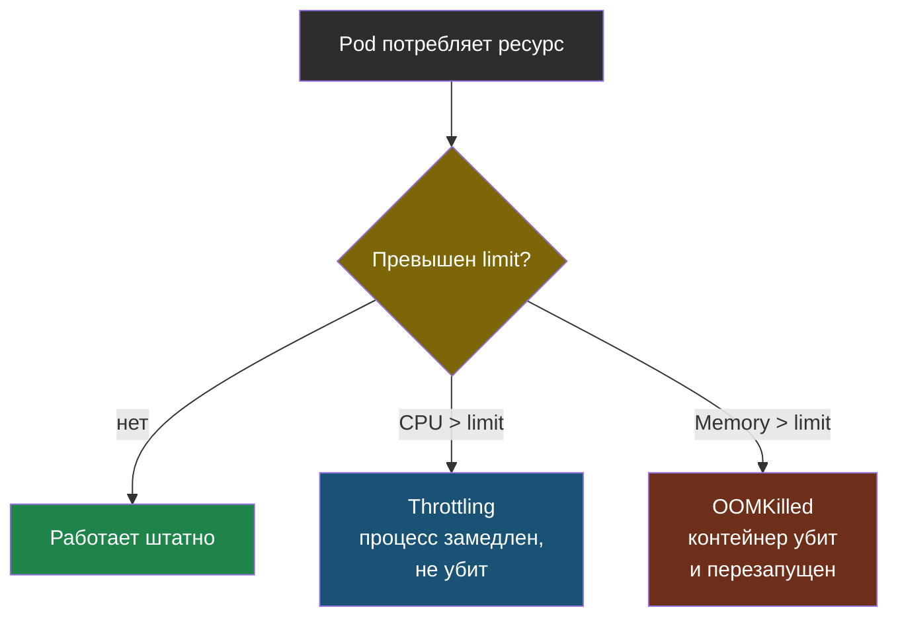

# Глава 3: Resources — limits, requests

> **Проблема:** Pod без limits съест всю память ноды → другие Pod'ы убиты.

---

## 3.1 requests vs limits

```yaml
resources:
  requests:
    cpu: "100m"      # зарезервировать (Scheduler)
    memory: "128Mi"
  limits:
    cpu: "500m"      # максимум
    memory: "256Mi"
```

| | requests | limits |
|--|----------|--------|
| **CPU** | Scheduler резервирует | Throttled (замедление) |
| **Memory** | Scheduler резервирует | OOMKilled (убийство) |

Что происходит, когда Pod упирается в limit:



---

## 3.2 CPU: milliCPU

```
100m = 0.1 CPU
250m = 0.25 CPU
1000m = 1 CPU
```

---

## 3.3 LimitRange — дефолты

```yaml
apiVersion: v1
kind: LimitRange
metadata:
  name: defaults
spec:
  limits:
  - type: Container
    default:
      cpu: "500m"
      memory: "256Mi"
    defaultRequest:
      cpu: "100m"
      memory: "128Mi"
```

Теперь каждый Pod без явных resources получит дефолты.

---

## 3.4 ResourceQuota — ограничение namespace

```yaml
apiVersion: v1
kind: ResourceQuota
metadata:
  name: quota
spec:
  hard:
    requests.cpu: "4"
    requests.memory: 8Gi
    limits.cpu: "8"
    limits.memory: 16Gi
    pods: "20"
```

Проверить текущее потребление:

```bash
kubectl describe resourcequota -n prod
```

```text
Name:     prod-quota
Resource  Used   Hard
--------  ----   ----
cpu       450m   500m
memory    200Mi  512Mi
pods      4      10
```

Если лимит исчерпан, новый Pod не создастся:

```text
Error: pods "myapp-xxx" is forbidden: exceeded quota: prod-quota,
       requested: cpu=100m, used: cpu=450m, limited: cpu=500m
```

---

## 3.5 Как выбрать значения

1. Запусти без limits
2. `kubectl top pods` — посмотри реальное потребление
3. limits = 2× среднее
4. requests = 50-70% limits

---

## 📋 Чеклист

- [ ] resources заданы каждому Pod
- [ ] LimitRange создан для namespace
- [ ] ResourceQuota создан
- [ ] Понимаю разницу throttled vs OOMKilled

**Переходи к Главе 4 — StatefulSet.**
