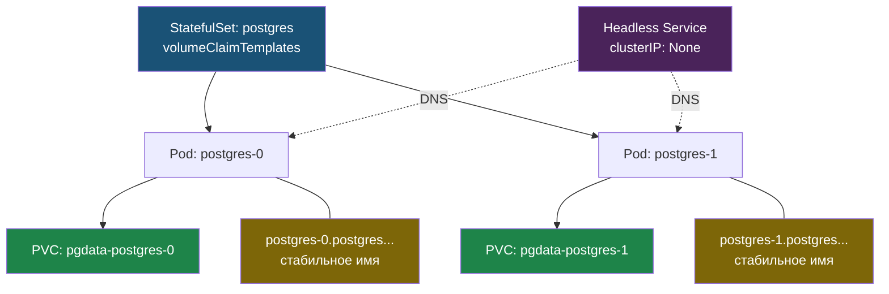

# Глава 4: StatefulSet — БД в K8s

> **Проблема:** Deployment для БД = случайные имена, теряются данные при пересоздании.

---

## 4.1 Deployment vs StatefulSet

| Deployment | StatefulSet |
|-----------|-------------|
| Pod'ы взаимозаменяемы | Стабильные имена |
| myapp-xxx-aaa | postgres-0, postgres-1 |
| Пересоздан = новый IP | Пересоздан = тот же PVC |

---

## 4.1.1 Когда StatefulSet вместо Deployment

| | Deployment | StatefulSet |
|--|------------|-------------|
| Порядок создания | Случайный | Строгий: 0, 1, 2 |
| Имена Pod'ов | Случайные суффиксы | Предсказуемые: `pg-0`, `pg-1` |
| PVC | Общий или без PVC | Свой PVC на каждый Pod |
| Применение | Stateless apps | БД, очереди, кластерные сервисы |

StatefulSet нужен там, где важны стабильное имя, порядок старта и отдельный диск на каждую реплику.

---

## 4.2 Манифест

```yaml
apiVersion: apps/v1
kind: StatefulSet
metadata:
  name: postgres
spec:
  serviceName: postgres
  replicas: 1
  selector:
    matchLabels:
      app: postgres
  template:
    metadata:
      labels:
        app: postgres
    spec:
      containers:
      - name: postgres
        image: postgres:16-alpine
        env:
        - name: POSTGRES_PASSWORD
          value: "secret"
        volumeMounts:
        - name: pgdata
          mountPath: /var/lib/postgresql/data
  volumeClaimTemplates:
  - metadata:
      name: pgdata
    spec:
      accessModes: ["ReadWriteOnce"]
      resources:
        requests:
          storage: 1Gi
```

Ключевое здесь: `volumeClaimTemplates`.
Каждый Pod получает свой PVC, например `pgdata-postgres-0`, `pgdata-postgres-1`.

---

## 4.3 Headless Service

```yaml
apiVersion: v1
kind: Service
metadata:
  name: postgres
spec:
  clusterIP: None    # headless
  selector:
    app: postgres
  ports:
  - port: 5432
```

DNS: `postgres-0.postgres.default.svc.cluster.local`

Как StatefulSet связывает стабильные имена, отдельные PVC и headless Service:



---

## 4.4 Проверка

```bash
kubectl get statefulset
kubectl exec -it postgres-0 -- psql -U postgres -c "\dt"

# Убить и проверить что данные сохранились
kubectl delete pod postgres-0
# Новый pod-0 использует тот же PVC
```

---

## 📋 Чеклист

- [ ] StatefulSet создан для PostgreSQL
- [ ] Headless Service настроен
- [ ] PVC привязан к Pod
- [ ] Данные сохраняются при пересоздании Pod

**Переходи к Главе 5 — NetworkPolicy.**
