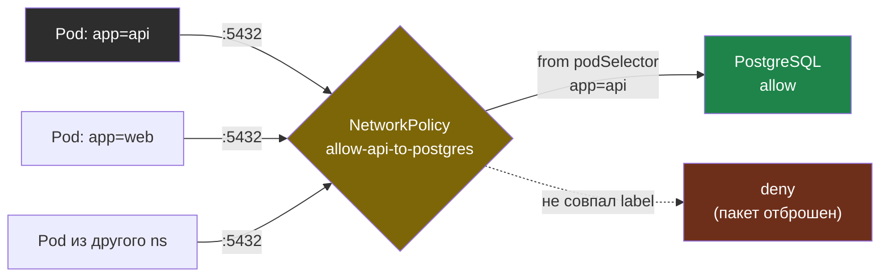

# Глава 5: NetworkPolicy — фаервол для Pod'ов

> **Проблема:** По умолчанию любой Pod видит любой Pod. БД доступна из всех namespace.

---

## 5.1 По умолчанию: всё разрешено

```
Pod в default → Pod в prod → PostgreSQL
Любой Pod → Redis → все данные
```

---

## 5.2 Deny All

```yaml
apiVersion: networking.k8s.io/v1
kind: NetworkPolicy
metadata:
  name: deny-all
  namespace: prod
spec:
  podSelector: {}
  policyTypes:
  - Ingress
  - Egress
```

Теперь весь входящий и исходящий трафик в namespace prod заблокирован.

---

## 5.3 Разрешить конкретный трафик

```yaml
apiVersion: networking.k8s.io/v1
kind: NetworkPolicy
metadata:
  name: allow-api-to-postgres
  namespace: prod
spec:
  podSelector:
    matchLabels:
      app: postgres
  policyTypes:
  - Ingress
  ingress:
  - from:
    - podSelector:
        matchLabels:
          app: api
    ports:
    - port: 5432
```

Только Pod с label `app=api` может обратиться к PostgreSQL на порт 5432.

Как политика фильтрует входящий трафик к PostgreSQL:



---

## 5.4 Как протестировать NetworkPolicy

Проверка разрешённого Pod:

```bash
kubectl run test-allowed --image=curlimages/curl \
  --labels="app=api" --rm -it --restart=Never -n prod \
  -- curl http://postgres-svc:5432
```

Проверка заблокированного Pod:

```bash
kubectl run test-blocked --image=curlimages/curl \
  --rm -it --restart=Never -n prod \
  -- curl --max-time 5 http://postgres-svc:5432
```

Как интерпретировать результат:

- `connection refused` — пакет дошёл до PostgreSQL, политика пропустила
- `connection timed out` — пакет отброшен NetworkPolicy

---

## 5.5 Важно: поддержка CNI

NetworkPolicy работает только если CNI-плагин её поддерживает.

- `k3s` по умолчанию использует Flannel, а enforcement NetworkPolicy
  обеспечивает встроенный контроллер (kube-router) — то есть в k3s политики работают из коробки
- Чистый Flannel (вне k3s) сам NetworkPolicy не реализует
- Для полного контроля и расширенных возможностей берут Calico или Cilium

Проверка:

```bash
kubectl get pods -n kube-system | grep -E "calico|cilium|flannel"
```

Пример установки Calico:

```bash
kubectl apply -f https://raw.githubusercontent.com/projectcalico/calico/v3.26.0/manifests/calico.yaml
```

---

## 📋 Чеклист

- [ ] CNI поддерживает NetworkPolicy
- [ ] Deny-all policy создан
- [ ] Разрешён только нужный трафик
- [ ] Проверено: заблокированный трафик не проходит

**Переходи к Главе 6 — RBAC.**
