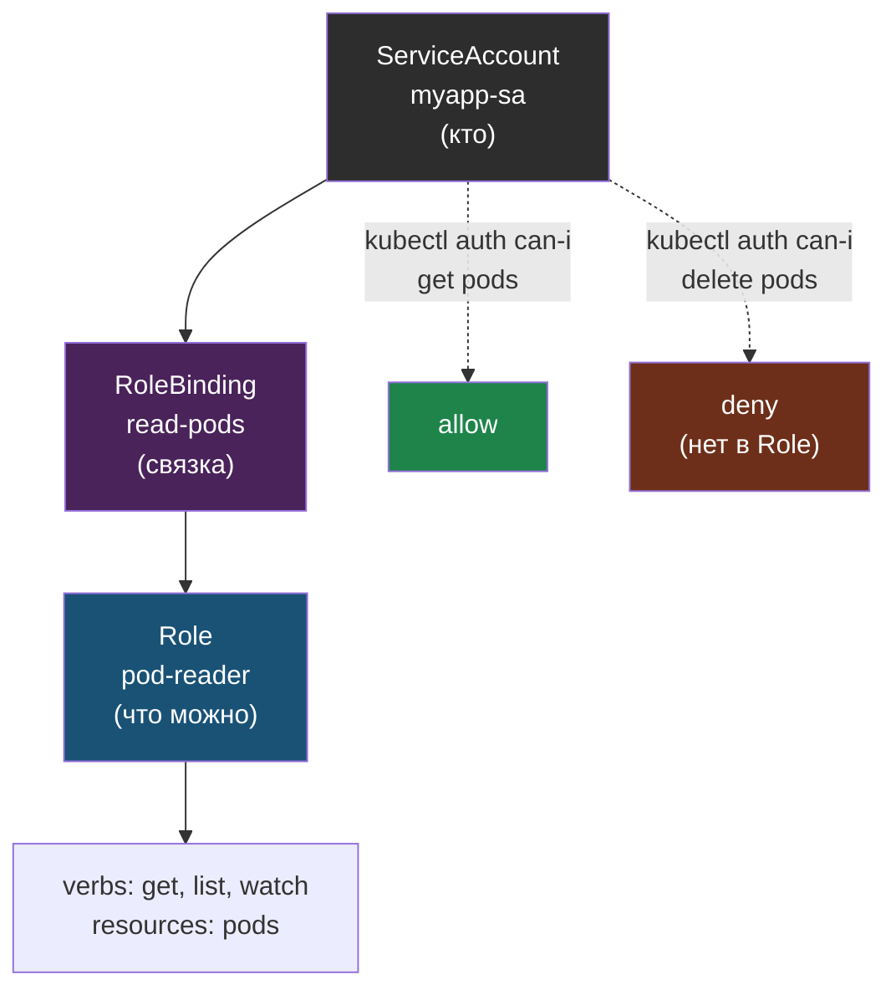

# Глава 6: RBAC — права в кластере

> **Проблема:** Все с одним kubeconfig могут всё. Случайный `kubectl delete` = катастрофа.

---

## 6.1 Объекты RBAC

```
ServiceAccount (кто) → RoleBinding → Role (что может)
```

---

## 6.2 ServiceAccount

```yaml
apiVersion: v1
kind: ServiceAccount
metadata:
  name: myapp-sa
  namespace: prod
```

---

## 6.3 Role

```yaml
apiVersion: rbac.authorization.k8s.io/v1
kind: Role
metadata:
  name: pod-reader
  namespace: prod
rules:
- apiGroups: [""]
  resources: ["pods"]
  verbs: ["get", "list", "watch"]
```

---

## 6.4 RoleBinding

```yaml
apiVersion: rbac.authorization.k8s.io/v1
kind: RoleBinding
metadata:
  name: read-pods
  namespace: prod
subjects:
- kind: ServiceAccount
  name: myapp-sa
roleRef:
  kind: Role
  name: pod-reader
  apiGroup: rbac.authorization.k8s.io
```

Как связаны субъект, привязка и набор прав:



Role и RoleBinding действуют в пределах namespace. Для прав на весь кластер используют ClusterRole и ClusterRoleBinding (см. 6.6).

---

## 6.5 Проверка

```bash
kubectl auth can-i get pods --as=system:serviceaccount:prod:myapp-sa
# yes

kubectl auth can-i delete pods --as=system:serviceaccount:prod:myapp-sa
# no
```

---

## 6.6 Читатель только для monitoring

Типичный сценарий: дать инженеру доступ только на чтение Pod и логов, без права что-либо менять.

```yaml
apiVersion: rbac.authorization.k8s.io/v1
kind: ClusterRole
metadata:
  name: monitoring-viewer
rules:
- apiGroups: [""]
  resources: ["pods", "nodes"]
  verbs: ["get", "list", "watch"]
- apiGroups: [""]
  resources: ["pods/log"]
  verbs: ["get"]
```

Такой доступ подходит для мониторинга и первичной диагностики, но не позволяет удалять Pod, менять Deployment или править ConfigMap.

---

## 📋 Чеклист

- [ ] ServiceAccount создан
- [ ] Role с минимальными правами
- [ ] RoleBinding связывает
- [ ] Проверено: can-i работает правильно

**Переходи к Главе 7 — Helm зачем.**
