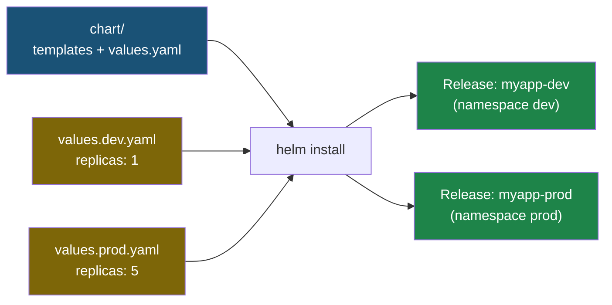

# Глава 7: Helm зачем

> **Проблема:** 20 YAML файлов для одного приложения. Для dev/prod — copy-paste с ошибками.

---

## 7.1 Без Helm

```
k8s/
├── configmap.yaml    ← dev значения
├── secret.yaml
├── deployment.yaml   ← replicas: 1
├── service.yaml
├── ingress.yaml
├── hpa.yaml
└── ...
```

Для prod — копируем и меняем значения. Ошибки неизбежны.

---

## 7.2 С Helm

```
chart/
├── Chart.yaml        # имя, версия
├── values.yaml       # значения по умолчанию
└── templates/
    ├── deployment.yaml   # {{ .Values.replicas }}
    ├── service.yaml
    └── ...
```

Один chart — разные окружения через разные values.



---

## 7.3 Установка

```bash
# snap
snap install helm --classic

# или скрипт
curl https://raw.githubusercontent.com/helm/helm/main/scripts/get-helm-3 | bash

helm version
```

---

## 📋 Чеклист

- [ ] Helm установлен
- [ ] Понимаю проблему которую решает Helm

**Переходи к Главе 8 — Создаём Chart.**
