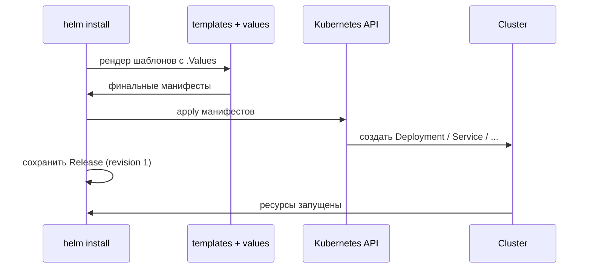

# Глава 8: Создаём Chart

> **Принцип:** сначала raw YAML — потом Helm. Никогда `helm install` до написания YAML руками.

---

## 8.1 Создать

```bash
helm create myapp
```

```
myapp/
├── Chart.yaml
├── values.yaml
└── templates/
    ├── deployment.yaml
    ├── service.yaml
    └── ...
```

---

## 8.2 values.yaml

```yaml
replicaCount: 2
image:
  repository: ghcr.io/user/myapp
  tag: "1.0"
service:
  port: 80
resources:
  requests:
    cpu: 100m
    memory: 128Mi
  limits:
    cpu: 500m
    memory: 256Mi
```

---

## 8.3 Шаблон deployment.yaml

```yaml
apiVersion: apps/v1
kind: Deployment
metadata:
  name: {{ .Release.Name }}-app
spec:
  replicas: {{ .Values.replicaCount }}
  selector:
    matchLabels:
      app: {{ .Release.Name }}-app
  template:
    metadata:
      labels:
        app: {{ .Release.Name }}-app
    spec:
      containers:
      - name: app
        image: "{{ .Values.image.repository }}:{{ .Values.image.tag }}"
        ports:
        - containerPort: 8000
        resources:
          {{- toYaml .Values.resources | nindent 12 }}
```

---

## 8.4 Проверить без применения

```bash
helm template myapp ./myapp -f values.yaml
```

Покажет финальный YAML без применения к кластеру.

Что делает Helm 3 при install (без Tiller, напрямую к API):



---

## 8.5 Применить

```bash
helm install myapp-dev ./myapp -f values.dev.yaml -n dev --create-namespace
helm install myapp-prod ./myapp -f values.prod.yaml -n prod --create-namespace
```

---

## 8.6 Обновить и удалить

```bash
helm upgrade myapp-dev ./myapp -f values.dev.yaml
helm list -n dev
helm uninstall myapp-dev -n dev
```

---

## 📋 Чеклист

- [ ] Chart создан через `helm create`
- [ ] values.yaml настроен
- [ ] Шаблоны работают с `.Values`
- [ ] `helm template` показывает правильный YAML
- [ ] `helm install` и `helm uninstall` работают

**Переходи к Главе 9 — Helm практика.**
