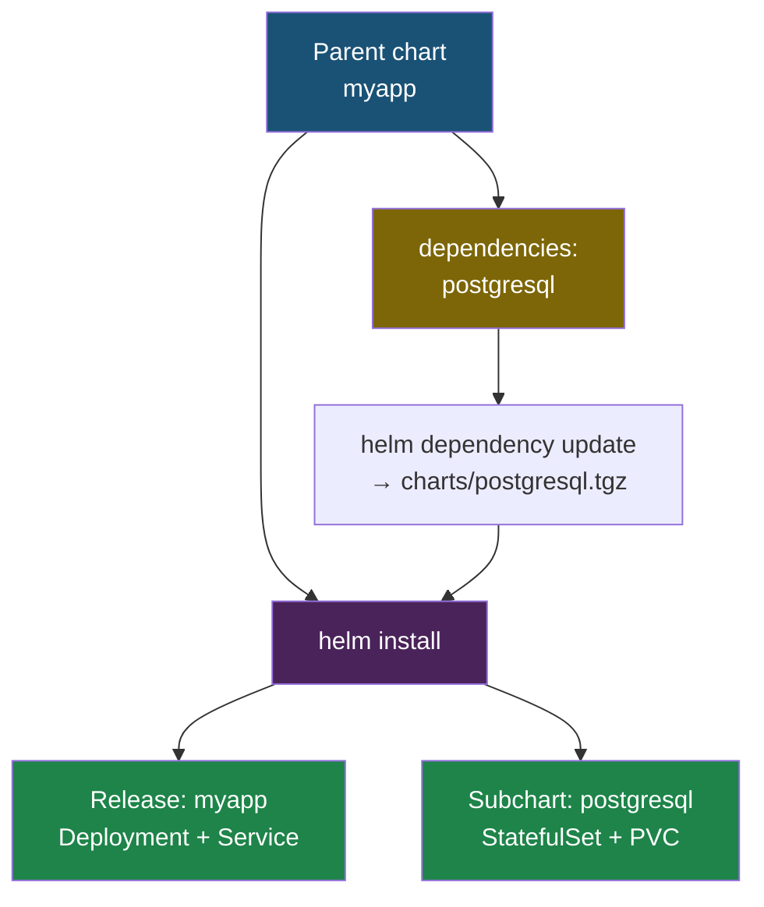

# Глава 9: Helm практика

---

## 9.1 Готовые Charts

```bash
helm repo add bitnami https://charts.bitnami.com/bitnami
helm repo update
helm search hub postgresql
```

---

## 9.2 Установка готового Chart

```bash
helm install my-postgres bitnami/postgresql \
  --set auth.postgresPassword=secret \
  -n prod
```

Все параметры:
```bash
helm show values bitnami/postgresql
```

---

## 9.3 Зависимости

```yaml
# Chart.yaml
dependencies:
- name: postgresql
  version: "12.x"
  repository: "https://charts.bitnami.com/bitnami"
  condition: postgresql.enabled
```

```bash
helm dependency update
```

Как chart с зависимостью разворачивает и своё приложение, и subchart:



---

## 9.4 Rollback

```bash
helm history myapp-dev
helm rollback myapp-dev 1
```

---

## 📝 Упражнения

### 9.1: Установить PostgreSQL
1. `helm install pg bitnami/postgresql --set auth.postgresPassword=test`
2. Проверь: `kubectl get pods`
3. Удали: `helm uninstall pg`

### 9.2: Свой Chart
1. `helm create myapp`
2. Настрой values.yaml
3. `helm template` → проверь YAML
4. `helm install` → проверь Pod'ы

---

## 📋 Чеклист

- [ ] Могу установить готовый Chart
- [ ] Могу создать свой Chart
- [ ] Знаю `helm template`, `install`, `upgrade`, `rollback`, `uninstall`

**Книга 11 завершена!**
