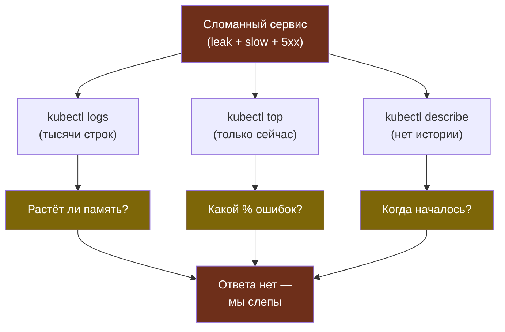

# Глава 0: Ломаем сервис — зачем мониторинг

> **Цель:** создать сервис с проблемами и показать что без мониторинга мы слепы.

---

## 0.1 Сломанное приложение

```python
# app.py
import time, random
from flask import Flask, jsonify

data = []  # memory leak!
app = Flask(__name__)

@app.route("/")
def home():
    data.extend([0] * 10000)  # растёт
    return jsonify({"ok": True})

@app.route("/slow")
def slow():
    time.sleep(random.uniform(0.1, 5.0))
    return jsonify({"ok": True})

@app.route("/flaky")
def flaky():
    if random.random() < 0.3:
        return jsonify({"error": "fail"}), 500
    return jsonify({"ok": True})
```

Три проблемы: memory leak, медленные запросы, случайные ошибки.

---

## 0.2 Деплой и нагрузка

```bash
kubectl apply -f broken-app.yaml
kubectl run loadgen --image=busybox --restart=Never -- \
  sh -c "while true; do wget -q -O- http://broken-svc/; done"
```

---

## 0.3 Попытка найти проблему

```bash
kubectl logs broken-app-xxx     # тысячи строк
kubectl top pods                # только текущее состояние
kubectl describe pod            # нет истории
```

Без инструментов мы не видим:
- Растёт ли память?
- Какой % ошибок?
- Когда начались проблемы?

Наглядно: одиночные `kubectl`-команды дают только снимок «сейчас», а вопросы о тренде и истории остаются без ответа.



**Вывод:** нужна система которая сама всё видит.

---

## 📋 Чеклист

- [ ] Сломанное приложение задеплоено
- [ ] Нагрузка запущена
- [ ] Я вижу что без мониторинга проблему не найти

**Переходи к Главе 1 — Prometheus.**
