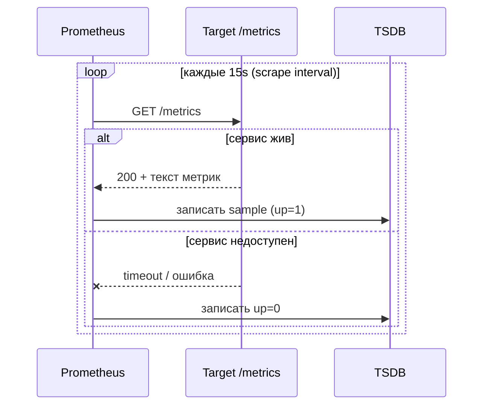
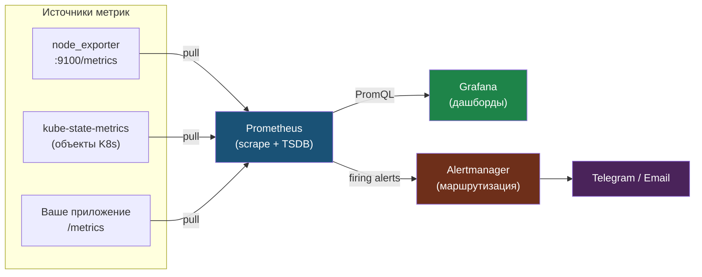

# Глава 1: Prometheus — сбор метрик

---

## 1.1 Pull-модель

```
Prometheus → /metrics приложения
    ↓
Собирает метрики каждые 15 секунд
```

Если /metrics не отвечает — Prometheus знает что сервис упал.

В отличие от push-модели, здесь инициатор всегда Prometheus: он сам ходит к таргетам по расписанию (scrape interval) и сам фиксирует недоступность.



Сама недоступность таргета — это уже метрика `up=0`, по которой можно построить алерт.

---

## 1.2 Установка

```bash
helm repo add prometheus-community https://prometheus-community.github.io/helm-charts
helm install monitoring prometheus-community/kube-prometheus-stack \
  -n monitoring --create-namespace
```

В одном Helm chart:
- Prometheus (сбор метрик)
- Grafana (дашборды)
- Alertmanager (алерты)
- Node Exporter (метрики нод)
- kube-state-metrics (метрики K8s)

Как эти компоненты связаны: экспортеры и приложения отдают метрики, Prometheus их скрейпит и хранит, Grafana визуализирует, Alertmanager рассылает уведомления.



---

## 1.3 Доступ

Проверить что стек реально поднялся:

```bash
kubectl get pods -n monitoring
```

```
NAME                                                  READY   STATUS
alertmanager-monitoring-kube-prometheus-alertmanager  2/2     Running
monitoring-grafana-xxx                                3/3     Running
monitoring-kube-prometheus-operator-xxx               1/1     Running
monitoring-kube-state-metrics-xxx                     1/1     Running
monitoring-prometheus-node-exporter-xxx               1/1     Running
prometheus-monitoring-kube-prometheus-prometheus      2/2     Running
```

Если какой-то Pod в `Pending`, проверь PVC:

```bash
kubectl get pvc -n monitoring
kubectl describe pvc -n monitoring | grep -A5 Events
```

Частая причина: в кластере нет подходящего `StorageClass`.

```bash
# Prometheus
kubectl port-forward svc/monitoring-kube-prometheus-prometheus 9090:9090 -n monitoring

# Grafana
kubectl port-forward svc/monitoring-grafana 3000:80 -n monitoring
# пароль: admin
kubectl get secret monitoring-grafana -n monitoring -o jsonpath='{.data.admin-password}' | base64 -d
```

Для удобства Prometheus можно пробросить и в фоне:

```bash
kubectl port-forward svc/monitoring-kube-prometheus-prometheus 9090:9090 -n monitoring &
```

Открыть `http://localhost:9090` → `Status` → `Targets`: все targets должны быть `UP`.

---

## 1.4 Первый запрос

Открой Prometheus UI (localhost:9090):

```
up
```

Покажет все таргеты. Все должны быть `1` (живы).

---

## 📝 Упражнения

### Упражнение 1.1: Установка
1. Установи `kube-prometheus-stack`
2. `kubectl get pods -n monitoring` — все `Running`?
3. Сделай `port-forward` на 9090
4. В Prometheus UI открой `Status -> Targets`
5. Сколько targets в состоянии `UP`?

### Упражнение 1.2: Первый запрос
1. В Prometheus UI открой `Graph`
2. Выполни запрос `up`
3. Сколько сервисов мониторится?
4. Есть ли targets со значением `0`?

---

## 📋 Чеклист

- [ ] kube-prometheus-stack установлен
- [ ] Prometheus UI доступен
- [ ] Grafana доступна
- [ ] Запрос `up` показывает все таргеты живыми

**Переходи к Главе 2 — PromQL.**
