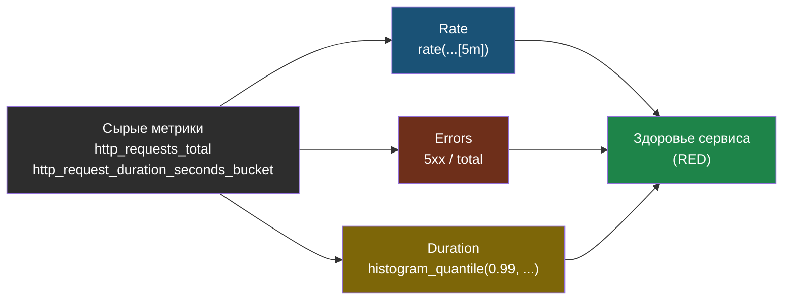

# Глава 2: PromQL

---

## 2.1 Основы

```promql
# Скорость роста counter
rate(http_requests_total[5m])

# Сумма по статусам
sum by (status) (rate(http_requests_total[5m]))

# Среднее памяти
avg(container_memory_usage_bytes)

# Процент ошибок
rate(http_requests_total{status=~"5.."}[5m]) / rate(http_requests_total[5m]) * 100
```

Ожидаемый результат для `rate(http_requests_total[5m])`:

```
http_requests_total{handler="/",method="GET",status="200"} 2.3
http_requests_total{handler="/health",method="GET",status="200"} 0.5
```

Это читается как `2.3 req/s` и `0.5 req/s`.

Для `sum by (status) (rate(http_requests_total[5m]))`:

```
{status="200"} 2.8
{status="500"} 0.05
```

То есть ошибок примерно `1.7%`.

---

## 2.2 Применить к сломанному сервису

```promql
# Memory leak
container_memory_usage_bytes{pod=~"broken-.*"}

# Ошибки
rate(http_requests_total{status="500"}[5m])

# P99 latency (если есть histogram)
histogram_quantile(0.99, rate(http_request_duration_seconds_bucket[5m]))
```

---

## 2.3 Три ключевых запроса для любого сервиса (RED метрики)

```promql
# Rate — запросов в секунду
rate(http_requests_total[5m])

# Errors — доля ошибок
rate(http_requests_total{status=~"5.."}[5m])
  /
rate(http_requests_total[5m])
* 100

# Duration — P99 задержка
histogram_quantile(0.99,
  rate(http_request_duration_seconds_bucket[5m])
)
```

RED = `Rate + Errors + Duration`.
Если эти три запроса работают, базовый мониторинг сервиса уже есть.

Из одних и тех же сырых counter/histogram PromQL вычисляет три разных взгляда на здоровье сервиса:



---

## 📝 Упражнения

### Упражнение 2.1: Базовые запросы
1. Открой Prometheus UI
2. Выполни `up`
3. Выполни `container_memory_usage_bytes`
4. Выполни `rate(container_cpu_usage_seconds_total[5m])`
5. Найди Pod который ест больше всего CPU

### Упражнение 2.2: RED метрики
1. Запусти нагрузку на своё приложение
2. Посмотри `rate(http_requests_total[1m])`
3. Вызови ошибку через несуществующий endpoint
4. Видно ли рост `5xx` в error rate?

---

## 📋 Чеклист

- [ ] Могу написать rate(), sum by(), avg()
- [ ] Вижу memory leak в Prometheus
- [ ] Вижу процент ошибок

**Переходи к Главе 3 — Инструментирование.**
