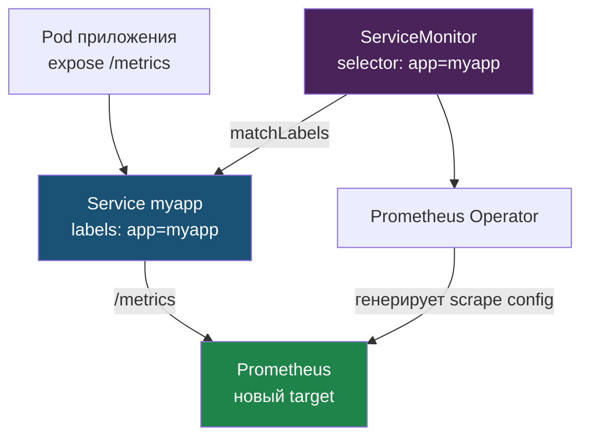

# Глава 3: Инструментирование Python

---

## 3.1 prometheus-client

```python
from prometheus_client import Counter, Histogram, generate_latest, CONTENT_TYPE_LATEST
from flask import Response

REQUESTS = Counter('http_requests_total', 'HTTP requests', ['method', 'path', 'status'])

@app.route("/metrics")
def metrics():
    return Response(generate_latest(), mimetype=CONTENT_TYPE_LATEST)

@app.route("/")
def home():
    REQUESTS.labels(method="GET", path="/", status=200).inc()
    return "ok"
```

Проверка endpoint:

```bash
curl http://localhost:8000/metrics
```

```
# HELP http_requests_total HTTP requests
# TYPE http_requests_total counter
http_requests_total{method="GET",path="/",status="200"} 42.0
http_requests_total{method="GET",path="/health",status="200"} 156.0

# HELP python_gc_objects_collected_total Python garbage collector
# TYPE python_gc_objects_collected_total counter
python_gc_objects_collected_total{generation="0"} 1234.0
```

Именно этот текст Prometheus будет скрейпить каждые 15 секунд.

---

## 3.2 ServiceMonitor

```yaml
apiVersion: monitoring.coreos.com/v1
kind: ServiceMonitor
metadata:
  name: myapp
spec:
  selector:
    matchLabels:
      app: myapp
  endpoints:
  - port: http
    path: /metrics
```

Prometheus автоматически начнёт скрейпить /metrics.

Связь через labels: `ServiceMonitor` по `matchLabels` находит нужный `Service`, оператор превращает это в scrape-конфиг, и Prometheus добавляет под этим Service в список таргетов.



Если labels в `Service` и `selector` в `ServiceMonitor` не совпадают — target не появится (частая причина «Prometheus не видит сервис»).

---

## 3.3 RED метрики

```
Rate:     rate(http_requests_total[5m])
Errors:   rate(http_requests_total{status=~"5.."}[5m])
Duration: histogram_quantile(0.99, rate(http_request_duration_seconds_bucket[5m]))
```

---

## 3.4 Проверить что Prometheus нашёл сервис

Проверить через UI:

```bash
# В Prometheus UI: Status -> Targets
# Найти target с job="myapp"
```

Или через запрос:

```promql
up{job="myapp"}
```

`1` = target доступен, `0` = Prometheus не может его скрейпить.

---

## 📝 Упражнения

### Упражнение 3.1: Метрики в приложении
1. Добавь `Counter` для HTTP-запросов
2. Выполни `curl http://localhost:8000/metrics`
3. Видна ли метрика?
4. Примени `ServiceMonitor`
5. Проверь `Status -> Targets` в Prometheus

### Упражнение 3.2: Проверка RED
1. Сделай несколько запросов к `/`
2. Выполни `http_requests_total`
3. Найди свой `job="myapp"`
4. Убедись что данные появились в Prometheus

---

## 📋 Чеклист

- [ ] /metrics endpoint добавлен
- [ ] ServiceMonitor создан
- [ ] RED метрики видны в Prometheus

**Переходи к Главе 4 — Grafana.**
