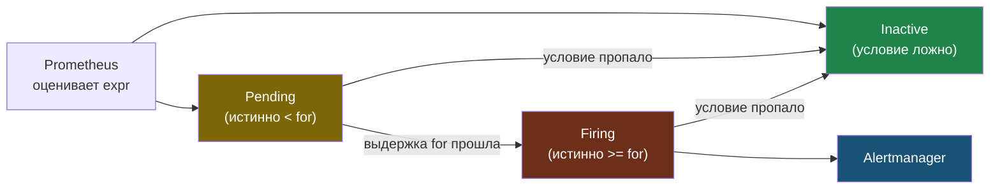
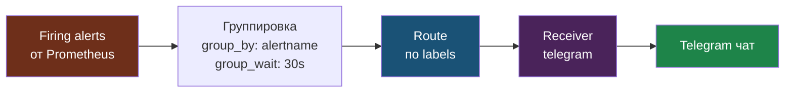

# Глава 5: Alertmanager — алерты в Telegram

---

## 5.1 Telegram бот

1. @BotFather → `/newbot` → получи токен
2. Напиши боту → найди chat_id

---

## 5.2 PrometheusRule

```yaml
apiVersion: monitoring.coreos.com/v1
kind: PrometheusRule
metadata:
  name: myapp-alerts
spec:
  groups:
  - name: myapp
    rules:
    - alert: HighErrorRate
      expr: rate(http_requests_total{status=~"5.."}[5m]) > 0.1
      for: 2m
      annotations:
        description: "Error rate > 10%"
    - alert: MemoryLeak
      expr: container_memory_usage_bytes{pod=~"myapp-.*"} > 500e6
      for: 5m
      annotations:
        description: "Memory > 500MB"
```

Алерт не срабатывает мгновенно: пока условие держится меньше `for`, он в состоянии `Pending`; только после выдержки становится `Firing` и уходит в Alertmanager. Это отсекает кратковременные всплески.



---

## 5.3 Настройка Telegram в Alertmanager

Полный `alertmanager-values.yaml`:

```yaml
# alertmanager-values.yaml
alertmanager:
  config:
    global:
      resolve_timeout: 5m
    route:
      group_by: ['alertname']
      group_wait: 30s
      group_interval: 5m
      repeat_interval: 4h
      receiver: telegram
    receivers:
    - name: telegram
      telegram_configs:
      - bot_token: "TOKEN"
        chat_id: CHAT_ID
        message: |
          {{ range .Alerts }}
          🚨 *{{ .Annotations.summary }}*
          {{ .Annotations.description }}
          {{ end }}
        parse_mode: "Markdown"
```

```bash
helm upgrade monitoring prometheus-community/kube-prometheus-stack \
  -f alertmanager-values.yaml -n monitoring
```

Внутри Alertmanager firing-алерты не летят в канал по одному: они группируются (`group_by`), ждут `group_wait`, маршрутизируются по `route` к нужному `receiver` и только потом превращаются в сообщение.



`repeat_interval` не даёт спамить одним и тем же алертом, а `resolve_timeout` помечает проблему как решённую, когда условие исчезло.

---

## 5.4 Проверка

Принудительно вызвать тестовый алерт:

```bash
curl -X POST http://localhost:9093/api/v2/alerts \
  -H "Content-Type: application/json" \
  -d '[{
    "labels": {"alertname": "TestAlert", "severity": "warning"},
    "annotations": {"summary": "Тестовый алерт", "description": "Проверка Telegram"}
  }]'
```

Или создать временное правило:

```yaml
- alert: AlwaysTrue
  expr: vector(1) == 1
  annotations:
    summary: "Тест алерта"
    description: "Этот алерт всегда срабатывает — удали после проверки"
```

Если всё настроено правильно, сообщение придёт в Telegram и появится в Alertmanager UI.

---

## 📝 Упражнения

### Упражнение 5.1: Telegram бот
1. Создай бота через `@BotFather`
2. Найди `chat_id`
3. Добавь конфиг в `alertmanager-values.yaml`
4. Выполни `helm upgrade`
5. Отправь тестовый алерт

### Упражнение 5.2: Реальный алерт
1. Создай `PrometheusRule` для `HighMemory`
2. Подожди пока условие сработает
3. Проверь Alertmanager UI
4. Сообщение пришло в Telegram?

---

## 📋 Чеклист

- [ ] Telegram бот создан
- [ ] PrometheusRule с алертами создан
- [ ] Alertmanager настроен на Telegram
- [ ] Алерт пришёл при нагрузке

**Переходи к Главе 6 — Loki.**
