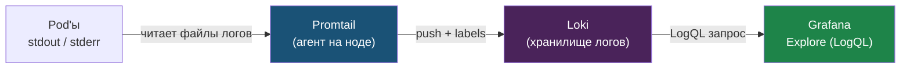

# Глава 6: Loki — агрегация логов

---

## 6.1 Метрики vs Логи

```
Метрики: "error rate = 5%"     → что
Логи:    "ERROR: db failed"    → почему
```

---

## 6.2 Установка

```bash
helm repo add grafana https://grafana.github.io/helm-charts
helm install loki grafana/loki-stack \
  --set grafana.enabled=false \
  --set prometheus.enabled=false \
  -n monitoring
```

---

## 6.3 Loki datasource в Grafana

Configuration → Data Sources → Add → Loki:
- URL: `http://loki:3100`

Проверить что Loki и promtail реально работают:

```bash
kubectl get pods -n monitoring | grep loki
```

Ожидаемо:

```
loki-0                1/1   Running
loki-promtail-xxx     1/1   Running
```

`loki` хранит логи. `promtail` собирает их с Pod и отправляет в Loki.

Конвейер логов зеркалит модель метрик, но push-направление: агент на каждой ноде читает файлы логов контейнеров, добавляет labels (namespace, pod) и шлёт их в Loki, а Grafana запрашивает их обратно.



Важно: Loki индексирует только labels, а не сам текст логов — поэтому он дешёвый по хранилищу, а фильтрация по содержимому (`|= "ERROR"`) идёт по уже отобранным по labels потокам.

Проверить последние логи promtail:

```bash
kubectl logs -l app.kubernetes.io/name=promtail -n monitoring | tail -20
```

---

## 6.4 Explore в Grafana

Explore → выбери Loki → напиши:

```
{namespace="default", pod=~"myapp-.*"} |= "ERROR"
```

Покажет все ERROR логи из Pod'ов myapp.

---

## 📝 Упражнения

### Упражнение 6.1: Первые логи
1. Открой Grafana → `Explore`
2. Выбери Loki datasource
3. Выполни `{namespace="default"}`
4. Добавь фильтр `{namespace="default"} |= "ERROR"`
5. Видишь логи своих Pod?

---

## 📋 Чеклист

- [ ] Loki установлен
- [ ] Datasource добавлен в Grafana
- [ ] Могу искать логи через Explore

**Переходи к Главе 7 — LogQL.**
