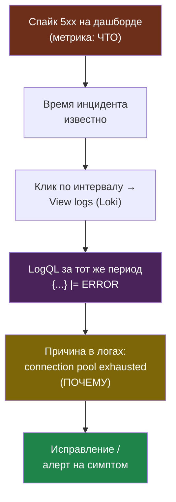

# Глава 7: LogQL — поиск по логам

---

## 7.1 Основы

```
# Все логи из namespace
{namespace="default"}

# С фильтром по тексту
{namespace="default"} |= "ERROR"

# Regexp
{namespace="default"} |~ "error|exception|failed"

# JSON парсинг
{container="app"} | json | level="error"
```

---

## 7.2 Корреляция с метриками

В Grafana:
1. Увидел спайк ошибок на дашборде (метрика)
2. Кликнул на временной отрезок
3. Открылись логи из Loki за это время
4. Нашёл причину: "ERROR: connection pool exhausted"

Полный путь расследования: метрика отвечает на «что и когда», а переход в логи за тот же интервал — на «почему». Это и есть связка Prometheus + Loki в одном Grafana.



---

## 📝 Упражнения

### Упражнение 7.1: LogQL запросы
1. Выполни `{namespace="monitoring"}`
2. Выполни `{namespace="default"} |= "error"`
3. Если логи JSON, выполни `{container="app"} | json | level="error"`

### Упражнение 7.2: Корреляция метрик и логов
1. Найди спайк ошибок на RED-дашборде
2. Кликни на временной отрезок
3. Открой `View logs`
4. Найди причину ошибки в логах

---

## 📋 Чеклист

- [ ] Могу написать LogQL запрос
- [ ] Вижу логи в Grafana
- [ ] Коррелирую метрики с логами

**Книга 12 завершена!**
