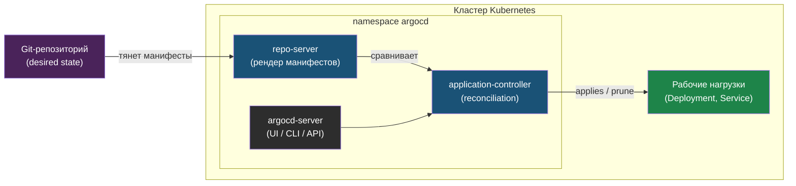

# Глава 3: ArgoCD установка

---

## 3.1 Установка

```bash
kubectl create namespace argocd
kubectl apply -n argocd -f https://raw.githubusercontent.com/argoproj/argo-cd/stable/manifests/install.yaml
```

Или Helm:
```bash
helm repo add argo https://argoproj.github.io/argo-helm
helm install argocd argo/argo-cd -n argocd --create-namespace
```

---

## 3.2 Доступ

```bash
# UI
kubectl port-forward svc/argocd-server -n argocd 8080:443

# Пароль
kubectl -n argocd get secret argocd-initial-admin-secret \
  -o jsonpath="{.data.password}" | base64 -d

# CLI
brew install argocd
argocd login localhost:8080
```

---

## 3.3 Первое Application

```yaml
apiVersion: argoproj.io/v1alpha1
kind: Application
metadata:
  name: myapp
  namespace: argocd
spec:
  project: default
  source:
    repoURL: https://github.com/user/app-infra.git
    targetRevision: main
    path: helm/myapp
  destination:
    server: https://kubernetes.default.svc
    namespace: prod
  syncPolicy:
    automated:
      prune: true
      selfHeal: true
```

```bash
kubectl apply -f application.yaml -n argocd
```

Объект `Application` описывает связку «откуда брать манифесты» (`source`) и «куда применять» (`destination`). ArgoCD непрерывно сверяет desired state из Git с actual state в кластере и при `automated` синхронизирует автоматически.



`application-controller` — сердце ArgoCD: он крутит цикл reconciliation, выставляя статус `Synced` или `OutOfSync`.

---

## 3.4 ArgoCD UI: основные экраны

После `kubectl port-forward svc/argocd-server -n argocd 8080:443` открой `https://localhost:8080`.

- `Applications` — список приложений
  - `Synced + Healthy` — всё хорошо
  - `OutOfSync` — Git и кластер отличаются
  - `Degraded` — ресурсы применены, но Pod или Service в плохом состоянии

- Внутри Application видно:
  - граф ресурсов `Deployment -> ReplicaSet -> Pods`
  - состояние каждого ресурса
  - кнопки `Sync`, `Refresh`, `Delete`

- Во вкладке `Diff` видно что изменится при следующем sync.

---

## 3.5 argocd CLI: основные команды

```bash
# Статус всех приложений
argocd app list

# Детали одного приложения
argocd app get myapp

# Принудительный sync
argocd app sync myapp

# История и откат
argocd app history myapp
argocd app rollback myapp 2

# Diff: что изменится
argocd app diff myapp
```

---

## 📝 Упражнения

### Упражнение 3.1: Первое Application
1. Создай `app-infra` репозиторий
2. Добавь туда простой Deployment
3. Примени `application.yaml`
4. Выполни `argocd app list`
5. Убедись что приложение появилось со статусом `Synced`

### Упражнение 3.2: OutOfSync
1. Измени `replicas` в Git
2. Выполни `argocd app get myapp`
3. Убедись что статус стал `OutOfSync`
4. Выполни `argocd app sync myapp`
5. Проверь что кластер обновился

### Упражнение 3.3: UI
1. Открой ArgoCD UI
2. Найди своё Application
3. Посмотри граф ресурсов
4. Открой вкладку `Diff`
5. Пойми какие ресурсы меняются при sync

---

## 📋 Чеклист

- [ ] ArgoCD установлен
- [ ] UI доступен
- [ ] Application создано
- [ ] Auto-sync включён

**Переходи к Главе 4 — CI + ArgoCD.**
