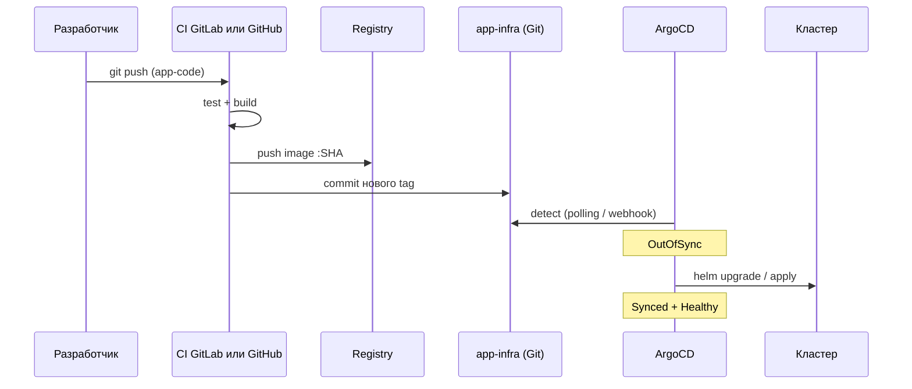
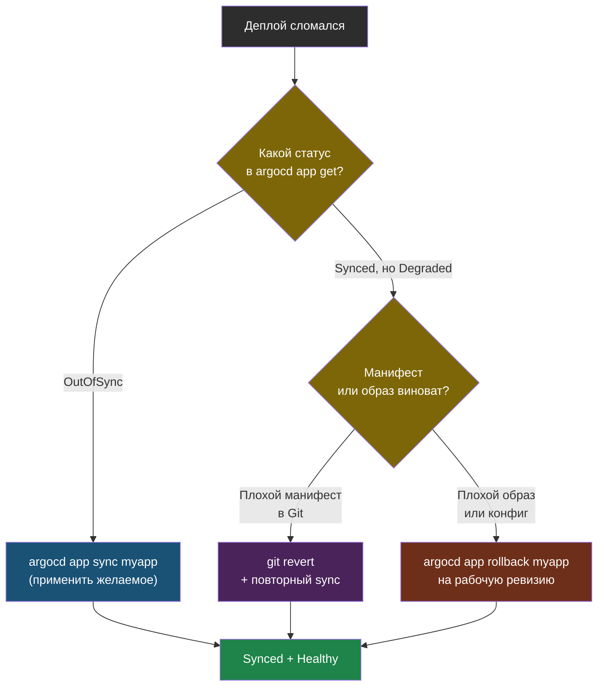

# Глава 4: CI + ArgoCD — полный цикл

---

## 4.1 CI обновляет infra-repo

```yaml
# .gitlab-ci.yml (в app-code repo)
update-infra:
  stage: deploy
  image: alpine/git
  script:
    - git clone https://token@gitlab.com/user/app-infra.git
    - cd app-infra
    - sed -i "s|tag: .*|tag: $CI_COMMIT_SHA|" values.yaml
    - git commit -am "Update image to $CI_COMMIT_SHA"
    - git push
  rules:
    - if: $CI_COMMIT_BRANCH == "main"
```

---

## 4.2 Полный цикл

```
git push → CI: test → build → push image
                              ↓
                    update app-infra repo
                              ↓
                    ArgoCD: обнаружил изменение
                              ↓
                    K8s: helm upgrade
```

0 ручных шагов.



Разработчик делает один `git push` — дальше цепочка идёт без участия человека.

---

## 4.3 Проблемы sed-подхода и альтернативы

`sed -i "s|tag: .*|tag: $CI_COMMIT_SHA|" values.yaml` работает, но хрупок:

- ломается если формат `values.yaml` изменился
- создаёт мусорные коммиты в infra-repo
- плохо масштабируется на много сервисов

Альтернатива — ArgoCD Image Updater:

```bash
kubectl apply -n argocd \
  -f https://raw.githubusercontent.com/argoproj-labs/argocd-image-updater/stable/manifests/install.yaml
```

```yaml
metadata:
  annotations:
    argocd-image-updater.argoproj.io/image-list: myapp=ghcr.io/user/myapp
    argocd-image-updater.argoproj.io/myapp.update-strategy: latest
```

Теперь ArgoCD сам отслеживает новые теги в registry и обновляет приложение.

---

## 4.4 Что делать когда цикл сломался

Если CI частично прошёл, а приложение задеплоилось плохо:

```bash
argocd app get myapp
kubectl get pods -n prod
kubectl describe pod <failing-pod> -n prod | tail -20
argocd app rollback myapp
```

Сначала выясни это `OutOfSync`, `Degraded` или проблема конкретного Pod. Потом либо делай `sync`, либо откатывайся на предыдущую рабочую ревизию.



Откат в GitOps — это не «магическая кнопка», а возврат Git к рабочему состоянию: `git revert` фиксирует откат в истории, и кластер подтягивает его так же, как любой другой коммит.

---

## 📝 Упражнения

### Упражнение 4.1: Полный цикл
1. Сделай `git push` в `app-code`
2. Убедись что CI собрал и запушил образ
3. Проверь что `app-infra` обновился
4. Проверь что ArgoCD синхронизировал изменения
5. Убедись что в кластере работает новая версия

### Упражнение 4.2: Откат
1. Задеплой плохую версию
2. Выполни `argocd app history myapp`
3. Выполни `argocd app rollback myapp <revision>`
4. Проверь что приложение снова работает

---

## 📋 Чеклист

- [ ] CI обновляет image tag в infra-repo
- [ ] ArgoCD обнаруживает и синхронизирует
- [ ] 0 ручных шагов

**Переходи к Главе 5 — Progressive Delivery.**
