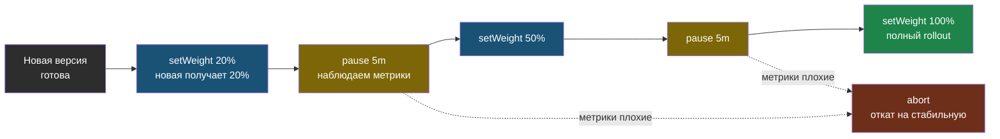

# Глава 5: Progressive Delivery

---

## 5.1 Canary

```yaml
apiVersion: argoproj.io/v1alpha1
kind: Rollout
spec:
  strategy:
    canary:
      steps:
      - setWeight: 20
      - pause: {duration: 5m}
      - setWeight: 50
      - pause: {duration: 5m}
      - setWeight: 100
```

20% → 50% → 100%.

Canary вводит новую версию постепенно: на каждом шаге часть трафика идёт на неё, а `pause` даёт время посмотреть метрики и при проблеме прервать выкатку.



Пунктирные стрелки показывают: на любой паузе можно сделать `abort` и мгновенно вернуть весь трафик на стабильную версию.

---

## 5.2 Blue-Green

```yaml
strategy:
  blueGreen:
    activeService: myapp-active
    previewService: myapp-preview
    autoPromotionEnabled: false
```

```bash
kubectl argo rollouts promote myapp
```

---

## 5.3 Наблюдать за Canary rollout

```bash
kubectl argo rollouts get rollout myapp --watch
```

Пример:

```
Name:            myapp
Status:          Paused
Strategy:        Canary
  Step:          1/3
  SetWeight:     20
  ActualWeight:  20

Replicas:
  Desired:  5
  Current:  5
  Updated:  1
  Ready:    5
```

Это значит: 20% трафика уже на новой версии, остальное ещё идёт на стабильную.

---

## 5.4 Продолжить или откатить

```bash
# Продолжить rollout
kubectl argo rollouts promote myapp

# Прервать и откатить
kubectl argo rollouts abort myapp
```

---

## 📝 Упражнения

### Упражнение 5.1: Canary
1. Установи Argo Rollouts
2. Создай `Rollout` с шагами `20% -> 50% -> 100%`
3. Выполни `kubectl argo rollouts get rollout myapp --watch`
4. Посмотри первую паузу на 20%
5. Выполни `promote`, потом `abort`

### Упражнение 5.2: Blue-Green
1. Создай `blueGreen` стратегию
2. Проверь `previewService`
3. Выполни `kubectl argo rollouts promote myapp`
4. Убедись что трафик переключился

---

## 📋 Чеклист

- [ ] Понимаю Canary vs Blue-Green
- [ ] Argo Rollouts установлен

**Книга 13 завершена!**
