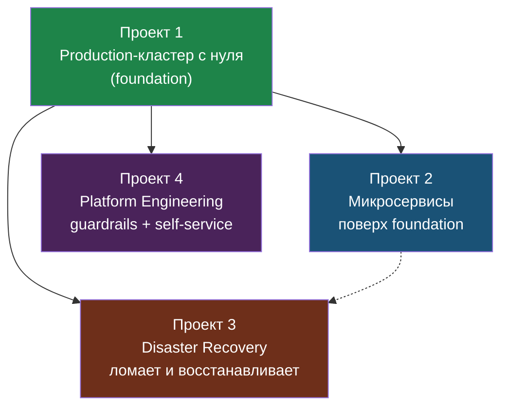

# Финальные проекты: Production-инфраструктура

> Модуль 14 — финал курса. Никакой теории. Только проекты.

---

## Оглавление

- [**Проект 1: Production Python App**](project-1.md)
- [**Проект 2: Микросервисы**](project-2.md)
- [**Проект 3: Disaster Recovery**](project-3.md)
- [**Проект 4: Platform Engineering**](project-4.md)
- [**Глоссарий**](glossary.md)

---

## Критерий успеха

> Удали всё → восстанови из кода за X минут.
> Если не можешь — проект не завершён.

---

## Как проекты связаны

Проекты не равнозначны по стартовой точке:

| Проект | Стартовая точка |
|--------|-----------------|
| Проект 1 | Базовый production-кластер с нуля: Terraform → Ansible → K8s → ArgoCD → Monitoring |
| Проект 2 | Продолжение проекта 1: на тот же кластер добавляются микросервисы |
| Проект 3 | Продолжение проекта 1 или 2: проверяется disaster recovery на уже работающей платформе |
| Проект 4 | Продолжение проекта 1: поверх базовой платформы добавляются guardrails и self-service |

Если хочешь проходить проект 2, 3 или 4 отдельно, сначала восстанови состояние проекта 1. Минимум: рабочий K8s-кластер, ArgoCD, monitoring stack, домен/Ingress и infra-репозиторий.

Зависимости между проектами. Проект 1 — фундамент (foundation), остальные три надстраиваются над ним:



### Где сохранять состояние

После проекта 1 обязательно сохрани состояние платформы. Если это VM или набор VM, сделай снапшот. Если это облако через Terraform, зафиксируй git commit infra-репозитория, remote state и бэкапы данных.

Название точки:

```text
after-project-1-foundation
```

Эта точка нужна для проектов 2, 3 и 4. Проект 2 добавляет микросервисы поверх foundation, проект 3 ломает и восстанавливает уже работающую платформу, проект 4 добавляет platform engineering поверх foundation.

Перед проектом 3 сделай отдельную защитную копию текущего состояния:

```text
before-project-3-disaster-recovery
```

Проект 3 содержит destructive-проверки: удаление Pod, сломанный deploy, потеря PVC и `terraform destroy`. Не начинай его без восстановимой точки.

---

## Инструменты

Все проекты используют:
| Инструмент | Модуль |
|-----------|--------|
| Terraform | 8 |
| Ansible | 9 |
| K8s + Helm | 10, 11 |
| Prometheus + Grafana | 12 |
| GitOps (ArgoCD) | 13 |

---

*Финальные проекты — Курс DevOps, Модуль 14 (финальный)*
