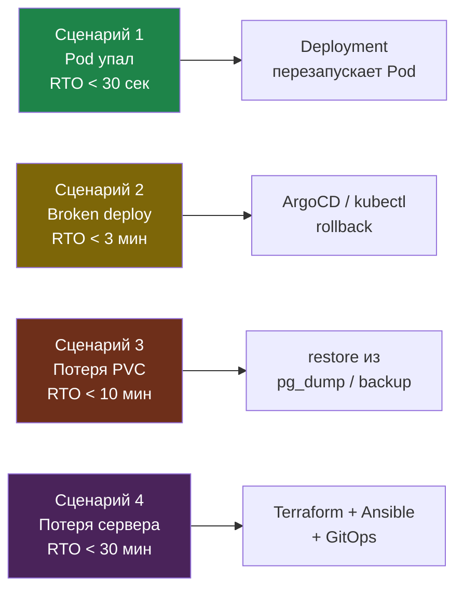

# Проект 3: Disaster Recovery

---

## Цель

RTO < 30 минут, RPO < 5 минут.

| Сценарий | RTO | RPO |
|----------|-----|-----|
| Pod упал | < 30 сек | 0 |
| Broken deploy | < 3 мин | 0 |
| Потеря PVC | < 10 мин | < 1 мин |
| Потеря сервера | < 30 мин | < 5 мин |

Четыре сценария по нарастанию тяжести — от перезапуска одного Pod'а до полного пересоздания сервера. Чем правее, тем выше RTO и тем больше слоёв восстановления задействовано:



---

## Стартовая точка

Тип проекта: **disaster recovery на уже работающей платформе**.

Это не установка с нуля, а проверка восстановления. Используй тестовую платформу после проекта 1 или проекта 2. Не выполняй destructive-команды на единственном production-сервере без подтверждённых бэкапов.

До начала должно быть:
- рабочий K8s-кластер;
- ArgoCD;
- PostgreSQL с тестовыми данными;
- backup/restore механизм для базы данных;
- monitoring и Telegram-алерты;
- Terraform/Ansible код, которым можно заново поднять сервер;
- понятный runbook восстановления.

Если проекта 1 нет, сначала подними его. Если есть проект 2, можно проверять DR на микросервисной версии.

Перед началом сделай защитную копию текущей платформы:

```text
before-project-3-disaster-recovery
```

Если это VM, сделай снапшот VM. Если это облачная инфраструктура, убедись что Terraform state сохранён в remote backend, последний commit infra-репозитория запушен, а бэкапы PostgreSQL/PVC реально восстанавливаются. В этом проекте будут destructive-действия, поэтому точка отката обязательна.

---

## Playbook

### Сценарий 1: Pod упал

```bash
# 1. Убить Pod
kubectl delete pod myapp-xxx

# 2. Наблюдать
kubectl get pods --watch

# Результат: Pod поднялся за < 30 сек
```

```bash
# Как измерить время
START=$(date +%s)
kubectl delete pod myapp-xxx -n prod
kubectl wait --for=condition=Ready pod -l app=myapp -n prod --timeout=60s
END=$(date +%s)
echo "RTO: $((END - START)) секунд"
# Критерий успеха: меньше 30 секунд
```

### Сценарий 2: Broken deploy

```bash
# 1. Сломать
kubectl set image deployment/myapp app=broken:latest

# 2. CrashLoopBackOff
kubectl get pods

# 3. Получить алерт в Telegram

# 4. Откат
argocd app rollback myapp 1

# 5. Проверить
curl https://myapp.ru/health
```

```bash
# Как измерить время и что считать успехом
kubectl set image deployment/myapp app=ghcr.io/user/myapp:nonexistent -n prod
kubectl rollout status deployment/myapp -n prod --timeout=120s
# Ожидаемо: rollout зависает и приходит ошибка, Pod'ы уходят в ImagePullBackOff

START=$(date +%s)
kubectl rollout undo deployment/myapp -n prod
kubectl rollout status deployment/myapp -n prod
END=$(date +%s)
echo "RTO: $((END - START)) секунд"
# Критерий успеха: rollback занял меньше 3 минут
```

### Сценарий 3: Потеря данных PostgreSQL

```bash
# 1. Создать тестовые данные
kubectl exec -it postgres-0 -- psql -U postgres -c "CREATE TABLE test (value TEXT); INSERT INTO test VALUES ('before-dr-test');"

# 2. Удалить PVC
kubectl delete pvc pgdata-postgres-0

# 3. Удалить StatefulSet
kubectl delete statefulset postgres

# 4. Восстановить (из backup или новый PVC)
kubectl apply -f k8s/postgres/

# 5. Проверить данные
kubectl exec -it postgres-0 -- psql -U postgres -c "SELECT * FROM test;"
```

```bash
# Более строгая проверка RPO/RTO
kubectl exec -it postgres-0 -n prod -- \
  psql -U postgres -c "INSERT INTO test VALUES ('before-dr-test')"

kubectl exec -it postgres-0 -n prod -- \
  pg_dump -U postgres myapp > backup-$(date +%Y%m%d).sql

kubectl delete pod postgres-0 -n prod

START=$(date +%s)
kubectl exec -it postgres-0 -n prod -- \
  psql -U postgres -c "SELECT * FROM test WHERE value = 'before-dr-test'"
END=$(date +%s)
echo "RPO проверен, RTO: $((END - START)) секунд"
# Критерий успеха: данные на месте (RPO=0, если PVC не удалялся), время меньше 10 минут
```

### Сценарий 4: Потеря всего сервера

```bash
# 1. Уничтожить
terraform destroy

# 2. Восстановить
time (terraform apply && ansible-playbook setup-server.yml)

# 3. Проверить
kubectl get nodes
curl https://myapp.ru/health
kubectl exec -it postgres-0 -- psql -U postgres -c "SELECT 1;"
```

```bash
# ВНИМАНИЕ: выполнять только на тестовом стенде с подтверждённым бэкапом
START=$(date +%s)

terraform destroy -auto-approve
terraform apply -auto-approve
ansible-playbook setup-server.yml

kubectl get nodes
kubectl get pods -n prod
curl -i https://myapp.ru/health

END=$(date +%s)
echo "Полное восстановление: $((END - START)) секунд"
echo "RTO: $(((END - START) / 60)) минут"
# Критерий успеха: меньше 30 минут
```

---

## Runbook

### Если приложение недоступно

```
1. kubectl get pods -n prod
2. kubectl describe pod myapp-xxx
3. kubectl logs myapp-xxx --tail=100
4. argocd app get myapp
5. Grafana → MyApp dashboard
6. argocd app rollback myapp 1
```

### Если БД недоступна

```
1. kubectl get pods -n prod | grep postgres
2. kubectl describe pod postgres-0
3. kubectl logs postgres-0 --tail=100
4. kubectl exec -it postgres-0 -- psql -U postgres -c "SELECT 1;"
```

Восстановление сервера (сценарий 4) — самый длинный путь. Каждый слой поднимает следующий, поэтому критично, чтобы код Terraform/Ansible и бэкапы были актуальны:


---

## Checklist (20 пунктов)

### Сценарии (7)
- [ ] Сценарий 1 пройден: Pod → восстановлен < 30 сек
- [ ] Сценарий 2 пройден: broken → rollback < 3 мин
- [ ] Сценарий 3 пройден: потеря PVC → данные восстановлены
- [ ] Сценарий 4 пройден: потеря сервера → полное восстановление < 30 мин
- [ ] RPO подтверждён: потеря данных < 5 мин
- [ ] Runbook написан для каждого сценария
- [ ] Runbook проверен: второй человек следовал и восстановил

### Бэкапы (7)
- [ ] Velero или ручной backup создан
- [ ] Backup PostgreSQL (pg_dump) автоматизирован по cron
- [ ] Terraform state в remote backend
- [ ] Алерт: backup не выполнялся > 24 часов
- [ ] Тест restore выполнен
- [ ] Бэкапы зашифрованы
- [ ] Мониторинг бэкапов: метрики в Prometheus

### Документация (6)
- [ ] Архитектурная схема актуальна
- [ ] Секреты документированы (где, как ротировать)
- [ ] SLA: RTO, RPO, uptime %
- [ ] Процедура обновления кластера описана
- [ ] Oncall runbook: кто что делает
- [ ] Тайминги записаны для каждого сценария
