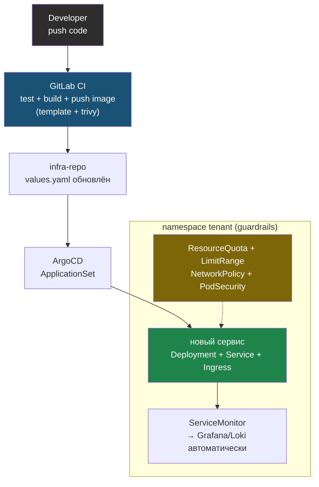
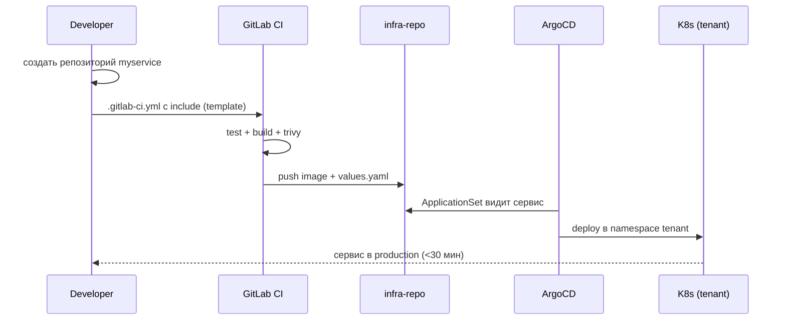

# Проект 4: Platform Engineering

---

## Что строим

Платформа для разработчиков. Developer self-service:

```
Developer
    │ push code
    ▼
GitLab CI → test → build → push image
    │                ↓
    │           update infra-repo
    │                ↓
    ▼           ArgoCD → K8s
  самообслуживание
```

Self-service-поток в виде схемы. Разработчик пушит код, а дальше платформа сама ведёт сервис до production — внутри guardrails (ResourceQuota, LimitRange, NetworkPolicy, PodSecurity), без участия DevOps:



---

## Стартовая точка

Тип проекта: **надстройка над платформой из проекта 1**.

Это не чистый кластер. Ты берёшь базовую production-платформу из проекта 1 и превращаешь её в developer self-service: guardrails, шаблоны, CI template и GitOps-поток для команд разработки.

До начала должно быть:
- проект 1 пройден или восстановлен;
- K8s-кластер работает;
- ArgoCD и monitoring stack доступны;
- есть namespace для tenant-команды;
- есть GitLab или GitHub CI;
- есть infra-репозиторий, который ArgoCD синхронизирует в кластер.

Если хочешь пройти этот проект отдельно, сначала восстанови foundation из проекта 1. Фаза 1 ниже специально ссылается на проект 1, а не заменяет его подробными командами.

---

## Playbook

### Фаза 1: Foundation

```bash
# То же что Проект 1:
terraform apply → ansible-playbook → ArgoCD → Prometheus → Loki
```

```bash
# Проверить что foundation готов перед продолжением
kubectl get nodes
argocd app list
kubectl get pods -n monitoring | grep -c Running
curl -i https://myapp.ru/health

echo "Foundation OK — можно начинать Platform Engineering"
```

### Фаза 2: Guardrails

```bash
mkdir -p guardrails
nano guardrails/resourcequota.yaml
```

Вставь в файл:

```yaml
apiVersion: v1
kind: ResourceQuota
metadata:
  name: quota
  namespace: tenant
spec:
  hard:
    requests.cpu: "4"
    requests.memory: 8Gi
    pods: "20"
```

Сохрани файл: `Ctrl+O`, `Enter`, затем выйди: `Ctrl+X`.

```bash
nano guardrails/limitrange.yaml
```

Вставь в файл:

```yaml
apiVersion: v1
kind: LimitRange
metadata:
  name: defaults
  namespace: tenant
spec:
  limits:
  - type: Container
    default:
      cpu: "500m"
      memory: "256Mi"
    defaultRequest:
      cpu: "100m"
      memory: "128Mi"
```

Сохрани файл: `Ctrl+O`, `Enter`, затем выйди: `Ctrl+X`.

```bash
nano guardrails/networkpolicy-deny-all.yaml
```

Вставь в файл:

```yaml
apiVersion: networking.k8s.io/v1
kind: NetworkPolicy
metadata:
  name: deny-all
  namespace: tenant
spec:
  podSelector: {}
  policyTypes:
  - Ingress
  - Egress
```

Сохрани файл: `Ctrl+O`, `Enter`, затем выйди: `Ctrl+X`.

```bash
kubectl apply -f guardrails/resourcequota.yaml
kubectl apply -f guardrails/limitrange.yaml
kubectl apply -f guardrails/networkpolicy-deny-all.yaml

# 4. PodSecurity
kubectl label namespace tenant pod-security.kubernetes.io/enforce=restricted
```

```bash
# Проверка guardrails после применения
kubectl run test --image=nginx -n tenant --restart=Never
kubectl describe pod test -n tenant | grep -A5 Limits
# Ожидаемо: Pod получает дефолтные requests/limits из LimitRange

kubectl run quota-test --image=nginx -n tenant \
  --requests=cpu=9 --limits=cpu=9 --restart=Never
# Ожидаемо: сервер вернёт exceeded quota
kubectl delete pod quota-test -n tenant --ignore-not-found
```

### Фаза 3: Developer templates

```bash
# 1. Golden path Helm chart
helm create platform-app-template

# 2. Включает: Deployment, Service, Ingress, HPA, ServiceMonitor, PrometheusRule

# 3. GitLab CI template
# Разработчик в своём .gitlab-ci.yml:
include:
  - project: platform/ci-templates
    file: '/templates/python-service.yml'
```

### Фаза 4: Onboarding

```
Разработчик:
1. Создаёт репозиторий myservice
2. Копирует .gitlab-ci.yml с include
3. Создаёт values.yaml в infra-repo
4. Создаёт Application в ArgoCD

Итог: новый сервис в production за < 30 минут
```

Тот же онбординг как последовательность шагов. Все ручные действия разработчика — слева, дальше платформа доводит сервис до production автоматически:



```bash
# Platform Engineering: критерии готовности

# 1. Developer может задеплоить новый сервис без DevOps
git clone app-template
# Поменять имя сервиса
git push
# Дальше CI pipeline и ArgoCD должны довести сервис до production без ручных шагов DevOps

# 2. Guardrails работают
kubectl run big-pod --image=nginx --requests=cpu=8 -n tenant
# Ожидаемо: Error (exceeded quota)

# 3. Мониторинг нового сервиса автоматический
# ServiceMonitor входит в шаблон, а Grafana автоматически начинает видеть новый сервис
```

---

## Checklist (20 пунктов)

### Platform (7)
- [ ] Новое приложение онбордится за < 30 мин
- [ ] GitLab CI template работает (только include)
- [ ] ArgoCD ApplicationSet создаёт Application автоматически
- [ ] Метрики нового приложения появляются в Grafana автоматически
- [ ] Логи нового приложения в Loki автоматически
- [ ] ResourceQuota для каждого namespace
- [ ] LimitRange дефолты работают

### Developer experience (7)
- [ ] push → deploy без помощи ops
- [ ] Разработчик видит логи в Grafana
- [ ] Разработчик делает rollback через ArgoCD UI
- [ ] Разработчик видит статус пайплайна в GitLab
- [ ] Разработчик получает алерт при падении
- [ ] Canary деплой доступен из коробки
- [ ] Локальная разработка совместима с K8s

### Безопасность (6)
- [ ] PodSecurity restricted для tenant namespace
- [ ] Нет privileged контейнеров
- [ ] Образы сканированы trivy в CI
- [ ] RBAC: разработчик видит только свой namespace
- [ ] Secrets: Sealed Secrets или Vault
- [ ] Audit log всех действий в кластере
