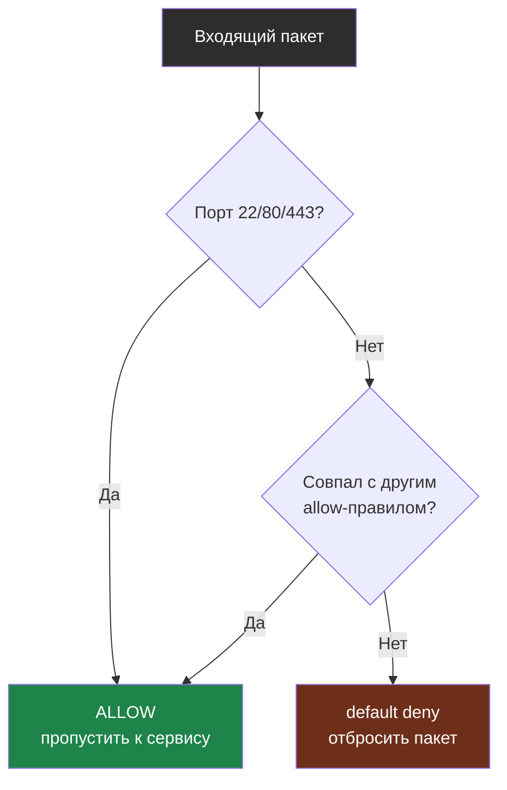
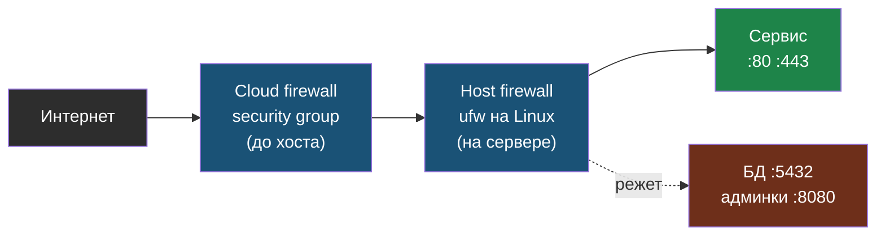

# Глава 4: Firewall и политика доступа

> **Запомни:** firewall — это не список "открыть нужное", а политика "всё лишнее запрещено".

---

## 4.1 Базовый defensive принцип

Правильный базовый подход:

```text
default deny incoming
allow only what is required
```

То есть:
- не открывать порты "на всякий случай";
- не держать БД доступной снаружи;
- не публиковать админки, если можно не публиковать.

Как входящий пакет проходит через политику `deny by default`: правила allow проверяются по очереди, и всё, что не совпало ни с одним, отбрасывается:



Ключевая идея: ветка `default deny` ловит всё, что не разрешено явно. Поэтому забытый открытый порт БД не станет публичным сам по себе.

---

## 4.2 Что обычно нужно открыть

Для простого веб-сервиса:

- `22` — SSH, и то лучше ограничить по IP или заменить на VPN;
- `80` — HTTP для редиректа/ACME/первичной публикации;
- `443` — HTTPS.

Часто **не нужно** открывать наружу:

- `5432` PostgreSQL;
- `3306` MySQL;
- `6379` Redis;
- `8080/9090/9000` админки и dashboards.

---

## 4.3 Host firewall и edge firewall

Идеальный путь для VPS:

- cloud firewall/security group фильтрует до хоста;
- host firewall на Linux повторно фильтрует на самом сервере.

Почему два слоя лучше одного:
- ошибка в одном не сразу открывает всё;
- проще отделить публичную публикацию от поведения самого хоста;
- логи и правила можно проверять отдельно.

Два независимых фильтра на пути к сервису:



Даже если в одном слое ошибиться, второй слой ещё держит периметр.

---

## 4.4 Практика с `ufw`

### Включить политику по умолчанию

```bash
sudo ufw default deny incoming
sudo ufw default allow outgoing
```

### Разрешить только нужное

```bash
sudo ufw allow OpenSSH
sudo ufw allow 80/tcp
sudo ufw allow 443/tcp
```

### Проверить

```bash
sudo ufw status verbose
```

Пример правильного результата:

```
Status: active
Logging: on (low)
Default: deny (incoming), allow (outgoing), deny (routed)

To                         Action      From
--                         ------      ----
OpenSSH                    ALLOW IN    Anywhere
80/tcp                     ALLOW IN    Anywhere
443/tcp                    ALLOW IN    Anywhere
```

Что здесь проверяем:
- `Default: deny (incoming)` — главный признак, что политика закрывает всё лишнее по умолчанию;
- в списке правил есть только осознанно опубликованные сервисы;
- здесь не должно быть `5432`, `3306`, `6379`, `8080`, `9090`, если это не специальный учебный сценарий.

Если сервер удалённый, сначала убедись, что SSH разрешён, и только потом включай firewall.

### Включить firewall

```bash
sudo ufw enable
```

---

## 4.5 Проверка снаружи

С другой своей машины проверь только свои адреса:

```bash
nmap -Pn SERVER_IP
nmap -Pn -p 22,80,443,5432,3306,6379 SERVER_IP
```

Ожидаемо должно быть видно только то, что ты осознанно открыл.

---

## 4.6 Практика: закрыть БД наружу

Если БД нужна приложению на том же сервере:

1. не открывай её порт в firewall;
2. привяжи её к `127.0.0.1` или к внутренней сети;
3. убедись, что приложение ходит к ней локально;
4. проверь с другой своей машины, что порт не виден.

Это один из самых частых реальных выигрышей по защите.

---

## 4.7 Lab-only проверка

На своей lab:

1. открой тестовый порт;
2. убедись, что он виден с другой своей машины;
3. закрой его через `ufw`;
4. проверь ещё раз;
5. зафиксируй difference before/after.

Цель этой проверки — почувствовать, что firewall это проверяемая политика, а не ритуальная команда.

---

## 4.8 Типовые ошибки

- включить `ufw` до разрешения SSH;
- надеяться только на cloud firewall или только на host firewall;
- публиковать БД "для удобства";
- забыть проверить результат сканированием со своей машины;
- перепутать "порт закрыт" и "порт не слушается приложением".

---

## 4.9 Чеклист главы

- [ ] У меня включена политика `deny incoming`
- [ ] Я осознанно открыл только нужные порты
- [ ] БД и внутренние сервисы не торчат наружу
- [ ] Я проверил сервер со своей второй машины
- [ ] Я понимаю разницу между edge firewall и host firewall
