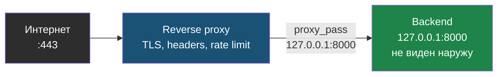
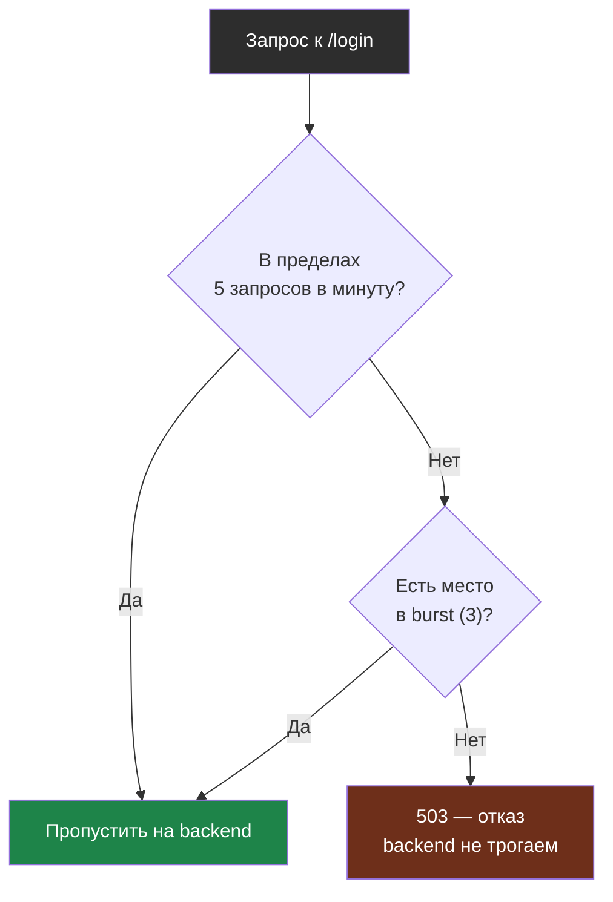

# Глава 5: Reverse proxy, rate limiting и WAF basics

> **Запомни:** хороший reverse proxy не только проксирует запрос, но и становится первой осмысленной линией защиты для веб-входа.

---

## 5.1 Почему reverse proxy — это часть защиты

Reverse proxy стоит перед приложением и может:

- завершать TLS;
- скрывать backend;
- нормализовать входящий HTTP;
- ставить security headers;
- делать rate limiting;
- давать одну точку логирования и контроля.

Если backend слушает только localhost или внутреннюю сеть, это уже большой выигрыш.

Reverse proxy как единственная публичная дверь перед скрытым backend:



Наружу торчит только proxy, а приложение слушает локально и недоступно напрямую.

---

## 5.2 Rate limiting

Rate limit не решает всё, но помогает против:
- шумных ботов;
- простого brute-force на форму логина;
- дешёвого application-layer мусора.

Рабочий пример для `nginx`:

```nginx
# /etc/nginx/nginx.conf, внутри http {}
limit_req_zone $binary_remote_addr zone=login:10m rate=5r/m;

server {
    listen 443 ssl http2;
    server_name example.com;

    location /login {
        limit_req zone=login burst=3 nodelay;
        proxy_pass http://127.0.0.1:8000;
    }
}
```

Что означает каждая настройка:
- `5r/m` — максимум 5 запросов в минуту с одного IP;
- `burst=3` — допускаем короткий всплеск ещё на 3 запроса;
- `nodelay` — лишние запросы не ждут в очереди, а сразу получают отказ;
- `proxy_pass http://127.0.0.1:8000` — backend остаётся локальным и не торчит наружу.

Проверка:

```bash
curl -I https://HOST/login
```

При превышении лимита ожидай ответ вида:

```
HTTP/2 503
server: nginx
```

Это означает, что nginx режет лишние запросы на входе, не отдавая их приложению.

Как nginx решает судьбу запроса к `/login` при лимите `5r/m` и `burst=3`:



Лишние запросы получают отказ сразу на proxy и не доходят до приложения.

---

## 5.3 Security headers

На уровне proxy удобно централизовать:

- `X-Frame-Options`;
- `X-Content-Type-Options`;
- `Referrer-Policy`;
- `Content-Security-Policy` как отдельную осознанную тему;
- `Strict-Transport-Security` после уверенного HTTPS.

Важно: headers — полезный слой, но не замена безопасному приложению.

Рабочий блок для `nginx`:

```nginx
add_header X-Frame-Options "SAMEORIGIN" always;
add_header X-Content-Type-Options "nosniff" always;
add_header Referrer-Policy "strict-origin-when-cross-origin" always;
add_header Strict-Transport-Security "max-age=31536000; includeSubDomains" always;
```

Проверка, что заголовки реально отдаются:

```bash
curl -sI https://HOST | grep -Ei 'x-frame|x-content|strict-transport|referrer'
```

Ожидаемый результат:

```
X-Frame-Options: SAMEORIGIN
X-Content-Type-Options: nosniff
Referrer-Policy: strict-origin-when-cross-origin
Strict-Transport-Security: max-age=31536000; includeSubDomains
```

Почему это полезно: proxy выставляет единое поведение для всех ответов, и тебе не нужно надеяться, что каждое приложение выставляет заголовки одинаково.

---

## 5.4 Где в этой схеме место WAF

WAF полезен как дополнительный HTTP-слой:
- видит подозрительные запросы;
- может блокировать часть мусора и типовых payload patterns;
- помогает small business и enterprise на публичных приложениях.

Но WAF:
- не заменяет исправление приложения;
- не спасает от сетевых проблем и большого DDoS;
- требует аккуратной настройки и понимания false positives.

---

## 5.5 Практика на `nginx`

### Идея

Сделать так, чтобы:
- backend не светился наружу;
- вход шёл через proxy;
- повторяющиеся шумные запросы не проходили бесконтрольно.

### Что проверить

```bash
curl -I http://HOST
curl -Ik https://HOST
sudo tail -f /var/log/nginx/access.log
sudo tail -f /var/log/nginx/error.log
```

### Что должно быть видно

- один фронт-дверной сервис на `80/443`;
- backend на `127.0.0.1:PORT` или внутреннем адресе;
- единое место логирования;
- предсказуемая реакция на bursts к чувствительным endpoints.

Практический признак успеха:

```
LISTEN 0.0.0.0:80   nginx
LISTEN 0.0.0.0:443  nginx
LISTEN 127.0.0.1:8000 python3
```

Это хорошая картина: наружу виден только proxy, а приложение слушает локально.

---

## 5.6 Lab-only проверка

На своей lab можно сделать controlled test:

```bash
# Пример: серия запросов к чувствительному endpoint
for i in $(seq 1 30); do
  curl -s -o /dev/null -w "%{http_code}
" https://HOST/login
done
```

Идея проверки:
- до rate limit ответы обычные;
- после настроенного лимита часть запросов начнёт получать ограничение;
- в логах будет видно, что поведение изменилось.

Проверка не должна превращаться в вредную нагрузку. Это controlled validation на своём стенде.

---

## 5.7 Типовые ошибки

- держать backend публичным и одновременно проксировать его через nginx;
- включить заголовки без понимания их эффекта;
- считать WAF универсальной бронёй;
- сделать rate limit слишком агрессивным и сломать легитимных пользователей;
- не смотреть access/error logs после изменений.

---

## 5.8 Чеклист главы

- [ ] Backend не торчит наружу там, где это не нужно
- [ ] Reverse proxy стал единой точкой входа для веб-трафика
- [ ] Я понимаю, что rate limiting — это не DDoS-защита, а полезный слой против мусора
- [ ] Я знаю, где смотреть логи proxy
- [ ] Я понимаю место WAF в общей архитектуре
