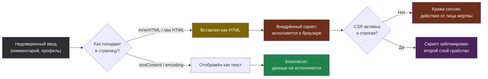

# Глава 3: XSS, output encoding и CSP basics

> **Запомни:** XSS начинается там, где приложение перестает различать данные и исполняемый браузером контекст.

---

## 3.1 Контекст и границы

XSS живет в любом месте, где недоверенный ввод попадает в HTML, JS, CSS или URL-контекст без правильного экранирования.

Даже хороший framework можно ослабить через dangerouslySetInnerHTML, markdown renderer без sanitization, inline scripts и бессмысленную CSP.

Эта глава особенно полезна для всех frontend/backend команд, которые выводят пользовательский ввод, markdown, HTML snippets или error messages.

---

## 3.2 Как выглядит риск

Типовые слабые места:
- ввод пользователя вставляется в DOM как HTML;
- markdown renderer разрешает сырой HTML;
- CSP либо отсутствует, либо содержит unsafe-inline;
- ошибки в шаблонах выводятся без контекстного экранирования;
- есть client-side рендер через innerHTML.

### Где особенно важно
- комментарии
- профили пользователей
- встроенный markdown
- email templates
- админка CMS

---

## 3.3 Что строит защитник

- контекстное output encoding по месту вывода;
- минимум сырых HTML-вставок;
- sanitization для rich content;
- CSP без бессмысленных исключений;
- ревью frontend API, которые пишут в DOM.

### Практический результат главы
- ты умеешь отличать HTML, attribute, JS и URL contexts;
- знаешь, что CSP помогает как второй слой, а не как замена экранирования;
- можешь показать, где именно приложение превращает пользовательский текст в DOM.

```nginx
add_header Content-Security-Policy "default-src 'self'; script-src 'self'; object-src 'none'; base-uri 'self'; frame-ancestors 'none'" always;
add_header X-Content-Type-Options nosniff always;
```

```javascript
// Плохо
element.innerHTML = userSuppliedText

// Лучше
element.textContent = userSuppliedText
```

XSS возникает, когда недоверенный текст попадает в DOM как HTML, а не как данные. Контекстное экранирование закрывает первый путь, а CSP работает вторым слоем — если скрипт всё же просочился, политика не даёт ему исполниться.



---

## 3.4 Практика

### Шаг 1: Найди опасные DOM API и сырые HTML-вставки
- в коде ищи innerHTML, outerHTML, dangerouslySetInnerHTML, небезопасные markdown renderers;
- проверь, откуда приходит строка и где проходит sanitization.

```bash
rg -n "innerHTML|outerHTML|dangerouslySetInnerHTML|markdown|sanitize" src/ app/
```

### Шаг 2: Проверь security headers
- сними заголовки ответа на нескольких страницах;
- сравни поведение обычной страницы и страницы логина.

```bash
curl -I https://HOST
curl -I https://HOST/profile
```

Хороший результат:

```
content-security-policy: default-src 'self'; script-src 'self'; object-src 'none'
x-content-type-options: nosniff
x-frame-options: SAMEORIGIN
```

Плохой результат:

```
content-security-policy: default-src *; script-src 'unsafe-inline' 'unsafe-eval'
```

Такая CSP почти ничего не ограничивает и превращается в декоративный заголовок.

### Шаг 3: Проверка controlled rendering
- на своей lab введи строку со спецсимволами и убедись, что она отображается как текст;
- не используй вредоносные payload chains, цель здесь не эксплуатация, а подтверждение encoding-поведения.

```bash
journalctl -u myapp -n 100 --no-pager
```

Безопасная тестовая строка для lab:

```
<b>тест</b> & "кавычки" 'одинарные'
```

Как читать результат:
- если браузер показывает буквально `<b>тест</b>`, значит ввод экранирован и попал как текст;
- если слово отображается жирным, значит строка была вставлена как HTML и граница доверия нарушена.

В DevTools полезно смотреть Console. Пример сообщения о рабочей CSP:

```
Refused to execute inline script because it violates the following Content Security Policy directive: "script-src 'self'"
```

### Что нужно явно показать
- какие DOM API использует проект;
- какая CSP реально уходит в ответе;
- где приложение делает sanitization rich content;
- как выглядит controlled test с безопасной строкой.

---

## 3.5 Lab-only проверка

Все проверки в этой главе выполняются только на своих VM, контейнерах, тестовых доменах и собственных сервисах.

- отправь в свою форму тестовую строку со спецсимволами и проверь, что браузер показывает текст, а не исполняет его;
- убедись, что CSP не сломана и не содержит очевидно опасных директив;
- зафиксируй, как DevTools сообщает о нарушениях CSP.

---

## 3.6 Типовые ошибки

- считать CSP заменой экранирования;
- разрешать inline scripts без крайней необходимости;
- санитизировать вход один раз и считать проблему закрытой;
- забывать про DOM-based XSS в клиентском коде.

---

## 3.7 Чеклист главы

- [ ] Я проверил вывод недоверенного ввода по контекстам
- [ ] Я нашел и оценил все сырые HTML-вставки
- [ ] У меня есть базовая рабочая CSP
- [ ] Я понимаю, какие client-side паттерны создают XSS-риск
