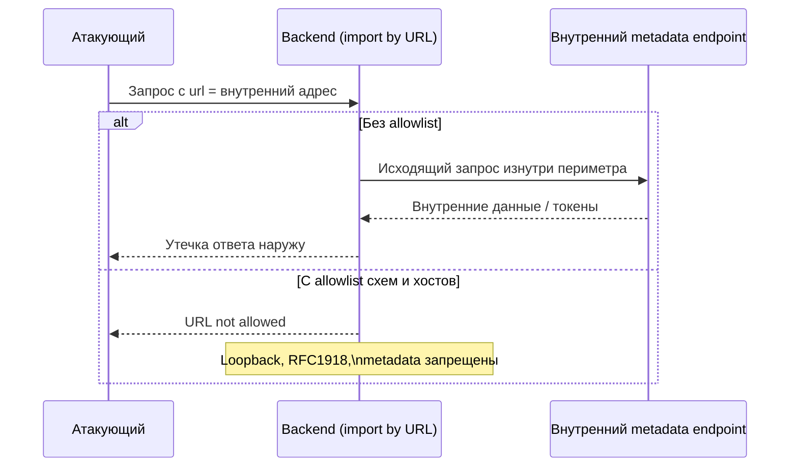
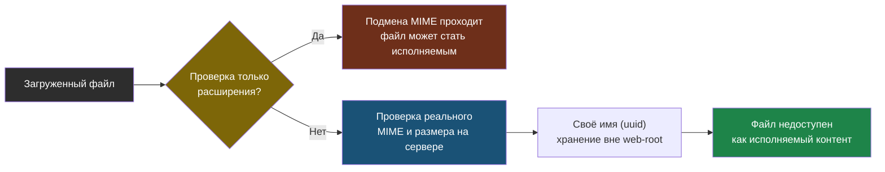

# Глава 5: SSRF, file upload и внешние ресурсы

> **Запомни:** как только backend начинает скачивать что-то по URL или принимать файлы, он становится прокси к внутренним ресурсам и потенциальной точкой обхода периметра.

---

## 5.1 Контекст и границы

SSRF часто выглядит как обычная бизнес-функция: скачать картинку по ссылке, сходить за metadata, проверить webhook, импортировать документ.

File upload несет свой класс рисков: исполняемые типы, подмена MIME, oversized uploads, path traversal, хранение файлов в web-root и небезопасная постобработка.

Эта глава особенно полезна для сервисов с import by URL, webhook validation, аватарами, документами, media pipeline и интеграциями.

---

## 5.2 Как выглядит риск

Типовые слабые места:
- backend принимает произвольный URL и сам ходит по нему;
- разрешены внутренние адреса, metadata endpoints или loopback;
- валидируется только расширение файла;
- файл сохраняется с исходным именем и в web-root;
- preview pipeline запускает сложные парсеры без изоляции.

### Где особенно важно
- import by URL
- file upload forms
- webhook callbacks
- document converters
- image processing

---

## 5.3 Что строит защитник

- allowlist схем, хостов и сетей для исходящих запросов;
- запрет loopback, RFC1918 и metadata-сервисов, если это не требуется;
- проверка MIME и размера на сервере;
- хранение файлов вне web-root и генерация собственных имен;
- изолированная обработка файлов и антивирус/сканирование при необходимости.

### Практический результат главы
- ты можешь описать trust boundary между пользователем, backend и внешним URL;
- понимаешь разницу между client content-type и реальным типом файла;
- умеешь обосновать egress policy для приложения.

```python
ALLOWED_SCHEMES = {"https"}
ALLOWED_HOSTS = {"cdn.example.com", "images.example.net"}
MAX_UPLOAD_SIZE = 5 * 1024 * 1024

storage_name = f"{uuid4()}.bin"
```

При SSRF backend становится прокси: атакующий подставляет внутренний адрес, а сервер сам идёт по нему с доверенной позиции внутри периметра. Allowlist схем и хостов отсекает loopback и metadata-сервисы.



Загрузка файла несёт отдельный класс рисков. Безопасный pipeline проверяет реальный тип и размер на сервере, генерирует своё имя и хранит файл вне web-root.



---

## 5.4 Практика

### Шаг 1: Проверь import by URL и веб-хуки
- найди код, который сам делает исходящий HTTP по данным пользователя;
- посмотри, какие хосты и схемы реально разрешены.

```bash
rg -n "requests\.|httpx\.|aiohttp|urllib|fetch_url|download" app/ src/
```

### Шаг 2: Проверь upload pipeline
- определи максимальный размер файла, разрешенные MIME и место хранения;
- убедись, что загруженный файл не становится сразу исполняемым ресурсом.

```bash
find . -maxdepth 3 -type d | rg 'upload|media|storage|tmp'
```

### Шаг 3: Проверь серверные лимиты и прокси
- на nginx или аналогичном прокси задай ограничения на body size;
- отдели upload backend от публичной раздачи.

```bash
sudo nginx -T | rg -n 'client_max_body_size|proxy_request_buffering|location /upload'
```

Пример нормального nginx-конфига для upload:

```nginx
client_max_body_size 5m;

location /upload {
    client_max_body_size 10m;
    proxy_pass http://127.0.0.1:8000;
    proxy_request_buffering on;
}
```

### Что нужно явно показать
- какие URL разрешены приложению для исходящих запросов;
- где хранится файл после загрузки;
- какой максимальный размер и MIME policy действуют;
- есть ли отдельная обработка для документов и картинок.

---

## 5.5 Lab-only проверка

Все проверки в этой главе выполняются только на своих VM, контейнерах, тестовых доменах и собственных сервисах.

- используй только контролируемые test URLs на своем стенде и проверь, что backend не уходит в loopback или внутренние адреса;
- загрузи безопасный тестовый файл разного размера и убедись, что лимиты и MIME validation работают;
- проверь, что файл нельзя запросить напрямую как исполняемый контент из web-root.

Примеры controlled SSRF-проверок:

```bash
curl -s "https://HOST/fetch?url=http://127.0.0.1:5432"
curl -s "https://HOST/fetch?url=http://169.254.169.254/latest/meta-data/"
```

Правильный ответ выглядит так:

```
{"error":"URL not allowed"}
```

Плохой признак: backend подвисает на несколько секунд и потом возвращает таймаут. Это значит, что он реально попытался сходить по внутреннему адресу.

---

## 5.6 Типовые ошибки

- валидировать только расширение файла;
- разрешать backend произвольный egress в интернет;
- сохранять файлы с пользовательским именем;
- включать document/image converters без изоляции и лимитов.

---

## 5.7 Чеклист главы

- [ ] Я нашел все места, где backend скачивает URL по входным данным
- [ ] У меня есть allowlist или явный запрет внутренних адресов
- [ ] Я проверил server-side валидацию файлов
- [ ] Файлы не становятся исполняемым контентом по умолчанию
