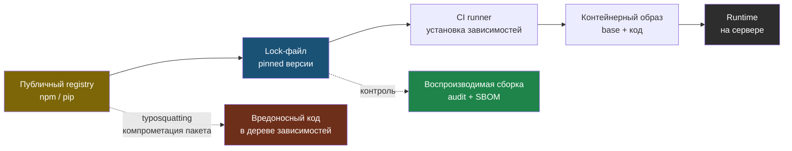

# Глава 7: Dependency и supply chain risks

> **Запомни:** уязвимость нередко приезжает не через твой код, а через пакет, lock-файл, контейнерный образ и доверие к чужой публикации.

---

## 7.1 Контекст и границы

Современное приложение почти всегда состоит из чужих библиотек. Риск в supply chain — это не только CVE, но и typosquatting, abandoned packages, install scripts, непинованные версии и неуправляемое обновление дерева зависимостей.

Нужно смотреть не только на наличие уязвимости, но и на путь доставки: lock-файл, registry, CI runner, приватные пакеты, подписи, provenance и процесс обновления.

Эта глава особенно полезна для всех, кто использует npm, pip, go modules, CI, контейнеры и автоматические обновления зависимостей.

---

## 7.2 Как выглядит риск

Типовые слабые места:
- нет lock-файла или он перегенерируется без review;
- зависимости тянутся с широкими version ranges;
- CI запускает latest образы и инструменты без фиксации версии;
- нет инвентаризации SBOM и базовой проверки CVE;
- пакеты обновляются автоматически без smoke test и rollback-плана.

### Где особенно важно
- frontend сборка
- backend сервисы
- CI pipelines
- контейнеры
- private registries

---

## 7.3 Что строит защитник

- lock-файлы и pinned versions;
- регулярный audit зависимостей и образов;
- разделение build и runtime окружений;
- проверка происхождения образов и публикаций;
- обновление по плану: оценка риска, тест, rollout, rollback.

### Практический результат главы
- ты умеешь объяснить, откуда в проект приезжает код, который вы не писали;
- можешь показать, какой пакет или образ использует сервис и как он обновляется;
- понимаешь, зачем нужен SBOM даже в небольшом проекте.

```bash
pip-audit
npm audit --production
trivy image myapp:latest
```

Чужой код приезжает в приложение по цепочке: registry → lock-файл → CI → образ → runtime. Каждое звено — точка, где можно подменить или зафиксировать происхождение.



---

## 7.4 Практика

### Шаг 1: Инвентаризация зависимостей
- посмотри lock-файлы, package manager и registry;
- отдели прямые зависимости от транзитивных.

```bash
rg --files | rg "package-lock.json|poetry.lock|requirements.txt|go.sum|Cargo.lock"
```

### Шаг 2: Проверь аудит и обновление
- прогони пакетный аудит в своей среде;
- не исправляй все подряд: сначала оцени blast radius и наличие тестов.

```bash
pip-audit || true
npm audit --production || true
```

Пример вывода `pip-audit`:

```
Name          Version  ID                  Fix Versions
------------- -------- ------------------- ------------
Pillow        9.0.0    GHSA-4fx9-vc88-q2xc 9.0.1
cryptography  3.4.7    GHSA-x9w5-v3q2-3rhw 38.0.3
```

Что делать дальше:
1. Прочитать advisory и понять, используется ли уязвимая функция.
2. Обновить пакет в отдельной ветке.
3. Прогнать тесты и smoke check.

Пример вывода `npm audit --production`:

```
# npm audit report
lodash  <4.17.21
Severity: high
Prototype Pollution in lodash - https://npmjs.com/advisories/1523
Dependents: webpack > loader-utils > lodash
fix available via `npm audit fix`
```

`npm audit fix` не должен запускаться вслепую в production-ветке: сначала нужно понять, ломает ли обновление API и сборку.

### Шаг 3: Проверь CI и образы
- найди latest, непинованные action версии и широкие base images;
- зафиксируй, где нужна версия, digest или provenance.

```bash
rg -n "latest|uses: .*@main|FROM .*:latest" .github/ Dockerfile* docker-compose*.yml
```

Пример вывода `trivy` по образу:

```
myapp:latest (ubuntu 22.04)
Total: 3 (HIGH: 1, MEDIUM: 2)

Library   Vulnerability   Severity   Installed   Fixed
openssl   CVE-2023-XXXX   HIGH       3.0.2       3.0.7
```

Плохой Dockerfile:

```dockerfile
FROM python:latest
```

Лучше:

```dockerfile
FROM python:3.12-slim
```

Ещё лучше:

```dockerfile
FROM python:3.12-slim@sha256:abc123def456...
```

Текущий digest образа можно посмотреть так:

```bash
docker inspect --format='{{index .RepoDigests 0}}' python:3.12-slim
```

### Что нужно явно показать
- какие package managers использует проект;
- есть ли lock-файлы;
- какой инструмент аудита уже применим к проекту;
- какие зависимости или образы самые рискованные.

---

## 7.5 Lab-only проверка

Все проверки в этой главе выполняются только на своих VM, контейнерах, тестовых доменах и собственных сервисах.

- на своем стенде прогони безопасный аудит зависимостей и зафиксируй 3 самые критичные находки;
- проверь, что обновление одной библиотеки проходит через smoke test, а не сразу уезжает в production;
- сравни base image до и после ужесточения версии.

---

## 7.6 Типовые ошибки

- обновлять все разом без понимания влияния;
- доверять latest в CI и контейнерах;
- не хранить lock-файл в репозитории;
- путать vulnerability scanning и управление риском изменения.

---

## 7.7 Чеклист главы

- [ ] Я знаю, какие lock-файлы и package managers есть в проекте
- [ ] Я умею сделать базовый аудит зависимостей и образов
- [ ] У меня есть процесс контролируемого обновления
- [ ] Я не завишу от latest там, где это можно исключить
