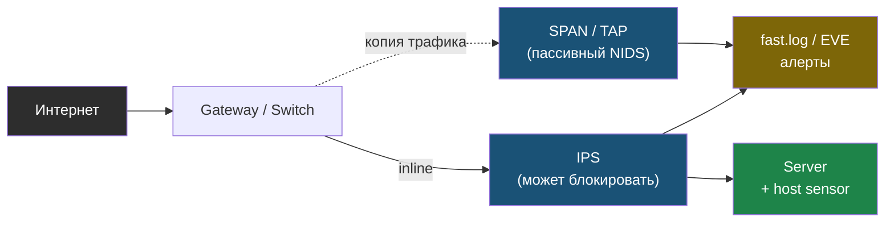
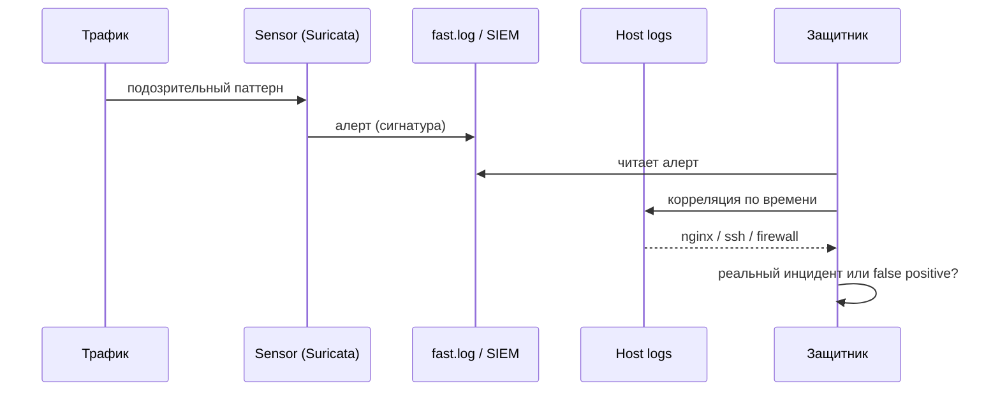

# Глава 5: IDS/IPS на сетевом уровне

> **Запомни:** IDS/IPS полезны только тогда, когда ты понимаешь, что они видят, что пропускают и как интерпретировать сигналы без лишнего шума.

---

## 5.1 Контекст и границы

Firewall решает “пускать или не пускать”, а IDS/IPS помогает увидеть подозрительный паттерн трафика и при необходимости автоматически реагировать.

Главная ошибка — ставить IDS ради галочки и утонуть в false positive, не понимая, что именно она анализирует: зеркало трафика, span, inline-позицию или host-based источник.

Где именно стоит сенсор — определяет, что он вообще способен увидеть. SPAN/TAP дают пассивную копию трафика (режим IDS), inline-позиция позволяет блокировать (режим IPS), а host-based видит только трафик своего узла.



Эта глава особенно полезна для small business, VPS-групп и лабораторий, где нужно научиться видеть сетевые события, а не только открытые порты.

---

## 5.2 Как выглядит риск

Типовые слабые места:
- сеть не наблюдается вообще — сканирование и east-west шум проходят без единого сигнала.
  Проверить: есть ли хоть один sensor, SPAN/TAP или host-based capture point.
- есть IDS, но никто не смотрит алерты — система шумит сама в себе и не меняет поведение команды.
  Проверить: кто читает `fast.log` или SIEM-алерты и как это отражено в процессе.
- правила загружены без tuning под свою инфраструктуру — появляется вал ложных срабатываний, и полезные события тонут.
  Проверить: открыть активные rulesets и посмотреть, какие из них реально относятся к твоим сервисам.
- нет корреляции с host-логами — событие IDS нельзя связать с nginx, SSH или firewall по времени.
  Проверить: сопоставить один controlled scan с логами sensor и хоста.
- ожидается, что IDS остановит volumetric DDoS сама по себе — detection подменяет собой edge-защиту.
  Проверить: документирована ли граница ответственности IDS и anti-DDoS слоя.

### Где особенно важно
- малый офис
- лаборатория с несколькими сегментами
- серверная зона за gateway

---

## 5.3 Что строит защитник

- понятная точка обзора: mirror/SPAN, TAP, gateway или host sensor;
- базовые сигнатуры плюс локальная подстройка;
- связка событий IDS с firewall и host logs;
- приоритет на high-confidence правила;
- процедура review алертов и ложных срабатываний.

### Практический результат главы
- ты понимаешь, где ставить sensor и что он реально увидит;
- умеешь отличать IDS от IPS;
- можешь показать, как сетевой сигнал связывается с хостовым событием.

Ценность сенсора не в самом алерте, а в цепочке от детекта до решения. Сетевое событие нужно сопоставить с host-логами по времени, иначе его нельзя ни подтвердить, ни отличить от ложного срабатывания.



```bash
sudo suricata -T -c /etc/suricata/suricata.yaml
sudo tail -f /var/log/suricata/fast.log
```

---

## 5.4 Практика

### Шаг 1: Выбери точку наблюдения
- реши, смотришь ли ты трафик на gateway, на зеркальном порту или на самом хосте;
- опиши ограничения выбранного места.

```bash
ip link
```

### Шаг 2: Подними sensor и логи
- проверь конфиг, интерфейс и каталоги логов;
- включи только те наборы правил, которые реально относятся к твоей сети.

```bash
sudo suricata -T -c /etc/suricata/suricata.yaml
sudo systemctl status suricata --no-pager
```

### Шаг 3: Сделай controlled network activity
- на своем стенде создай безопасный трафик: scan своего узла, burst запросов к веб-сервису, DNS-пакеты;
- проверь, видит ли sensor событие и пригодно ли оно для расследования.

```bash
nmap -Pn SERVER_IP
curl -I https://HOST
```

### Что нужно явно показать
- где именно стоит sensor;
- какие типы событий он может видеть;
- какие логи и алерты ты реально читаешь;
- какие high-confidence правила включены.

---

## 5.5 Lab-only проверка

Все проверки в этой главе выполняются только на своих VM, контейнерах, тестовых доменах и собственных сервисах.

- сделай controlled scan своей lab-машины и проверь, появляется ли событие в логах sensor;
- сравни сетевой алерт и host log по времени;
- зафиксируй ложные срабатывания и их причину.

---

## 5.6 Типовые ошибки

- ждать от IDS полной блокировки всего плохого;
- ставить sensor в место, где он не видит нужный трафик;
- не заниматься tuning сигнатур;
- не хранить достаточно логов для расследования.

---

## 5.7 Чеклист главы

- [ ] Я понимаю, где стоит мой сетевой sensor
- [ ] Я умею проверять его конфиг и логи
- [ ] Я связал IDS-сигналы с host/firewall наблюдаемостью
- [ ] У меня есть controlled сценарии для проверки видимости
