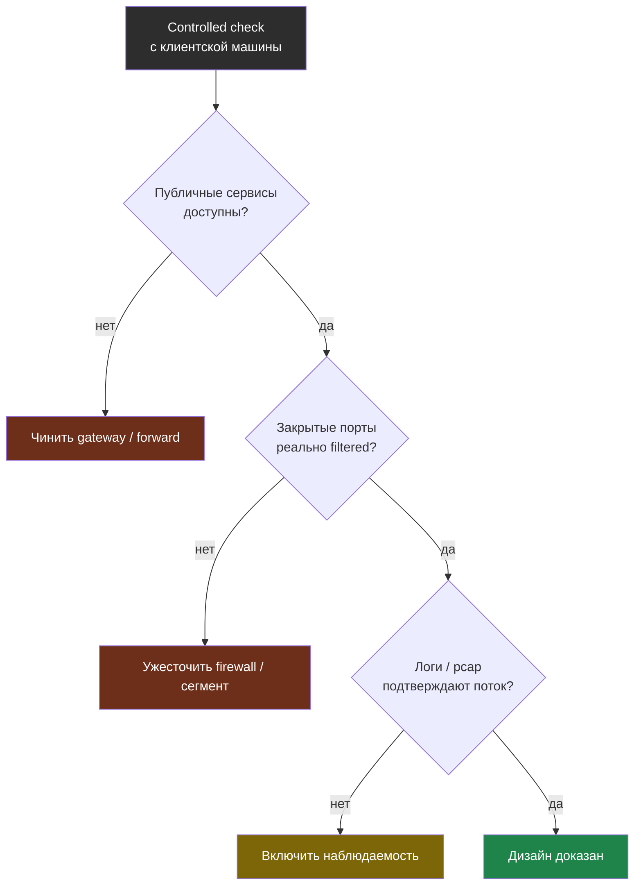

# Глава 9: Итоговый проект

> **Запомни:** хороший сетевой проект должен отвечать не только на вопрос "как маршрутизировать трафик", но и на вопрос "какие зоны доверия я построил и как их проверил".

---

## 9.1 Цель проекта

Собрать defensible network design и доказать его controlled checks.

Основной вариант этой книги:
- gateway/firewall;
- app server;
- разделение зон или виртуальных сетей;
- понятные ACL/правила доступа;
- packet visibility или firewall-level logging.

---

## 9.2 Стартовая точка

Нужно иметь:
- минимум 2 VM, лучше 3;
- возможность создать отдельные virtual networks/VLAN-like сегменты;
- snapshot перед началом;
- одну клиентскую машину для внешних проверок.

---

## 9.3 Фазы проекта

### Фаза 1: Описать зоны доверия

Например:
- client;
- admin;
- gateway;
- server.

### Фаза 2: Построить схему доступа

Определи:
- кто может стучаться на `22/80/443`;
- кто не должен видеть внутренние сервисы;
- где нужен VPN или bastion.

### Фаза 3: Включить наблюдаемость

Минимум:
- firewall logs/counters;
- packet capture для controlled tests;
- список опубликованных сервисов.

### Фаза 4: Проверки

Со своей клиентской машины проверь:
- доступ к опубликованным сервисам;
- недоступность закрытых портов;
- поведение при попытке обойти схему.

---

## 9.4 Варианты проекта

### Основной вариант

`gateway + DMZ + app server`

### Альтернативный домашний вариант

Один хост с несколькими VM и виртуальными сетями, где pfSense/OPNsense играет роль gateway.

---

## 9.5 Что считать успешным результатом

- схема зон доверия нарисована и совпадает с реальностью;
- доступы соответствуют правилам;
- packet capture или логи подтверждают поведение;
- нет случайно открытых сервисов между зонами.

Проверку удобно оформить как дерево решений: каждый ответ либо подтверждает дизайн, либо отправляет назад чинить конкретный слой. Проект считается сдан только когда все ветки приводят к «доказано».

---

## 9.6 Финальный чеклист

- [ ] Зоны доверия описаны ясно
- [ ] Gateway реально фильтрует трафик
- [ ] Внутренние сервисы не видны из внешней зоны
- [ ] Админский доступ отделён от пользовательского
- [ ] Controlled scans и captures подтверждают схему
- [ ] Есть snapshot и минимальный runbook по сети
