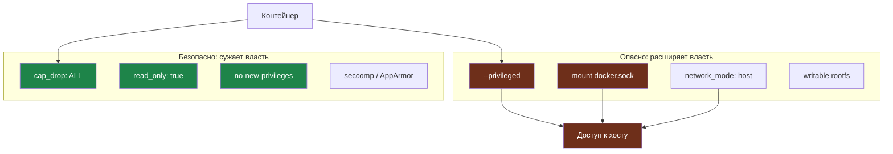

# Глава 5: Runtime security

> **Запомни:** контейнер может быть аккуратно собран, но плохо запущен: с лишними capability, volume mounts, network access и привилегиями.

---

## 5.1 Контекст и границы

Риски runtime — это не только escape-сценарии. Чаще проблема в том, что контейнеру дали слишком много: privileged, host network, root user, writable filesystem, bind mount docker.sock и доступ к секретам, которые ему не нужны.

Хороший runtime baseline сужает последствия ошибки в приложении и помогает локализовать инцидент.

Эта глава особенно полезна для Docker и Compose окружений, где контейнеры уже работают в production или lab.

---

## 5.2 Как выглядит риск

Типовые слабые места:
- контейнер запущен с `--privileged` или широкими capability — приложение получает почти хостовый уровень власти.
  Проверить: `docker inspect CONTAINER_NAME | rg -n 'Privileged|CapAdd|CapDrop'`.
- докер-сокет примонтирован в приложение — контейнер может управлять другими контейнерами и самим Docker daemon.
  Проверить: `docker inspect CONTAINER_NAME | rg -n 'docker.sock'`.
- root filesystem writable без причины — любой write-примитив живёт в образе контейнера дольше и легче используется для закрепления.
  Проверить: `docker inspect CONTAINER_NAME | rg -n 'ReadonlyRootfs'`.
- контейнер имеет полный исходящий доступ — SSRF или компрометация приложения получают свободный egress.
  Проверить: сетевые правила и маршруты контейнера.
- seccomp/apparmor profiles не используются — системные вызовы ограничиваются только дефолтами или не ограничиваются вообще.
  Проверить: `docker inspect CONTAINER_NAME | rg -n 'SecurityOpt|AppArmorProfile'`.

### Где особенно важно
- docker compose
- self-hosted services
- CI runners in containers
- sidecars

---

## 5.3 Что строит защитник

- drop capabilities и add только нужные;
- read-only root filesystem где возможно;
- не-root user в runtime;
- минимум volume mounts и отсутствие docker.sock;
- ограничение сетевого доступа и ресурсов.

### Практический результат главы
- ты умеешь читать docker run или compose как security policy;
- можешь объяснить, что именно получает контейнер в runtime;
- понимаешь, как уменьшить последствия компрометации приложения.

```yaml
services:
  app:
    image: myapp:hardened
    read_only: true
    cap_drop:
      - ALL
    security_opt:
      - no-new-privileges:true
    tmpfs:
      - /tmp
```

Как runtime-флаги расширяют или сужают власть контейнера:



---

## 5.4 Практика

### Шаг 1: Разбери compose и runtime flags
- найди privileged, cap_add, network_mode: host, bind mounts и docker.sock;
- оцени, какие из них действительно нужны.

```bash
rg -n "privileged|cap_add|docker.sock|network_mode|read_only|security_opt" docker-compose*.yml compose*.yml
```

### Шаг 2: Ужесточи runtime baseline
- добавь read_only, no-new-privileges, cap_drop, tmpfs там, где это возможно;
- проверь, что приложение не сломалось из-за реальной зависимости на запись.

```bash
docker compose up -d
docker inspect CONTAINER_NAME | rg -n 'ReadonlyRootfs|CapAdd|CapDrop|SecurityOpt'
```

### Шаг 3: Проверь ограничения ресурсов и сеть
- оцените лимиты CPU и memory и сетевой доступ;
- убедитесь, что контейнер не ходит в те сегменты, которые ему не нужны.

```bash
docker stats --no-stream
```

### Что нужно явно показать
- какие runtime привилегии реально есть у контейнера;
- есть ли docker.sock или опасные bind mounts;
- read-only ли root filesystem;
- как ограничены ресурсы и сеть.

---

## 5.5 Lab-only проверка

Все проверки в этой главе выполняются только на своих VM, контейнерах, тестовых доменах и собственных сервисах.

- сравни docker inspect до и после hardening runtime;
- проверь, что контейнер не требует privileged для нормальной работы;
- зафиксируй, какие записи действительно нужны в writable volume или tmpfs.

---

## 5.6 Типовые ошибки

- давать --privileged ради быстрого запуска;
- монтировать docker.sock в приложение;
- не проверять реальные потребности контейнера в записи;
- игнорировать capabilities и security profiles.

---

## 5.7 Чеклист главы

- [ ] Я проверил runtime привилегии контейнера
- [ ] Контейнеру не дано больше capability, чем нужно
- [ ] Опасные mounts и docker.sock исключены
- [ ] У контейнера есть минимум необходимых прав и ресурсов
