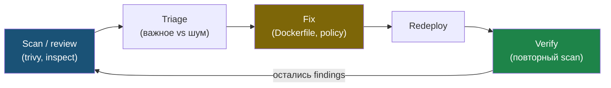

# Глава 8: Практика безопасных проверок

> **Запомни:** cloud и container security бессмысленны без цикла `scan -> fix -> redeploy -> verify`.

Базовый рабочий цикл безопасных проверок:



---

## 8.1 Что проверяем

В этой главе мы не ломаем инфраструктуру, а ищем слабые места controlled way:

- слишком широкие сетевые экспозиции;
- root inside container;
- секреты в image или в git;
- избыточные IAM права;
- weak manifests/policies;
- устаревшие зависимости и образы.

---

## 8.2 Практика с image scanning

Прогоняй scanner по своему образу:

```bash
trivy image YOUR_IMAGE:TAG
```

Смысл не в том, чтобы добиться нуля любой ценой, а в том, чтобы:
- увидеть критичные и high findings;
- понять, связаны ли они с base image;
- уменьшить шум и исправить реально важное.

---

## 8.3 Практика с runtime baseline

Проверь:
- запускается ли контейнер под non-root;
- нужен ли ему write access к FS;
- не слишком ли широкие Linux capabilities;
- не торчит ли сервис наружу, если он должен быть внутренним.

Это можно валидировать своими же `docker inspect`, manifest review и сетевыми проверками.

---

## 8.4 Controlled policy violations

В своей lab допустим сценарий:
- взять слабый `Dockerfile` или слишком открытый manifest;
- прогнать scanner/review;
- исправить;
- повторно прогнать проверку.

Это безопасная и полезная практика, потому что она не имитирует атаку на чужой объект, а тренирует secure baseline.

---

## 8.5 Чеклист главы

- [ ] Я умею запускать scanner по своим образам
- [ ] Я понимаю разницу между важными и шумными findings
- [ ] Я умею проверить runtime baseline контейнера
- [ ] Я могу провести controlled review cloud/container экспозиций
