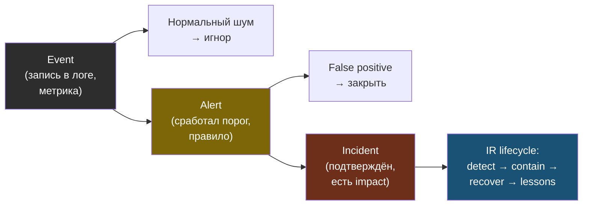

# Глава 0: Что считать инцидентом

> **Запомни:** прежде чем включать защиту, нужно понять, что именно ты защищаешь, от кого и какими слоями.

---

## 0.1 Зачем эта книга

Собрать инженерный IR-подход: сигнал, triage, containment, recovery, postmortem.

Эта книга самостоятельная. Она повторяет базовые вещи там, где это нужно для целостного defensive пути.

---

## 0.2 Стартовая точка

Подходит для сценариев:

- home lab;
- один VPS;
- small business;
- enterprise-pattern review.

До начала полезно иметь:

- отдельную тестовую VM или стенд;
- snapshot или backup перед опасными проверками;
- тестовый домен или локальные имена;
- привычку разделять production и lab.

---

## 0.3 Threat model

Ключевой вопрос этой книги: **какие активы у тебя есть, какие у них границы доверия и какие классы атак наиболее вероятны**.

Для этой темы важно смотреть на:

- что выставлено наружу;
- какие идентификационные данные могут утечь;
- какие сигналы останутся в логах и трафике;
- что можно быстро починить, а что требует отдельной архитектуры.

---

## 0.4 Карта пути

Event, alert, incident, severity и ожидания по реакции.

Не каждое событие — это инцидент. Сигнал проходит фильтрацию: большинство событий ничего не значат, часть становится алертами, и лишь подтверждённые алерты с реальным impact превращаются в инцидент, требующий реакции по жизненному циклу IR.

Дальше книга идёт от базовой модели угроз к практическим слоям защиты, затем к безопасным проверкам, а потом к итоговому проекту.

Принцип каждой главы:

1. понять риск;
2. построить защиту;
3. проверить защиту на своём стенде;
4. посмотреть, что видно в логах и сигналах.

---

## 0.5 Как работать безопасно

Все демонстрации в этой книге выполняются только на своих VM, контейнерах, тестовых VPS и доменах. Никаких проверок против чужих систем.

Минимальные правила lab:

- отдельная сеть или хотя бы отдельная VM;
- не использовать production-ключи и реальные чувствительные данные;
- документировать изменения;
- после опасной проверки уметь откатиться на snapshot.

---

## Чеклист главы 0

- [ ] Я понимаю основную цель книги
- [ ] У меня есть безопасная стартовая лаборатория
- [ ] Я понимаю, что offensive-элементы здесь только lab-only
- [ ] Я вижу путь книги от threat model к итоговому проекту
