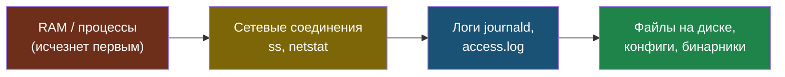
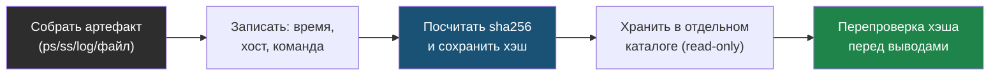

# Глава 7: Forensics basics для инженера

> **Запомни:** инженерное forensic-мышление — это умение сохранить артефакты и сделать аккуратные выводы, не превращая расследование в догадки.

---

## 7.1 Контекст и границы

Большинство небольших инцидентов не доходит до полноценной криминалистики, но подход должен быть аккуратным: что именно ты собрал, когда, с какого хоста и почему считаешь это надежным источником.

Полезно понимать разницу между volatile data и persistent artifacts, а также знать, что любое твое действие на системе меняет состояние.

Эта глава особенно полезна для практиков, которым нужно провести начальный разбор на Linux без глубокой криминалистической специализации.

---

## 7.2 Как выглядит риск

Типовые слабые места:
- артефакты собираются хаотично;
- нет фиксации времени и источника данных;
- переиспользуются файлы без хэширования;
- делаются сильные выводы по одному симптому;
- система изменяется сильнее, чем требуется.

### Где особенно важно
- VPS
- VM
- docker host
- single Linux node

---

## 7.3 Что строит защитник

- фиксация времени, хоста, команды и результата;
- сбор volatile data сначала, если это важно;
- хэширование и аккуратное хранение артефактов;
- минимум изменений на оригинальном хосте;
- разделение фактов, предположений и выводов.

### Практический результат главы
- ты умеешь проводить инженерное расследование аккуратно;
- понимаешь, какие артефакты стоит собирать первыми;
- можешь документировать ход разбора так, чтобы его можно было проверить.

Артефакты собирают по порядку волатильности (order of volatility): сначала то, что исчезнет первым (память, сетевые соединения, процессы), потом — то, что переживёт перезагрузку (логи, файлы на диске).



Каждый собранный артефакт проходит chain of custody: фиксируется время, хост, источник и хэш — чтобы позже можно было доказать, что файл не подменялся.



```bash
date -Is
hostnamectl
sha256sum /var/log/nginx/access.log
ps auxf > /tmp/ps_snapshot.txt
ss -tulpn > /tmp/ss_snapshot.txt
```

---

## 7.4 Практика

### Шаг 1: Собери шаблон заметки расследования
- в note должны быть: время, хост, источник сигнала, команды, артефакты, выводы;
- не смешивай факты и предположения.

```bash
cat > /tmp/incident-note-template.md <<'EOF'
# Incident Note
- time:
- host:
- signal source:
- commands run:
- artifacts collected:
- facts:
- hypotheses:
EOF
cat /tmp/incident-note-template.md
```

### Шаг 2: Потренируй сбор артефактов
- на своей lab собери snapshot процессов, портов, последних логов и контрольных сумм файлов;
- сохрани результаты как набор артефактов.

```bash
ps auxf > /tmp/ps_snapshot.txt
ss -tulpn > /tmp/ss_snapshot.txt
sha256sum /var/log/nginx/access.log
```

### Шаг 3: Оцени надежность источников
- для каждого артефакта запиши, почему ты ему доверяешь и что могло его изменить;
- особенно это важно для уже работающего хоста.

```bash
cat >> /tmp/incident-note-template.md <<'EOF'

## Source Reliability
- journald: trusted host log, but live system may rotate
- access.log: good for HTTP timeline, may miss app internals
- ps/ss snapshots: point-in-time only
EOF
tail -10 /tmp/incident-note-template.md
```

### Что нужно явно показать
- шаблон forensic notes;
- какие артефакты собираются первыми;
- как фиксируется хэш и происхождение файла;
- где проведена граница между фактом и гипотезой.

---

## 7.5 Lab-only проверка

Все проверки в этой главе выполняются только на своих VM, контейнерах, тестовых доменах и собственных сервисах.

- на своем стенде проведи мини-разбор безопасного инцидентного сценария и собери артефакты в одном каталоге;
- после сбора проверь контрольные суммы и опиши источник каждого файла;
- не уходи в destructive действия и не меняй систему больше, чем нужно для упражнения.

---

## 7.6 Типовые ошибки

- не фиксировать время и источник артефакта;
- делать выводы без достаточного набора данных;
- не понимать, что live-system уже меняется под руками;
- не хранить артефакты аккуратно и проверяемо.

---

## 7.7 Чеклист главы

- [ ] Я умею собрать минимальный набор артефактов
- [ ] Я фиксирую время, хост и команды
- [ ] Артефакты сопровождаются хэшами и описанием источника
- [ ] Мои выводы отделены от гипотез
