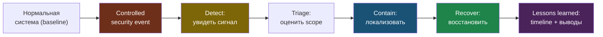

# Глава 8: Практика incident drills

> **Запомни:** incident response нельзя выучить только по теории. Нужны controlled drills, иначе под стрессом всё развалится.

---

## 8.1 Формат упражнений

Каждое упражнение строится по схеме:

1. есть базовая нормальная система;
2. в неё вносится controlled security event;
3. читатель должен увидеть сигнал;
4. провести triage;
5. локализовать проблему;
6. восстановить и зафиксировать выводы.

Это тот же жизненный цикл IR, что и в реальном инциденте, только в управляемой lab. Замыкающая фаза lessons learned превращает упражнение в реальный навык.

---

## 8.2 Примеры controlled drills

### Drill 1: Серия неудачных логинов

Сигнал:
- auth logs;
- ban events;
- опционально алерт.

Задача:
- подтвердить источник;
- проверить, это шумный бот или ошибка пользователя;
- убедиться, что защита не ломает легитимный доступ.

### Drill 2: Подозрительный burst к приложению

Сигнал:
- access logs;
- rate limit;
- spikes в метриках.

Задача:
- подтвердить scope;
- посмотреть affected endpoints;
- решить, нужен ли containment.

### Drill 3: Неожиданный процесс/изменение файла

Сигнал:
- host-level visibility;
- baseline deviation.

Задача:
- определить, это админское изменение, deployment или аномалия;
- собрать контекст перед действиями.

---

## 8.3 Что обязательно фиксировать

После каждого drill:
- timeline;
- signal source;
- hypothesis;
- containment action;
- recovery action;
- lesson learned.

Иначе упражнение не превращается в реальный IR-навык.

---

## 8.4 Чеклист главы

- [ ] Я умею запускать controlled incident drills на своём стенде
- [ ] Я документирую timeline и выводы
- [ ] Я различаю event, alert и incident
- [ ] Я умею пройти путь detect -> contain -> recover без паники
