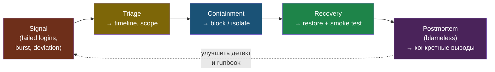

# Глава 9: Итоговый проект

> **Запомни:** хороший IR-проект нельзя оценить по настройкам. Он оценивается по тому, можешь ли ты пройти путь от сигнала до восстановления без хаоса.

---

## 9.1 Цель проекта

Построить небольшой стенд, где controlled security-event проходит полный жизненный цикл:

```text
signal -> triage -> containment -> recovery -> postmortem
```

Каждая фаза проекта даёт свой артефакт: triage — timeline и scope, containment — зафиксированное решение, recovery — подтверждённый smoke test, postmortem — blameless-выводы. Без последней фазы цикл не закрыт.



---

## 9.2 Стартовая точка

Нужны:
- логи или централизованный логовый доступ;
- метрики/алерты или хотя бы понятные события;
- snapshot/backup;
- test environment.

---

## 9.3 Фазы проекта

### Фаза 1: Подготовить сигналы

Например:
- repeated failed logins;
- suspicious request burst;
- controlled service failure;
- baseline deviation.

Lab-only симуляции:

```bash
nc -l -p 4444 &
ss -tulpn | grep 4444
sudo lsof -i :4444
```

### Фаза 2: Провести triage

Зафиксируй:
- что именно увидел;
- когда это началось;
- какой scope затронут;
- какая гипотеза основная.

```bash
for i in {1..5}; do
  ssh wronguser@TARGET_IP -o ConnectTimeout=3 2>/dev/null || true
done
sudo grep "Failed password\\|Invalid user" /var/log/auth.log | tail -10
sudo journalctl -u ssh -n 20 --no-pager | grep "Failed\\|Invalid"
```

### Фаза 3: Containment

Выбери минимально достаточное действие:
- блокировка IP;
- остановка доступа;
- rollback;
- изоляция сервиса.

```bash
sudo ufw default deny incoming
sudo ufw allow from YOUR_ADMIN_IP to any port 22
sudo ufw enable
```

### Фаза 4: Recovery

Подтверди:
- сервис снова работает;
- причина устранена;
- следы события сохранены;
- есть короткий postmortem.

```bash
echo "# test entry" | sudo tee -a /etc/crontab
sudo sha256sum -c /var/log/integrity-baseline.txt 2>/dev/null | grep FAILED
sudo tail -n 5 /etc/crontab
```

---

## 9.4 Варианты проекта

### Основной вариант

Attack-like event в lab и полный IR-цикл.

### Альтернативный вариант

Tabletop + маленький технический стенд для подтверждения сигналов и recovery.

---

## 9.5 Финальный чеклист

- [ ] У события есть нормальный сигнал
- [ ] Я могу отличить event от incident
- [ ] У меня есть зафиксированный timeline
- [ ] Containment не ломает всё без необходимости
- [ ] Recovery проверен, а не просто объявлен
- [ ] Postmortem содержит конкретные выводы
