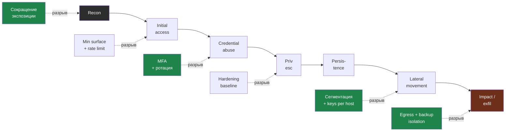

# Глава 9: Итоговый проект

> **Запомни:** итоговый проект этой книги оценивает понимание kill chain глазами защитника, а не способность провести offensive-операцию.

---

## 9.1 Цель проекта

Построить defensive narrative для своей инфраструктуры:
- какие этапы атаки наиболее вероятны;
- где именно они будут видны;
- какие controls разрывают цепочку;
- какие пробелы остаются.

Итоговый narrative — это вся kill chain со встроенными точками разрыва. Для каждого этапа отметь контроль, который останавливает продвижение на твоём стенде.



Сильный проект показывает не «я могу атаковать», а «я знаю, где именно моя защита ломает каждый этап».

---

## 9.2 Стартовая точка

Нужны:
- свой lab-стенд;
- список активов;
- логи и базовая видимость;
- snapshot перед демонстрациями.

---

## 9.3 Фазы проекта

### Фаза 1: Построить свою kill chain map

Для своего стенда опиши:
- recon;
- initial access;
- credential abuse;
- privilege escalation;
- persistence;
- lateral movement;
- impact/exfil.

Lab-only defensive recon задания:

```bash
nmap -Pn -sV --version-intensity 2 TARGET_IP 2>/dev/null
find /home -name "authorized_keys" 2>/dev/null | \
  xargs -I{} sh -c 'echo "=== {} ==="; wc -l < "{}"'
ssh -i /opt/myapp/.ssh/app_key db-server 2>&1 || true
```

Цель:
- внешний наблюдатель видит только нужные сервисы;
- у каждого пользователя свои ключи, а не shared access;
- с app-server нельзя уйти на db-server без отдельного разрешения.

### Фаза 2: Выбрать 2-3 safe demonstrations

Только lab-only:
- controlled scan;
- failed login storm;
- weak sudo/local misconfig demo.

### Фаза 3: Defensive interpretation

После каждой демонстрации покажи:
- сигнал;
- контроль;
- место разрыва цепочки;
- что усиливать дальше.

---

## 9.4 Финальный чеклист

- [ ] Я не вышел за рамки lab-only
- [ ] У меня есть карта kill chain для своего стенда
- [ ] Для каждой демонстрации есть defensive interpretation
- [ ] Я могу показать, где защита уже ломает цепочку
- [ ] Я не превращаю этот материал в offensive playbook
