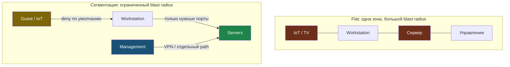

# Глава 1: Домашняя лаборатория и personal infrastructure

> **Запомни:** архитектура начинается задолго до enterprise. Домашний стенд — лучший полигон, чтобы научиться строить зоны, управление доступом и recovery без лишнего масштаба.

---

## 1.1 Контекст и границы

Домашняя инфраструктура часто собирается стихийно: роутер, один сервер, несколько VM и открытый SSH. Но именно здесь удобно научиться правильной структуре: отдельный management path, сегментация, snapshots, бэкапы и наблюдаемость.

Если baseline не построен дома, потом он плохо переносится в VPS и бизнес-инфраструктуру.

Эта глава особенно полезна для дома, personal lab и первого собственного сервера.

---

## 1.2 Как выглядит риск

Типовые слабые места:
- все устройства в одной сети — компрометация одного узла сразу увеличивает blast radius на всю домашнюю lab.
  Проверить: `ip neigh show` и список подсетей.
- сервер, рабочая станция и IoT делят один trust zone — слабое домашнее устройство получает путь к серверу и админским сервисам.
  Проверить: карта зон и доступов между устройствами.
- нет snapshots и проверенного восстановления — после ошибки или неудачного обновления нечем откатиться.
  Проверить: `virsh snapshot-list VM_NAME` или `VBoxManage snapshot VM_NAME list`.
- админ-доступ идет напрямую из интернета — домашний стенд перенимает худшие production-привычки.
  Проверить: внешний `nmap` и список проброшенных портов.
- стенд не документирован и держится на памяти — через месяц никто не помнит роли узлов и путь восстановления.
  Проверить: есть ли inventory и правило именования snapshots.

### Где особенно важно
- VirtualBox и libvirt lab
- домашний сервер
- первые VPS-проекты

---

## 1.3 Что строит защитник

- выделение ролей: workstation, management, servers, guest или IoT;
- snapshots перед крупными изменениями;
- VPN или хотя бы сужение admin access;
- простая карта сети и сервисов;
- бэкап и test restore даже для lab.

### Практический результат главы
- ты умеешь смотреть на домашний стенд как на полноценную архитектуру;
- понимаешь, какие привычки потом масштабируются в production;
- можешь описать домашнюю инфраструктуру как набор trust zones.

Разница между flat-сетью и сегментацией — это размер blast radius: в плоской сети компрометация любого устройства открывает путь ко всем. Логические зоны ограничивают распространение.



```bash
virsh list --all 2>/dev/null || true
ip a
ip r
ss -tulpn
```

---

## 1.4 Практика

### Шаг 1: Нарисуй домашнюю архитектуру
- выпиши физические и виртуальные узлы, подсети, точки администрирования и бэкапы;
- для каждого узла укажи роль.

```bash
ip neigh show
nmap -sn 192.168.1.0/24 2>/dev/null || true
virsh list --all 2>/dev/null || true
virsh snapshot-list VM_NAME 2>/dev/null || true
VBoxManage list vms 2>/dev/null || true
VBoxManage snapshot VM_NAME list 2>/dev/null || true
```

### Шаг 2: Выдели trust zones
- раздели рабочие устройства, серверы, управление и гостевые сети;
- пусть даже пока это логическая, а не физическая сегментация.

```bash
ip r
```

### Шаг 3: Подготовь дисциплину snapshots
- для VM зафиксируй правило: snapshot до крупных глав и проектов;
- для bare metal — конфиг backup и rollback plan.

```bash
virsh snapshot-list VM_NAME 2>/dev/null || true
VBoxManage snapshot VM_NAME list 2>/dev/null || true
```

## 1.5 Проверить восстановление

Самая важная часть домашней lab — реальный test restore:

```bash
virsh snapshot-revert VM_NAME SNAPSHOT_NAME 2>/dev/null || true
virsh start VM_NAME 2>/dev/null || true
ssh user@VM_IP echo "restored OK"
```

Для VirtualBox:

```bash
VBoxManage snapshot VM_NAME restore SNAPSHOT_NAME 2>/dev/null || true
VBoxManage startvm VM_NAME --type headless 2>/dev/null || true
ssh user@VM_IP echo "restored OK"
```

Если ты ни разу не делал откат, значит не знаешь, работает ли recovery вообще.

### Что нужно явно показать
- карту домашней lab;
- какие зоны выделены;
- как идет админ-доступ;
- как делаются snapshots и restore.

---

## 1.6 Lab-only проверка

Все проверки в этой главе выполняются только на своих VM, контейнерах, тестовых доменах и собственных сервисах.

- на своей инфраструктуре выдели хотя бы три роли: workstation, server, management, и опиши потоки между ними;
- перед следующим крупным упражнением создай snapshot и зафиксируй naming convention;
- сравни схему до и после структурирования.

---

## 1.7 Типовые ошибки

- считать домашний стенд несерьезным и не документировать его;
- держать все в одной подсети;
- не делать snapshots перед опасными изменениями;
- открывать управление наружу без отдельного плана.

---

## 1.8 Чеклист главы

- [ ] Домашняя инфраструктура описана как архитектура, а не как набор случайных устройств
- [ ] Зоны доверия выделены
- [ ] Snapshots и restore дисциплина определены
- [ ] Админ-доступ организован осознанно
