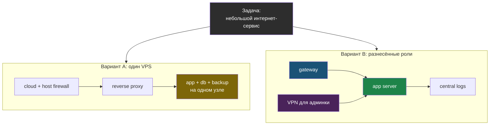

# Глава 8: Практика reference-архитектур

> **Запомни:** архитектура полезна только тогда, когда её можно сравнить, защитить аргументами и сопоставить с риском и бюджетом.

---

## 8.1 Как работать с reference-схемами

В этой главе недостаточно нарисовать 4 схемы. Нужно уметь ответить:
- какие активы защищает каждая схема;
- где у неё главные trust boundaries;
- чего в ней сознательно нет;
- какова operational cost этой архитектуры.

---

## 8.2 Практика сравнения

Для одной и той же задачи сравни хотя бы два варианта:

### Пример

Задача: небольшой интернет-сервис.

Вариант A:
- один VPS;
- cloud firewall;
- host firewall;
- reverse proxy;
- backup.

Вариант B:
- отдельный gateway;
- отдельный app server;
- VPN для админки;
- централизованные логи.

Сравни:
- риск;
- стоимость;
- сложность эксплуатации;
- время восстановления.

Две reference-схемы для одной задачи отличаются числом trust boundaries и operational cost. Вариант A проще и дешевле, вариант B даёт сегментацию и отдельный admin path ценой большей эксплуатационной нагрузки.

---

## 8.3 Практика дорожной карты

Возьми одну выбранную архитектуру и распиши:
- что можно сделать за 30 дней;
- что стоит делать за 90 дней;
- что оправдано только позже.

Это защищает от двух крайностей:
- слишком слабой архитектуры;
- и бессмысленного enterprise-overkill для маленькой системы.

---

## 8.4 Чеклист главы

- [ ] Я умею сравнивать архитектуры не только по "крутости", но и по стоимости и операционной цене
- [ ] Я могу защитить выбранную схему аргументами
- [ ] Я понимаю, где small business заканчивается и начинается enterprise-pattern
- [ ] Я умею строить roadmap, а не только статичную схему
