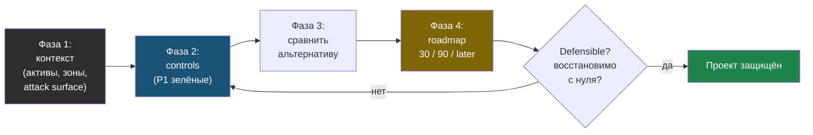

# Глава 9: Итоговый проект

> **Запомни:** финальный проект этой книги — не настройка сервера, а защита архитектурного решения инженерными аргументами.

---

## 9.1 Цель проекта

Выбрать один масштаб:
- дом;
- один VPS;
- small business;
- enterprise-like pattern.

И спроектировать целевую security-архитектуру для этого масштаба.

---

## 9.2 Что должно быть в проекте

Минимум:
- карта активов;
- trust zones;
- публичная поверхность атаки;
- ключевые controls;
- monitoring/detection слой;
- recovery baseline;
- roadmap развития.

Проект проходит четыре фазы: от описания контекста к выбору controls, затем сравнение с альтернативой и roadmap. Защищённость решения проверяется тем, можно ли восстановить архитектуру с нуля.



---

## 9.3 Фазы проекта

### Фаза 1: Описать контекст

Например:
- один публичный сервис на VPS;
- или small business с gateway и несколькими зонами.

Фаза пройдена, если можешь это подтвердить командами:

```bash
echo "Публичные endpoints:" && curl -s https://SERVER_IP/ -o /dev/null -w "%{http_code}\n"
echo "Открытые порты снаружи:" && nmap -Pn SERVER_IP 2>/dev/null | grep "open"
echo "Слушающие сервисы:" && ss -tulpn | grep LISTEN | wc -l
```

### Фаза 2: Выбрать controls

Нужно обосновать:
- что именно ставим;
- почему этого достаточно;
- почему не нужно больше или меньше.

Фаза пройдена, если все P1-проверки зелёные:

```bash
sshd -T | grep "passwordauthentication no"
sshd -T | grep "permitrootlogin no"
sudo ufw status | grep "Status: active"
ls /var/backups/*.sql 2>/dev/null | wc -l
```

### Фаза 3: Сравнить альтернативу

Сделай хотя бы одно сравнение:
- дешёвый baseline;
- более зрелая архитектура.

### Фаза 4: Составить roadmap

Что делать:
- сейчас;
- через 90 дней;
- позже по мере роста.

Финальный критерий проекта:

```bash
curl https://yourdomain.com/health
psql -c "SELECT COUNT(*) FROM users"
```

Если архитектуру можно восстановить с нуля (`terraform apply`, `ansible-playbook`, sync конфигурации), сервис поднимается, а данные на месте за разумное время, значит решение действительно defensible.

---

## 9.4 Финальный чеклист

- [ ] Архитектура соответствует выбранному масштабу
- [ ] Trust zones и controls описаны ясно
- [ ] У решения есть логика по риску и бюджету
- [ ] Я могу сравнить выбранную схему с альтернативой
- [ ] Есть roadmap, а не только статичная схема
