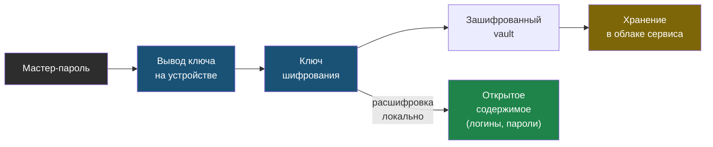

# Глава 3: Менеджеры паролей: mental model

> **Запомни:** менеджер паролей — это зашифрованное хранилище, а не просто красивый список логинов.

---

## 3.1 Что делает менеджер паролей

Менеджер паролей помогает:

- хранить уникальные пароли;
- генерировать новые пароли;
- автозаполнять формы входа;
- хранить secure notes;
- хранить recovery codes;
- синхронизировать доступы между устройствами;
- делиться отдельными записями, если это поддерживается;
- экспортировать и делать backup.

Главная идея:

```text
Ты помнишь один мастер-пароль.
Менеджер хранит остальные пароли.
```

Но это работает только если:

- мастер-пароль хороший;
- recovery продуман;
- backup проверен;
- устройство не заражено;
- MFA включён на самом менеджере.

---

## 3.2 Vault

Vault — это хранилище.

Внутри могут быть:

- логины и пароли;
- URL сайта;
- заметки;
- recovery codes;
- номера лицензий;
- Wi-Fi пароли;
- токены;
- данные банковской карты, если ты решил их там хранить.

Vault должен быть зашифрован. Это значит, что без ключа содержимое выглядит как бессмысленные данные.

---

## 3.3 Master password

Master password нужен, чтобы открыть vault.

Упрощённая модель:

```text
Мастер-пароль
  -> ключ
  -> открыть зашифрованный vault
```

Сервис может хранить зашифрованный vault у себя в облаке, но не должен знать твой мастер-пароль.

Схема показывает, почему сервис может хранить твой vault в облаке, но всё равно не видеть его содержимое: ключ выводится из мастер-пароля на твоём устройстве, а на сервер уходит уже зашифрованный vault.



Важный вывод:

> Если ты забудешь мастер-пароль, поддержка нормального менеджера паролей обычно не сможет просто "прислать его обратно".

Это не баг. Это часть защиты.

---

## 3.4 Unlock vs login

Есть две похожие операции.

**Login** — войти в аккаунт менеджера паролей.

Например:

- email;
- мастер-пароль;
- MFA.

**Unlock** — разблокировать уже открытое приложение.

Например:

- PIN;
- Face ID;
- Touch ID;
- Windows Hello;
- короткая локальная разблокировка.

Ошибка новичка: думать, что PIN от приложения заменяет мастер-пароль.

PIN — это удобная локальная разблокировка. Мастер-пароль остаётся главным ключом.

---

## 3.5 Генератор паролей

Генератор создаёт пароль, который человек не должен запоминать.

Пример учебного случайного пароля:

```text
qF8!mD2#vL9@pS6z
```

Для обычного сайта это нормально, потому что пароль сохранится в менеджере.

Настройки генератора:

- длина;
- буквы;
- цифры;
- специальные символы;
- исключение похожих символов;
- passphrase-режим.

Для большинства сайтов достаточно:

- 16-24 символа;
- случайная генерация;
- уникальный пароль.

---

## 3.6 Автозаполнение

Автозаполнение удобно, но его надо понимать.

Менеджер смотрит на домен сайта.

Если запись сохранена для:

```text
https://github.com
```

она не должна автоматически подставляться на:

```text
https://github-login.example.com
```

Это полезная защита от phishing. Поэтому не отключай проверку домена без причины.

---

## 3.7 Browser extension

Расширение браузера даёт:

- автозаполнение;
- сохранение новых логинов;
- генерацию пароля прямо на сайте;
- быстрый поиск по vault.

Риски:

- расширение должно быть настоящим, а не подделкой;
- браузер должен быть обновлён;
- компьютер должен блокироваться;
- нельзя ставить сомнительные расширения рядом.

Ставь extension только из официального источника.

---

## 3.8 Mobile app

На телефоне менеджер нужен для:

- входа в приложения;
- MFA или passkeys, если поддерживается;
- доступа к паролям вне компьютера;
- emergency-сценариев.

Важно:

- телефон должен иметь PIN/пароль;
- биометрия удобна, но не заменяет recovery;
- при смене телефона проверь, что MFA и passkeys перенесены.

---

## 3.9 Export и backup

Export — это выгрузка данных из менеджера.

Она нужна для:

- backup;
- миграции;
- проверки восстановления.

Опасность:

```text
Зашифрованный vault
  -> export в plain CSV
  -> файл лежит в Downloads
  -> все пароли открыты любому, кто получил файл
```

Правило:

- plain export использовать только временно;
- после проверки удалить;
- лучше использовать encrypted export, если менеджер поддерживает;
- backup должен быть защищён не хуже основного vault.

---

## 3.10 Secure notes

Secure note — защищённая заметка внутри менеджера.

Туда можно хранить:

- recovery codes;
- инструкции восстановления;
- номер лицензии;
- Wi-Fi пароль;
- важную заметку по аккаунту.

Не стоит бездумно хранить:

- сканы документов без необходимости;
- все банковские данные;
- seed phrase от crypto-кошелька без отдельного понимания рисков;
- секреты команды без правил доступа.

---

## 3.11 Практика: тестовое хранилище

В этой практике не используй реальные пароли.

### Задача 1: создать тестовый vault

Можно использовать выбранный менеджер или временный тестовый.

Создай записи:

```text
demo-email@example.com
demo-shop@example.com
demo-github@example.com
demo-router
demo-wifi
```

Пароли должны быть тестовыми.

### Задача 2: сгенерировать пароль

Сгенерируй пароль длиной 20 символов.

Проверь:

- он уникальный;
- ты не пытаешься его запомнить;
- он привязан к конкретному URL;
- он не записан в обычный текстовый файл.

### Задача 3: проверить автозаполнение

Используй тестовый сайт или локальную HTML-форму.

Если используешь локальный файл, не сохраняй там реальные пароли.

### Задача 4: сделать тестовый export

Сделай export только тестового vault.

После практики:

- найди файл export;
- открой и убедись, что понимаешь его чувствительность;
- удали файл;
- очисти корзину, если это нужно на твоей системе.

---

## Чеклист главы 3

- [ ] Я понимаю, что такое vault
- [ ] Я понимаю разницу между login и unlock
- [ ] Я умею сгенерировать случайный пароль
- [ ] Я понимаю, почему автозаполнение по домену полезно
- [ ] Я понимаю опасность plain export
- [ ] Я создал только тестовые записи
