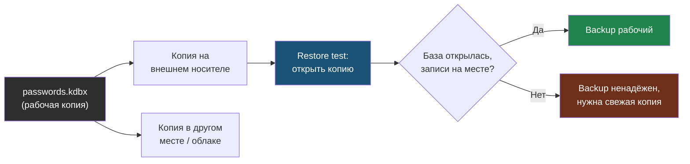

# Глава 6: KeePassXC и local-first подход

> **Запомни:** KeePassXC даёт контроль над файлом паролей, но вместе с контролем ты получаешь ответственность за backup и восстановление.

---

## 6.1 Что такое local-first

Local-first означает:

```text
Главное хранилище лежит у тебя локально
Сервис в облаке не обязателен
```

В KeePassXC пароли лежат в файле:

```text
passwords.kdbx
```

Этот файл зашифрован. Без мастер-пароля его нельзя просто открыть как текст.

---

## 6.2 Чем KeePassXC отличается от cloud manager

Cloud manager:

```text
Сервис хранит зашифрованный vault
Приложения синхронизируются через интернет
Backup частично скрыт внутри сервиса
```

KeePassXC:

```text
Файл .kdbx лежит у тебя
Ты сам решаешь, куда его копировать
Ты сам отвечаешь за backup
```

Это не лучше и не хуже автоматически. Это другой набор tradeoffs.

---

## 6.3 Плюсы KeePassXC

- не нужен аккаунт у сервиса;
- файл можно хранить offline;
- удобно для локальных секретов;
- можно использовать на Linux, Windows, macOS;
- хороший контроль над backup;
- понятная модель: есть файл, есть ключ к нему.

---

## 6.4 Минусы KeePassXC

- синхронизация между устройствами сложнее;
- потерял `.kdbx` и backup — потерял пароли;
- забыл мастер-пароль — не откроешь файл;
- можно создать несколько расходящихся копий;
- family/team сценарии сложнее;
- мобильная работа требует отдельной настройки.

---

## 6.5 Master password и key file

KeePassXC может использовать:

- мастер-пароль;
- key file;
- и то и другое.

Key file — это файл, который нужен для открытия базы.

Схема:

```text
Мастер-пароль + key file -> открыть .kdbx
```

Плюс:

- если украли только `.kdbx`, без key file открыть сложнее.

Минус:

- потерял key file — сам не откроешь базу.

Для новичка key file может быть лишней сложностью. Начинай с хорошего мастер-пароля и нормального backup.

---

## 6.6 Где хранить `.kdbx`

Варианты:

| Вариант | Плюсы | Минусы |
|---|---|---|
| Только ноутбук | Просто | Поломка диска = риск |
| Облачный диск | Синхронизация | Зависимость от облака |
| Syncthing | Контроль | Нужно настроить |
| USB-флешка | Offline | Можно потерять |
| Домашний NAS | Удобно дома | Нужно администрировать |

Если файл лежит в облачном диске, это не значит, что облако видит пароли. Оно видит зашифрованный файл.

Но если мастер-пароль слабый, риск растёт.

---

## 6.7 Синхронизация и конфликты

Опасная ситуация:

```text
Открыл базу на ноутбуке
Открыл старую копию на другом компьютере
Добавил разные записи
Синхронизация создала конфликт
```

Правила:

- не редактируй одну базу одновременно на нескольких устройствах;
- следи за конфликтными файлами;
- регулярно проверяй backup;
- перед крупными изменениями сделай копию.

---

## 6.8 Backup KeePassXC

Backup для `.kdbx` должен быть простым и проверенным.

Минимум:

```text
passwords.kdbx
  -> основная копия на компьютере
  -> копия на внешнем носителе
  -> копия в другом месте или облаке
```

Но backup без проверки — надежда, а не backup.

На схеме видно правило 3-2-1 для local-first: один файл живёт в нескольких местах, и только проверка восстановления превращает копию в настоящий backup.



Нужно периодически открыть копию и убедиться, что:

- файл не повреждён;
- мастер-пароль подходит;
- там актуальные записи;
- ты понимаешь, где лежит последняя версия.

---

## 6.9 Практика: тестовая база KeePassXC

Не используй реальные пароли.

### Задача 1: создать тестовую базу

Создай файл:

```text
demo-passwords.kdbx
```

Мастер-пароль учебный, не реальный.

Добавь записи:

- Demo Mail;
- Demo Shop;
- Demo GitHub;
- Demo Router;
- Demo Wi-Fi.

### Задача 2: сделать копию

Создай папку:

```text
password-backup-test
```

Скопируй туда `.kdbx`.

Если используешь Linux:

```bash
mkdir -p password-backup-test
cp demo-passwords.kdbx password-backup-test/
```

Что делает `mkdir -p`:

- создаёт папку;
- не ругается, если она уже есть.

Что делает `cp`:

- копирует файл.

### Задача 3: проверить восстановление

Открой копию из `password-backup-test`.

Проверь:

- база открылась;
- записи на месте;
- пароль подходит;
- ты точно открыл копию, а не оригинал.

### Задача 4: симуляция потери

Переименуй оригинальный файл:

```bash
mv demo-passwords.kdbx demo-passwords-lost.kdbx
```

Теперь попробуй восстановиться из backup.

После практики верни всё назад или удали тестовые файлы.

---

## 6.10 Когда KeePassXC хорош

KeePassXC хорош, если:

- ты понимаешь файлы и backup;
- тебе нужен local-first;
- ты хочешь контролировать хранение;
- у тебя мало устройств;
- ты готов проверять восстановление.

Он хуже подходит, если:

- тебе нужен простой family sharing;
- ты часто меняешь устройства;
- ты не делаешь backup;
- ты хочешь "чтобы всё само".

---

## Чеклист главы 6

- [ ] Я понимаю, что `.kdbx` — это главный файл хранилища
- [ ] Я понимаю, что backup полностью на мне
- [ ] Я знаю риск key file
- [ ] Я создал тестовую базу
- [ ] Я сделал копию базы
- [ ] Я проверил восстановление из копии
- [ ] Я понимаю, подходит ли мне local-first
