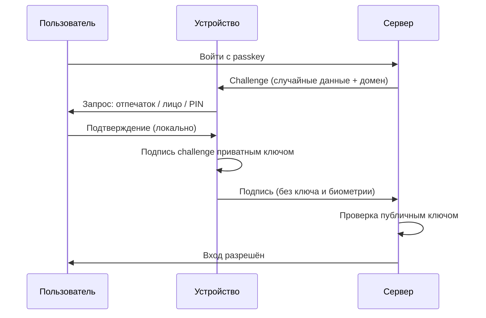

# Глава 9: Passkeys и будущее без паролей

> **Запомни:** passkey помогает убрать пароль из входа, но recovery всё равно нужно продумать.

---

## 9.1 Что такое passkey простыми словами

Passkey — это способ входа без обычного пароля.

Вместо строки `river-cactus-signal-mango` твоё устройство использует пару ключей — приватный и публичный.

```text
Приватный ключ → хранится только на твоём устройстве, никуда не уходит
Публичный ключ → хранится на сервере, его не секрет
```

### Как выглядит вход с passkey

1. Ты нажимаешь «Войти с passkey»;
2. Сервер присылает challenge — случайные данные плюс адрес сайта;
3. Твоё устройство просит подтверждение: отпечаток, лицо или PIN;
4. Устройство подписывает challenge приватным ключом;
5. Подпись уходит на сервер;
6. Сервер проверяет подпись публичным ключом — если совпало, вход разрешён.

```text
Сервер: «Докажи, что это ты. Вот задача: XXXX + домен github.com»
Устройство: [Touch ID] → подписывает задачу приватным ключом
Сервер: «Подпись верная, заходи»
```

Тот же обмен в виде последовательности шагов. Обрати внимание: приватный ключ и биометрия остаются на устройстве, а на сервер уходит только подпись.



### Что это значит практически

- Сервер хранит только публичный ключ — даже если его украдут, войти нельзя;
- Приватный ключ никогда не покидает устройство;
- Биометрия (Face ID, Touch ID) только разблокирует ключ на устройстве — лицо на сервер не отправляется.

Когда видишь «Войти с Face ID» — это не значит, что сайт получил твоё лицо. Face ID открыл доступ к ключу на iPhone, ключ подписал challenge, подпись ушла на сервер.

---

## 9.2 Почему passkeys помогают против phishing

### Что происходит при фишинге с паролем

Ты получаешь письмо: «Подтвердите аккаунт GitHub». Ссылка ведёт на:

```text
github-login.example.com
```

Сайт выглядит как настоящий. Ты вводишь логин и пароль — они уходят злоумышленнику. GitHub ничего не знает.

### Почему с passkey так не работает

В challenge, который сервер присылает устройству, вшит **домен сайта**. Устройство видит:

```text
Challenge от: github-login.example.com
Мой passkey создан для: github.com
```

Домены не совпадают — устройство откажет в подписи. Пользователь не может случайно «помочь» фишинговому сайту, даже если не заметил подделку.

Это принципиальное отличие от пароля:

```text
Пароль → ты его знаешь → можешь ввести куда угодно
Passkey → устройство проверяет домен → нельзя использовать на чужом сайте
```

Passkey — это встроенная защита от фишинга, которую нельзя отключить случайной ошибкой.


---

## 9.3 Где хранится passkey

Варианты:

- в iCloud Keychain;
- в Google Password Manager;
- в Windows Hello;
- в password manager;
- на hardware security key.

Главный вопрос:

> Что будет, если я потеряю устройство?

Если ответа нет, passkey настроен не до конца.

---

## 9.4 Platform authenticator

Platform authenticator — это встроенный механизм устройства.

Примеры:

- iPhone + iCloud Keychain;
- Android + Google Password Manager;
- Windows Hello;
- macOS Touch ID.

Плюсы:

- удобно;
- быстро;
- хорошо встроено;
- часто синхронизируется между устройствами одной экосистемы.

Минусы:

- зависимость от экосистемы;
- recovery зависит от Apple/Google/Microsoft аккаунта;
- перенос между платформами может быть сложнее.

---

## 9.5 Roaming hardware key

Roaming key — физический ключ, который можно носить с собой.

Плюсы:

- не привязан к одному телефону;
- хорош для админов и программистов;
- высокая защита от phishing.

Минусы:

- можно потерять;
- нужно иметь запасной ключ;
- не всегда удобно на телефоне;
- стоит денег.

Правило:

> Один hardware key — это хорошо. Два зарегистрированных ключа — намного лучше.

---

## 9.6 Passkey vs пароль + MFA

| Вариант | Плюсы | Минусы | Где уместно |
|---|---|---|---|
| Пароль + TOTP | Понятно и широко работает | Можно попасться на phishing | Большинство сервисов |
| Пароль + hardware key | Сильная защита | Нужно купить ключ | GitHub, почта, админки |
| Passkey в телефоне | Очень удобно | Зависит от recovery экосистемы | Личные аккаунты |
| Passkey на hardware key | Сильный вариант | Нужен backup key | Критичные аккаунты |

---

## 9.7 Где passkeys уже удобны

Passkeys полезны для:

- Google account;
- Apple ID;
- Microsoft account;
- GitHub;
- password managers;
- сервисов, где поддержка сделана нормально.

Но не все сайты поддерживают passkeys одинаково хорошо.

Иногда пароль всё ещё нужен:

- для старых сервисов;
- для recovery;
- для протоколов и приложений без passkey;
- для аварийного входа.

---

## 9.8 Passkeys для семьи

Семье passkeys могут быть удобны, но нужно объяснить:

- где они хранятся;
- что делать при смене телефона;
- как восстановиться;
- кто помогает, если человек потерял устройство;
- какие аккаунты нельзя оставлять только на одном устройстве.

Для семьи особенно важен emergency plan.

---

## 9.9 Passkeys для команды

В команде passkeys связаны с:

- корпоративной политикой;
- устройствами сотрудников;
- offboarding;
- SSO;
- hardware keys;
- recovery администратором.

Команде нельзя строить схему, где доступ к критичному сервису есть только у одного человека на одном телефоне.

---

## 9.10 Практика: включить passkey

Выбери тестовый или не самый критичный аккаунт, где passkeys поддерживаются.

Шаги:

1. открой security settings;
2. найди passkeys;
3. создай passkey;
4. выйди из аккаунта;
5. войди через passkey;
6. посмотри recovery options;
7. запиши, где хранится passkey.

Не удаляй пароль и старые способы входа, пока не понял recovery.

---

## 9.11 Практика: вопрос потери устройства

Ответь письменно:

```text
Где хранится passkey?
Синхронизируется ли он?
Что будет при потере телефона?
Можно ли войти с другого устройства?
Есть ли backup key?
Есть ли recovery codes?
```

Если ответы неясны, passkey пока не должен быть единственным способом входа.

---

## Чеклист главы 9

- [ ] Я понимаю, что passkey не передаёт сайту моё лицо или палец
- [ ] Я понимаю защиту от phishing
- [ ] Я знаю, где хранится passkey
- [ ] Я проверил recovery options
- [ ] Я не удалил старые способы входа без понимания recovery
- [ ] Я понимаю разницу между platform и hardware key
